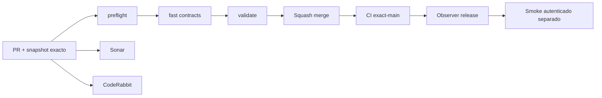

# GrindFlow — Último deploy

> **Snapshot v0.1.23: solo el deploy actual.** Base `main` v0.1.22 `7c9bdda75efd831e2a50f14e8770a59c3b957870`. Decisión de stack objetivo Condor y ruta de migración; **Laravel sigue en el código, Symfony no se ha implementado**. No afirmar Hostinger validado.

## Progress convention
- ✅ ~~Completado~~ = verificado; 🚧 Pendiente = por terminar; ⛔ bloqueado = dependencia externa.

## Fuentes de verdad
[AGENTS.md](AGENTS.md) · [Especificación](docs/GRINDFLOW-SPEC.md) · [Requisitos](docs/REQUIREMENTS.md) · [Transición Symfony](docs/STACK-TRANSITION-SYMFONY.md) · [Roadmap #2](https://github.com/pl0n3r/GrindFlow/issues/2)

## Estado del deploy
| Señal | Estado | Evidencia |
| --- | --- | --- |
| Version objetivo | 🚧 **v0.1.23** | `config/version.php` |
| Base exacta | ✅ ~~main v0.1.22~~ | `7c9bdda75efd831e2a50f14e8770a59c3b957870` |
| CI del PR | 🚧 Pendiente de head estable | [Issue #10](https://github.com/pl0n3r/GrindFlow/issues/10) |
| Sonar | 🚧 Pendiente de head estable | Proyecto `pl0n3r_GrindFlow` |
| CodeRabbit | 🚧 Revisión del PR por comprobar | [Issue #10](https://github.com/pl0n3r/GrindFlow/issues/10) |
| CI del SHA exacto de main | 🚧 Posterior al squash merge | No inferir del PR |
| Deploy Observer | ⛔ Sin release productivo corroborado | Falló en v0.1.22 |
| Production Smoke | ⛔ Sin credencial E2E configurada | [Issue #1](https://github.com/pl0n3r/GrindFlow/issues/1) |
| Producción v0.1.23 | ⛔ No verificada | Cambio documental ≠ cutover |
| Migraciones | ✅ ~~Sin modificaciones de esquema~~ | Solo plan, no SQL productivo |

## Huella del cambio
<!-- grindflow:git-delta -->
| Archivos | Inserciones | Eliminaciones | Neto |
| ---: | ---: | ---: | ---: |
| **8** | **+214** | **−92** | **+122** |

## Calidad y entrega
<!-- grindflow:gate-plan -->
| Control | Estado / contrato |
| --- | --- |
| Gates seleccionados | **preflight · fast[contracts]** |
| Arquitectura | Symfony 7.4 LTS + Doctrine/MariaDB + React/Vite + Twig/SSR como objetivo; Laravel es runtime existente |
| Revisiones | CI/Sonar/CodeRabbit y exact-main independientes |

## Flujo de entrega

## Qué se hizo
- Se adoptó el stack tecnológico objetivo de Condor **sin trasladar su modelo de negocio**.
- Se documentó transición incremental, matriz de paridad, seguridad/operación y primer slice visual Symfony/Twig + React/Vite.
- Se ordenó el roadmap #2 por el flujo del piloto y dependencias, conservando el historial.
- Symfony todavía no ejecuta código en GrindFlow; esta entrega solo cambia las fuentes de verdad para dirigir el desarrollo.

## Archivos modificados en este deploy
- `AGENTS.md` — instrucción canónica sobre la nueva arquitectura.
- `README.md` — snapshot documental v0.1.23.
- `config/version.php` — versión humana objetivo.
- `docs/DEVELOPMENT-MODEL.md` — coexistencia y contratos de entrega.
- `docs/GRINDFLOW-SPEC.md` — nuevo stack objetivo Symfony/React.
- `docs/MIGRATION-LARAVEL.md` — histórica; supersedida sin borrarla.
- `docs/REQUIREMENTS.md` — GF-ARCH-001..003 y GF-FR-008..009.
- `docs/STACK-TRANSITION-SYMFONY.md` — matriz de transición y vertical slices.

## Validación
- [CI exact-main anterior v0.1.22](https://github.com/pl0n3r/GrindFlow/actions/runs/35489330564): success; no prueba Symfony.
- Entrega documental: comprobar `validate` y Sonar sobre head final antes de merge; producción sigue independiente.

## Qué sigue
| Lane | Trabajo |
| --- | --- |
| **NOW** | 🚧 Validar documentación y preparar S0 Symfony/React, [roadmap #2](https://github.com/pl0n3r/GrindFlow/issues/2) |
| **NEXT** | 🚧 S1 identidad + S2 Vault web móvil |
| **LATER** | 🚧 S3 reglas → S4 entrega → S5 piloto → comercialización |
| **BLOCKED / EXTERNAL** | ⛔ Hostinger/smoke y permisos de proveedores reales sin corroborar |

## Panorama general pendiente
| Lane | Frente | Estado |
| --- | --- | --- |
| **DONE** | ✅ ~~Stack objetivo definido~~ | ✅ ~~Plan de transición documentado en rama~~ |
| **NOW** | 🚧 Primer slice visible | 🚧 Symfony aún no implementado |
| **NEXT** | 🚧 Onboarding y Vault móvil | 🚧 Por construir/portar |
| **LATER** | 🚧 Distribución externa y piloto | 🚧 Requiere permisos/medición |
| **BLOCKED / EXTERNAL** | ⛔ Producción | ⛔ Sin validación |
