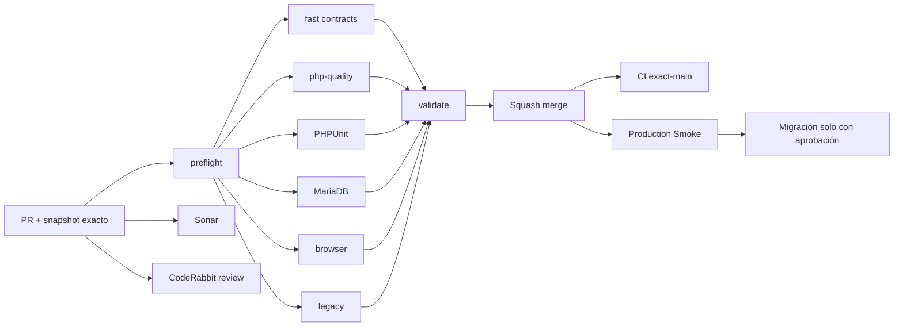

# GrindFlow — Último deploy

  
  
  

> **Development dashboard** · snapshot profesional de **solo el deploy actual**. CI, deploy y validación en producción son evidencias distintas.

## Estado del deploy

| Señal | Estado actual | Evidencia |
| --- | --- | --- |
| Work line | 🟠 **GF-OPS · Production Smoke workflow repair** | rama `fix/production-smoke-workflow-syntax-guard` |
| Base exacta | ✅ **main** | `c879faad626d09e969ba7b59fcb5d08a23c3439a` |
| Diagnóstico | ✅ **workflow inválido en source** | YAML de Smoke contenía shell truncado y pasos duplicados |
| CI del PR | ⚪ **pendiente** | la validación debe ejecutarse sobre el head final |
| Sonar / CodeRabbit | ⚪ **pendiente** | revisión separada del head final |
| CI del SHA exacto de main | ⚪ **sin evidencia nueva** | merge y push son estados distintos |
| Production Smoke | 🟠 **sin recuperación demostrada** | issue #69; el último run comentado es `6464a8a0…` |
| Migraciones | 🟠 **sin ejecutar desde este cambio** | inventario, backup restaurable y aprobación siguen fuera de CI |

## Huella del cambio

<!-- grindflow:git-delta -->

| Archivos | Inserciones | Eliminaciones | Neto |
| ---: | ---: | ---: | ---: |
| **4** | **+88** | **−106** | **-18** |

La huella se calcula con `git diff --numstat`; CI rechaza este dashboard si queda desactualizado.

## Calidad y entrega

<!-- grindflow:gate-plan -->

| Control | Estado / contrato |
| --- | --- |
| Gates seleccionados | **preflight · fast[contracts] · php-quality · PHPUnit · MariaDB · browser · legacy** |
| GrindFlow CI | `fast` analiza el YAML de los workflows y `bash -n` de los pasos Smoke |
| Sonar / CodeRabbit | evaluaciones independientes, sin atribuir aprobaciones anticipadas |
| Migración | ningún workflow ejecuta migraciones por este cambio |
| Producción | reparar CI no demuestra despliegue ni Smoke aprobado |

## Flujo de entrega

## Qué se hizo

- Reparó el reporte de incidente de Production Smoke: eliminó comandos truncados, shell sin cerrar y bloques duplicados.
- Conservó la clasificación segura `MIGRATIONS_PENDING=N` y la referencia al artefacto de diagnóstico de tres días.
- Añadió guardia de sintaxis de todos los workflows y de cada paso Bash embebido en Production Smoke.
- Integró la guardia en el gate `fast`; mantiene el contrato offline de migraciones.
- No consulta ni modifica esquema, credenciales, backups o datos de producción.

## Archivos modificados en este deploy

- `.github/workflows/grindflow-ci.yml` — ejecutar la nueva guardia en fast.
- `.github/workflows/production-smoke.yml` — restaurar el reporter.
- `README.md` — dashboard exacto y distinción de estados.
- `scripts/workflow-syntax-check.rb` — verificar YAML y shell sin ejecutar comandos.

## Validación

- El source de `production-smoke.yml` en la base contenía duplicados y un `grep` truncado; no se atribuye una ejecución correcta al nuevo head sin CI.
- La guardia Ruby usa solo bibliotecas estándar y `bash -n`, sin llamadas a Hostinger ni migraciones.
- Production Smoke del commit nuevo, despliegue real y backup restaurable siguen pendientes de evidencia independiente.

## Qué sigue

| Lane | Trabajo |
| --- | --- |
| **NOW** | Abrir PR y comprobar `validate`, Sonar y CodeRabbit para el head exacto. |
| **NEXT** | Fusionar con gates aprobados y comprobar CI del SHA fusionado en `main`. |
| **NEXT** | Verificar deploy Hostinger y Production Smoke; revisar inventario y backup externo restaurable. |
| **BLOCKED / EXTERNAL** | Aprobación del operador para migraciones; S3 y FFmpeg. |
| **LATER** | Providers reales en sandbox y conciliación Finance. |

## Panorama general pendiente

| Lane | Frente | Estado |
| --- | --- | --- |
| **NOW** | Recuperar workflow de Smoke | código corregido; gates por comprobar |
| **NEXT** | Migraciones productivas | inventario + backup + aprobación |
| **NEXT** | Scheduling/Distribution/Traffic/Finance | confirmar esquema productivo |
| **BLOCKED / EXTERNAL** | Hosting/storage | S3 + FFmpeg |
| **LATER** | Provider adapters | sandbox y credenciales cifradas |
| **LATER** | Legacy retirement | tras GF-MIG |
