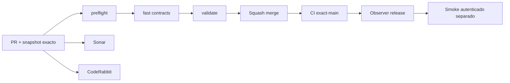

# GrindFlow — Último deploy

> **Candidato v0.1.71: revisión humana y elegibilidad interna S3.** El runtime productivo continúa siendo Laravel en Hostinger; Symfony sigue aislado. Base exacta `main` v0.1.70 `fedc8a153ae58e28765b1a7f398465cbcd97b191`, con CI exact-main success. La revisión humana y la autorización de distribución son contratos separados; quedar listo para programar no crea schedules ni habilita publicación externa.

## Progress convention
- ✅ ~~Completado~~ = verificado; 🚧 Pendiente = en curso; ⛔ bloqueado = dependencia externa.

## Fuentes de verdad
[AGENTS.md](AGENTS.md) · [Spec](docs/GRINDFLOW-SPEC.md) · [Requisitos](docs/REQUIREMENTS.md) · [Transición](docs/STACK-TRANSITION-SYMFONY.md) · [Roadmap #2](https://github.com/pl0n3r/GrindFlow/issues/2)

## Estado del deploy
| Señal | Estado | Evidencia |
| --- | --- | --- |
| Version objetivo | 🚧 **v0.1.71** | `config/version.php` |
| Base exacta | ✅ ~~main v0.1.70~~ | `fedc8a153ae58e28765b1a7f398465cbcd97b191` |
| CI del PR | 🚧 Head v0.1.71 por validar | `GrindFlow CI / validate` |
| Sonar | 🚧 Pendiente | SonarCloud PR |
| CodeRabbit | 🚧 Pendiente | PR |
| CI del SHA exacto de main | ✅ ~~v0.1.70 success~~ | run `35624143900` |
| Deploy Observer | ✅ ~~v0.1.70 observado~~ | run `35624143919`; versión humana, no prueba Symfony ni SHA remoto |
| Production Smoke | ⛔ Credencial E2E productiva pendiente | run `35624143926`; [Issue #1](https://github.com/pl0n3r/GrindFlow/issues/1) |
| Symfony S3 en Hostinger | ⛔ NO desplegado | Solo entorno aislado CI |
| Migraciones | 🚧 Ledger append-only de revisión S3 en MariaDB descartable | Producción intacta |

## Huella del cambio
<!-- grindflow:git-delta -->
| Archivos | Inserciones | Eliminaciones | Neto |
| ---: | ---: | ---: | ---: |
| **16** | **+741** | **−66** | **+675** |

## Calidad y entrega
<!-- grindflow:gate-plan -->
| Control | Estado / contrato |
| --- | --- |
| Gates seleccionados | **preflight · fast[contracts] · php-quality · PHPUnit · MariaDB · browser · real-stack · legacy · symfony-preview** |
| Alcance | S3: revisión humana explícita + readiness interno; sin schedule ni publicación externa |
| Revisiones | CI/Sonar/CodeRabbit, exact-main y Hostinger independientes |

## Flujo de entrega

## Qué se hizo
- Nuevo ledger append-only `approve/revoke` de revisión humana por recurso, tenant y actor, independiente de la clasificación y de la autorización de distribución.
- Admin/Studio/Editor pueden decidir revisión con CSRF dedicado y revalidación dentro de la transacción; recursos ajenos, en papelera o fuera de `needs_review` fallan cerrado.
- El preview S3 separa clasificación, revisión y autorización. Solo muestra `eligible=true` cuando la regla existe y los bloqueos internos están resueltos.
- La UI móvil muestra revisión pendiente/aprobada y “Listo para programar internamente”, pero conserva `can_publish=false`: no crea schedules, jobs ni llamadas externas.

## Archivos modificados en este deploy
Inventario de solo el deploy actual (candidato); no prueba despliegue Symfony en Hostinger.
- `.github/workflows/grindflow-ci.yml`
- `README.md`
- `config/version.php`
- `docs/GRINDFLOW-SPEC.md`
- `docs/REQUIREMENTS.md`
- `symfony/frontend/admin/AdminApp.tsx`
- `symfony/frontend/admin/WeeklyPlannerPanel.tsx`
- `symfony/frontend/admin/admin.css`
- `symfony/migrations/Version20260921163000.php`
- `symfony/src/Http/Controller/AdminContextController.php`
- `symfony/src/Http/Controller/ContentReviewController.php`
- `symfony/src/Http/Controller/ContentRuleController.php`
- `symfony/src/Identity/Application/MembershipContext.php`
- `symfony/tests/e2e/preview.spec.mjs`
- `symfony/tests/php/ContentReviewDecisionTest.php`
- `symfony/tests/php/DistributionAuthorizationTest.php`

## Validación
- CI/Sonar/CodeRabbit del candidato v0.1.71 por verificar; la base v0.1.70 tiene CI exact-main success.
- GitHub Actions debe validar migración reversible, PHPUnit/MariaDB, TypeScript/Vite y Chromium móvil. Producción permanece intacta.

## Qué sigue
[Roadmap canónico #2](https://github.com/pl0n3r/GrindFlow/issues/2)

| Lane | Trabajo | Estado |
| --- | --- | --- |
| **NOW** | 🚧 Validar revisión humana y readiness v0.1.71 | 🚧 CI y revisión |
| **NEXT** | 🚧 Scheduler Symfony persistido tenant-safe | 🚧 S4, sin publicación externa |
| **LATER** | 🚧 Scheduler Symfony + distribución autorizada + Traffic | 🚧 S3–S5 |
| **BLOCKED / EXTERNAL** | ⛔ Cutover sin paridad/datos migrados; Smoke sin credencial | ⛔ Dependencia externa |

## Panorama general pendiente
| Lane | Frente | Estado |
| --- | --- | --- |
| **DONE** | ✅ ~~Dashboard Laravel v0.1.30~~ | ✅ ~~Vault Symfony clasificación v0.1.63~~ |
| **NOW** | 🚧 Readiness S3 v0.1.71 | 🚧 CI y revisión |
| **NEXT** | 🚧 Scheduler Symfony persistido tenant-safe | 🚧 S4 |
| **LATER** | 🚧 Paridad del monolito modular | 🚧 S3–S5 |
| **BLOCKED / EXTERNAL** | ⛔ Sin cutover Symfony | ⛔ Sin credencial Smoke |
