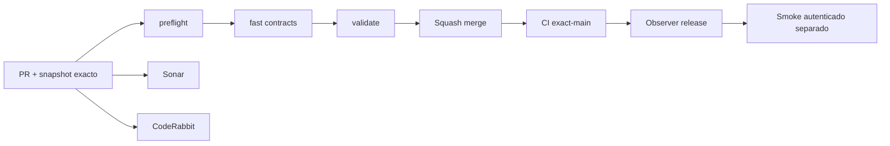

# GrindFlow — Último deploy

> **Snapshot v0.1.26: solo el deploy actual.** Base `main` v0.1.25 `fe0eea406de8b3325ff9bc37e5add85cafbdf7c9`. Pequeña entrega funcional: dashboard con contadores reales de recursos listos y publicaciones programadas, restringidos a organizaciones visibles. La arquitectura objetivo continúa siendo Symfony/React. **Sin prueba de despliegue Hostinger hasta observar el release remoto.**

## Progress convention
- ✅ ~~Completado~~ = verificado; 🚧 Pendiente = en curso; ⛔ bloqueado = dependencia externa.

## Fuentes de verdad
[AGENTS.md](AGENTS.md) · [Spec](docs/GRINDFLOW-SPEC.md) · [Requisitos](docs/REQUIREMENTS.md) · [Transición](docs/STACK-TRANSITION-SYMFONY.md) · [Roadmap #2](https://github.com/pl0n3r/GrindFlow/issues/2)

## Estado del deploy
| Señal | Estado | Evidencia |
| --- | --- | --- |
| Version objetivo | 🚧 **v0.1.26** | `config/version.php` |
| Base exacta | ✅ ~~main v0.1.25~~ | `fe0eea406de8b3325ff9bc37e5add85cafbdf7c9` |
| CI del PR | 🚧 Pendiente de head final | `GrindFlow CI / validate` |
| Sonar | 🚧 Pendiente de head final | SonarCloud PR |
| CodeRabbit | 🚧 Revisión por comprobar | PR de home |
| CI del SHA exacto de main | 🚧 Después del merge | No inferir del PR |
| Deploy Observer | ⛔ Release remoto v0.1.26 no observado | Sin evidencia de Hostinger |
| Production Smoke | ⛔ Autenticación E2E pendiente | [Issue #1](https://github.com/pl0n3r/GrindFlow/issues/1) |
| Producción v0.1.26 | ⛔ No verificada | CI ≠ deploy |
| Migraciones | ✅ ~~Ningún cambio de esquema~~ | UI/release solamente |

## Huella del cambio
<!-- grindflow:git-delta -->
| Archivos | Inserciones | Eliminaciones | Neto |
| ---: | ---: | ---: | ---: |
| **6** | **+148** | **−32** | **+116** |

## Calidad y entrega
<!-- grindflow:gate-plan -->
| Control | Estado / contrato |
| --- | --- |
| Gates seleccionados | **preflight · fast[contracts] · php-quality · PHPUnit · browser · real-stack** |
| Alcance | Dashboard de actividad real, aislamiento multi-tenant, versión visible, pruebas Chromium y PHP |
| Revisiones | CI/Sonar/CodeRabbit y exact-main independientes |

## Flujo de entrega

## Qué se hizo
- Dashboard cambiado de indicadores técnicos a resumen operativo con datos reales y acceso a módulos existentes.
- Backend agrega consultas por organización visible, estado y esquema disponible; `—` si faltan migraciones, no cero inventado.
- Patch consecutivo **0.1.25 → 0.1.26**. Sin datos, migraciones, conectores ni Hostinger modificados.

## Archivos modificados en este deploy
- `README.md`
- `app/Http/Controllers/DashboardController.php`
- `config/version.php`
- `resources/views/dashboard.blade.php`
- `scripts/browser-smoke.sh`
- `tests/Feature/OrganizationVisibilityTest.php`

## Validación
- Verificar CI/Sonar del head y CI exact-main tras fusión; observación Hostinger independiente.
- Footer indica versión humana y **no** demuestra SHA remoto por sí mismo.

## Qué sigue
| Lane | Trabajo |
| --- | --- |
| **NOW** | 🚧 Validar dashboard operativo v0.1.26, [roadmap #2](https://github.com/pl0n3r/GrindFlow/issues/2) |
| **NEXT** | 🚧 S1 login real Symfony con entrega visual pequeña |
| **LATER** | 🚧 S2 biblioteca móvil → S3 reglas → S4 distribution → S5 piloto |
| **BLOCKED / EXTERNAL** | ⛔ Hostinger y credencial smoke de solo lectura |

## Panorama general pendiente
| Lane | Frente | Estado |
| --- | --- | --- |
| **DONE** | ✅ ~~Symfony S0 validado en código~~ | ✅ ~~CI exact-main v0.1.25~~ |
| **NOW** | 🚧 Dashboard operativo v0.1.26 | 🚧 CI y observación remota |
| **NEXT** | 🚧 Primer login Symfony | 🚧 Tenant y permisos |
| **LATER** | 🚧 Automatización completa | 🚧 Por integrar |
| **BLOCKED / EXTERNAL** | ⛔ Producción v0.1.26 | ⛔ No observada |
