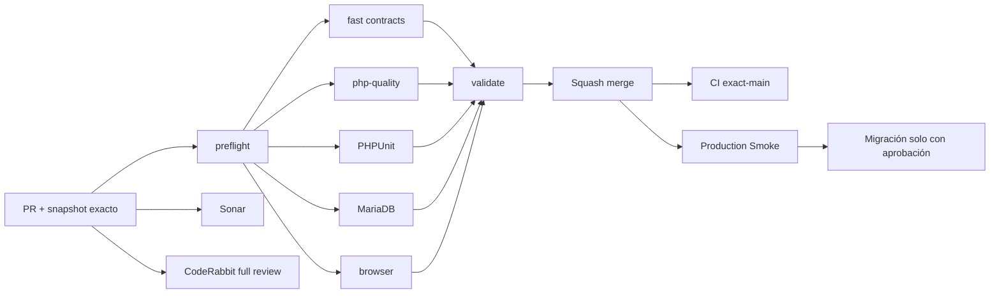

# GrindFlow — Último deploy

  
  
  

> **Development dashboard** · snapshot profesional de **solo el deploy actual**. CI, deploy y validación en producción son evidencias distintas.

## Estado del deploy

| Señal | Estado actual | Evidencia |
| --- | --- | --- |
| Work line | ✅ **GF-FR-007 · Finance core v1** | PR #75 fusionada en `main` |
| Finance merge commit | ✅ **main base** | `76b234c2e0926d0a46cd840bd8118fe689c008d0` |
| CI de PR | ✅ **GrindFlow CI #328** | fast, Pint/PHPStan, PHPUnit, MariaDB, browser y validate |
| Sonar | ✅ **último Quality Gate del PR passed** | 0 issues / 0 hotspots; no se atribuye validación del squash SHA |
| CodeRabbit | 🟠 **pending al merge** | no se atribuye review final no emitido |
| CI del SHA exacto de main | ⚪ **sin evidencia confirmada** | CI de PR y CI de `main` son distintos |
| Production Smoke | 🟠 **sin evidencia exact-main confirmada** | no se atribuye prueba de hosting desde el merge |
| Migraciones | 🟠 **2 nuevas sin aplicar** | tabla `revenue_allocations` + triggers de inmutabilidad |

## Huella del cambio

<!-- grindflow:git-delta -->

| Archivos | Inserciones | Eliminaciones | Neto |
| ---: | ---: | ---: | ---: |
| **1** | **+40** | **−65** | **-25** |

La huella se calcula con `git diff --numstat`; CI rechaza este dashboard si queda desactualizado.

## Calidad y entrega

<!-- grindflow:gate-plan -->

| Control | Estado / contrato |
| --- | --- |
| Gates seleccionados | **preflight · fast[contracts]** |
| GrindFlow CI | docs-only: contratos y dashboard exacto |
| Sonar | review documental independiente |
| CodeRabbit | review documental no reemplaza evidencia de PR #75 |
| Migración | no se ejecuta desde este PR |
| Producción | no se modifica desde este PR |

## Flujo de entrega

## Qué se hizo

- Sincroniza el dashboard después del squash merge de Finance core v1 (PR #75).
- Registra el commit del feature `76b234c2…` y CI #328 completo del head `80d37acd…`.
- Corrige el inventario: Finance agregó **dos migraciones**, una de tabla y otra de triggers MariaDB.
- Mantiene Quality Gate de Sonar y CodeRabbit pendientes/emitidos con evidencia diferenciada.
- Deja exact-main CI, Production Smoke y aplicación de migraciones como pasos independientes.
- Avanza el roadmap hacia la integración Traffic + Distribution sin activar providers externos.

## Archivos modificados en este deploy

- `README.md` — snapshot post-merge de Finance y próximo frente.

## Validación

- GF-FR-007 Finance core v1 fusionado en `main` como `76b234c2e0926d0a46cd840bd8118fe689c008d0`.
- CI #328 pasó completamente sobre PR #75 head `80d37acd1f989214faf726180e6810df0d1aac6a`.
- El ledger persiste dinero en unidades menores enteras y agrega cada moneda por separado.
- Reversas crean filas auditables; MariaDB bloquea UPDATE/DELETE directos con triggers.
- Admin/Studio tienen acceso; Editor/Model y accesos cross-tenant se deniegan.
- Las migraciones de Finance **no se aplicaron desde la PR**. No hay pagos, bancos ni impuestos conectados.
- CodeRabbit seguía `pending` al merge; no se registra aprobación inexistente.
- Exact-main CI y Smoke de producción aún requieren evidencia propia.

## Qué sigue

| Lane | Trabajo |
| --- | --- |
| **NOW** | Integrar tracked links con Distribution/campañas bajo tenant y roles existentes. |
| **NEXT** | Obtener evidencia exact-main + Production Smoke antes de migraciones productivas. |
| **NEXT** | Evolucionar Finance desde ledger a conciliación de fuentes verificables, sin payouts en este slice. |
| **BLOCKED / EXTERNAL** | Aplicación de migraciones, providers reales, FFmpeg y S3-compatible requieren configuración/aprobación. |
| **LATER** | Retiro del legacy solo tras GF-MIG. |

## Panorama general pendiente

| Lane | Frente | Estado |
| --- | --- | --- |
| **NOW** | Traffic + Distribution | tracked links por campaña · siguiente slice |
| **NEXT** | Finance | core v1 MERGED; conciliación/atribución de fuentes pendiente |
| **NEXT** | Distribution providers | adapters reales + auth/reconnect |
| **BLOCKED / EXTERNAL** | Producción | Scheduling/Distribution/Traffic/Finance migrations + Smoke |
| **BLOCKED / EXTERNAL** | Hosting / storage | FFmpeg real + S3-compatible |
| **LATER** | Payouts / invoices | fuera del core |
| **LATER** | Legacy retirement | solo tras GF-MIG |
