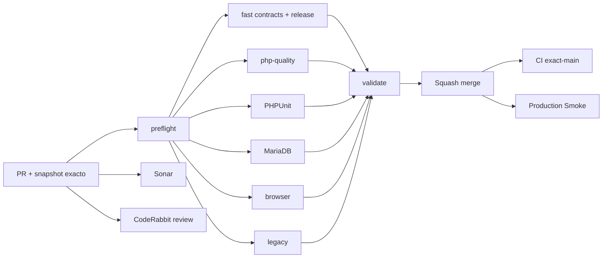

# GrindFlow — Último deploy

  
  
  

> **Development dashboard** de **solo el deploy actual**. Implementado, CI, deploy y validación productiva son estados distintos.

## Progress convention

- ✅ ~~Completado~~ = concluido y verificado por las compuertas que correspondan.
- 🚧 Pendiente = por hacer o en curso, sin tachado.

## Estado del deploy

| Señal | Estado | Evidencia |
| --- | --- | --- |
| Work line | 🚧 **GF-OPS · Readiness por módulo y Smoke seguro** | [Roadmap #88](https://github.com/drpipe1098-commits/GrindFlow/issues/88) |
| Base exacta | ✅ **v0.1.2 · PR #91 fusionado** | `main` `98ad68b32fea1e56538b7386cd32f6eb7699b1d3` |
| Version | 🚧 **v0.1.3** | diagnósticos y Smoke de solo lectura |
| CI del PR | 🚧 **por validar sobre head estable** | GrindFlow CI / validate |
| Sonar | 🚧 **por validar sobre head estable** | Quality Gate del PR |
| CodeRabbit | 🚧 **por revisar sobre head estable** | revisión de ops y pruebas |
| CI del SHA exacto de main | 🚧 **v0.1.3 tras merge** | v0.1.2 verde: #35430357855 |
| Production Smoke | 🚧 **schema bloqueado** | [#69](https://github.com/drpipe1098-commits/GrindFlow/issues/69): 7 pendientes en #35430357839 |
| Migraciones | 🚧 **no ejecutadas** | backup externo restaurable + aprobación expresa |

## Huella del cambio

<!-- grindflow:git-delta -->

| Archivos | Inserciones | Eliminaciones | Neto |
| ---: | ---: | ---: | ---: |
| **10** | **+263** | **−52** | **+211** |

## Calidad y entrega

<!-- grindflow:gate-plan -->

| Control | Estado / contrato |
| --- | --- |
| Gates seleccionados | **preflight · fast[contracts] · php-quality · PHPUnit · browser** |
| Tests | Admin System, readiness parcial, Smoke bloqueado, Vault fallido y enlace ausente |
| Autorización | Admin-only; el Smoke reutiliza sesión sintética y es solo lectura |
| Producción | migraciones y deploy siguen controles separados |

## Flujo de entrega

## Qué se hizo

- Admin > System separa conexión MariaDB, inventario de migraciones y cinco indicadores de esquema: Vault, Scheduling, Distribution, Traffic y Finance.
- Con inventario desconocido el estado de conexión no miente y el formulario de migraciones queda bloqueado.
- Smoke autenticado comprueba Vault y la readiness sanitizada de storage aun con migraciones pendientes; reporta adicionalmente fallo 500 o enlace ausente y evita reintentos improductivos.
- Contratos fake HTTP para bloqueos parciales, errores del Vault y manifest seguro. Regla de desarrollo sustancial incorporada en AGENTS y modelo. Sin mutaciones de producción.

## Archivos modificados en este deploy

- `.github/workflows/production-smoke.yml` — diagnóstico adicional de Vault
- `AGENTS.md` — regla de avance sustancial
- `README.md` — snapshot de v0.1.3
- `app/Http/Controllers/Admin/SystemController.php` — readiness de cinco módulos
- `config/version.php` — versión humana v0.1.3
- `docs/DEVELOPMENT-MODEL.md` — entrega autónoma por bloque
- `resources/views/admin/system.blade.php` — panel visible de readiness
- `scripts/production-smoke-contract.sh` — regresiones HTTP sintéticas
- `scripts/production-smoke.sh` — verificaciones de solo lectura con schema pendiente
- `tests/Feature/AdminSystemTest.php` — conexión e inventario separados, estado parcial

## Validación

- v0.1.2 exact-main CI / validate #35430357855 verde; Smoke #35430357839 sigue bloqueado por siete migraciones.
- v0.1.3 requiere CI / validate, Sonar y revisión del head final antes del merge.
- El Smoke no migra ni publica; identidad desplegada y pruebas productivas siguen siendo evidencia separada.

## Qué sigue

| Lane | Trabajo |
| --- | --- |
| **NOW** | 🚧 Validar readiness y Smoke v0.1.3; [roadmap #88](https://github.com/drpipe1098-commits/GrindFlow/issues/88). |
| **NEXT** | 🚧 Verificar estado productivo y preparar [#69](https://github.com/drpipe1098-commits/GrindFlow/issues/69). |
| **LATER** | 🚧 Auditoría de intentos y resiliencia de módulos. |
| **BLOCKED / EXTERNAL** | 🚧 Backup restaurable, aprobación de migraciones, storage S3 y FFmpeg. |

## Panorama general pendiente

| Lane | Frente | Estado |
| --- | --- | --- |
| **DONE** | ✅ ~~Workflow #87 y navegación #90/#91 fusionados~~ | ✅ ~~CI y Sonar aprobados; no implica producción~~ |
| **NOW** | 🚧 Visibilidad operativa | 🚧 v0.1.3 |
| **NEXT** | 🚧 Migraciones y storage | 🚧 [#34](https://github.com/drpipe1098-commits/GrindFlow/issues/34) · [#40](https://github.com/drpipe1098-commits/GrindFlow/issues/40) |
| **LATER** | 🚧 Finance y paridad legado | 🚧 Después del esquema |
| **BLOCKED / EXTERNAL** | 🚧 Producción | 🚧 Backup/aprobación y deploy |
