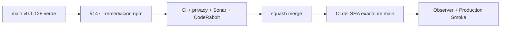

# GrindFlow — Último deploy

> **Candidato v0.1.129: remediación npm de #139 recuperada sobre main actual.** Base exacta v0.1.128 `a106204b2e6df9c468a01920c7e2fbf6fe6b7aec`, ya validada con CI exact-main, Deploy Observer y Production Smoke. El lockfile seguro se conserva del workflow de generación original y se reaplica sin edición manual porque los archivos npm de main no cambiaron desde aquella base.

## Progress convention
- ✅ ~~Completado~~ = verificado; 🚧 Pendiente = en curso; ⛔ bloqueado = dependencia externa.

## Fuentes de verdad
[AGENTS.md](AGENTS.md) · [Spec](docs/GRINDFLOW-SPEC.md) · [Requisitos](docs/REQUIREMENTS.md) · [Roadmap #2](https://github.com/pl0n3r/GrindFlow/issues/2)

## Estado del deploy
| Señal | Estado | Evidencia |
| --- | --- | --- |
| Producción base | ✅ **v0.1.128 / GREEN** | `a106204b2e6df9c468a01920c7e2fbf6fe6b7aec`; exact-main, Observer y Production Smoke en success |
| CI del SHA exacto de main (base) | ✅ **success** | v0.1.128 validada antes de abrir este candidato |
| Version objetivo | 🚧 **v0.1.129** | `config/version.php` |
| Pillow / workers | ✅ ~~completado~~ | v0.1.127; Pillow 12.3.0 ya integrado |
| Lockfile npm | ✅ **REUTILIZADO SIN EDICIÓN MANUAL** | generado en workflow #35994547753; base npm de main sin cambios |
| CI/Sonar/CodeRabbit del PR | 🚧 pendiente | revalidación oficial sobre base actual |
| Producción objetivo | 🚧 pendiente | solo tras merge, exact-main, observer y smoke |

## Huella del cambio
<!-- grindflow:git-delta -->
| Archivos | Inserciones | Eliminaciones | Neto |
| ---: | ---: | ---: | ---: |
| **4** | **+1533** | **−1154** | **+379** |

## Calidad y entrega
<!-- grindflow:gate-plan -->
| Control | Estado / contrato |
| --- | --- |
| Gates seleccionados | **preflight · fast[operational contracts + automation syntax + README dashboard] · legacy** |
| PR + snapshot exacto | **#147 · v0.1.129** | diff y README deben coincidir con el HEAD final |
| Gate agregador obligatorio | **validate** (incluye siempre el gate privacy-as-code); Sonar, CodeQL y CodeRabbit separados |
| Alcance | #139: Vitest/Vite/PostCSS/esbuild/next-intl/@vitest-mocker corregidos |
| Rol del PR | **Application Security · Node.js · Release Engineering · QA** |
| Revisiones | repetir CI/Sonar/CodeRabbit sobre el HEAD rebased a main |

## Flujo de entrega

## Qué se hizo
- Sube `vitest` a `^4.1.11` y `next-intl` a `^4.9.2`.
- Fuerza PostCSS 8.5.28 mediante `overrides` para eliminar la copia vulnerable 8.4.31 sin introducir un salto mayor de Next.
- El lockfile resuelve Vitest 4.1.11, Vite 8.3.0, PostCSS 8.5.28, esbuild 0.28.2, next-intl 4.14.7 y @vitest/mocker 4.1.11.
- No toca `datos.yml`, los documentos de privacidad ni los callers Factory ya integrados en v0.1.128.
- No modifica datos, secretos, permisos, migraciones ni producción.

## Archivos modificados en esta entrega candidata
<!-- grindflow:changed-files -->
- `README.md`
- `config/version.php`
- `package-lock.json`
- `package.json`

## Validación
- Evidencia original: workflow #35994547753 generó el lockfile con npm 11 y pasó `npm ci`, lint, typecheck y Vitest.
- Esta recuperación exige nuevamente CI oficial, Sonar, CodeQL y revisión del HEAD sobre `main` actual.
- #139 solo se cierra tras verificar Security/Dependabot sin alertas críticas ni altas aplicables.

## Qué sigue
[Roadmap canónico #2](https://github.com/pl0n3r/GrindFlow/issues/2)

## Panorama general pendiente
| Lane | Frente | Estado |
| --- | --- | --- |
| **NOW** | 🚧 #139 / PR #147 · npm crítico/alto | 🚧 revalidación v0.1.129 |
| **NEXT** | 🚧 repin Factory privacidad | 🚧 después de v0.1.129 |
| **BLOCKED / EXTERNAL** | ⛔ integraciones/Hostinger que requieran credenciales | ⛔ separadas |
| **LATER** | 🚧 Roadmap #2 | 🚧 prioridades posteriores |
