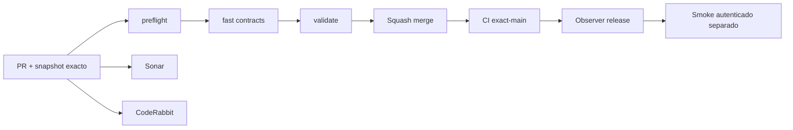

# GrindFlow — Último deploy

> **Candidato v0.1.61: clasificación y filtros de organización del Vault móvil, todavía no desplegado.** El alcance «solo el deploy actual» corresponde al runtime Laravel observado; Symfony permanece aislado. Base `main` v0.1.60 `04af1f3ad52630e9345db0934a0f59ec29b02f5c`, CI exact-main success. No se activan proveedores ni migraciones productivas.

## Progress convention
- ✅ ~~Completado~~ = verificado; 🚧 Pendiente = en curso; ⛔ bloqueado = dependencia externa.

## Fuentes de verdad
[AGENTS.md](AGENTS.md) · [Spec](docs/GRINDFLOW-SPEC.md) · [Requisitos](docs/REQUIREMENTS.md) · [Transición](docs/STACK-TRANSITION-SYMFONY.md) · [Roadmap #2](https://github.com/pl0n3r/GrindFlow/issues/2)

## Estado del deploy
| Señal | Estado | Evidencia |
| --- | --- | --- |
| Version objetivo | 🚧 **v0.1.61** | `config/version.php` |
| Base exacta | ✅ ~~main v0.1.60~~ | `04af1f3ad52630e9345db0934a0f59ec29b02f5c` |
| CI del PR | 🚧 Validación del nuevo head pendiente | `GrindFlow CI / validate` |
| Sonar | 🚧 Pendiente | SonarCloud PR |
| CodeRabbit | 🚧 Revisión pendiente | PR |
| CI del SHA exacto de main | 🚧 Después del merge | CI PR no lo sustituye |
| Deploy Observer | 🚧 Release humano por observar | No prueba Symfony en remoto |
| Production Smoke | ⛔ Credencial E2E productiva pendiente | [Issue #1](https://github.com/pl0n3r/GrindFlow/issues/1) |
| Symfony S2 en Hostinger | ⛔ NO desplegado | Solo entorno aislado CI |
| Migraciones | ✅ ~~Ningún esquema productivo modificado~~ | DB Symfony descartable |

## Huella del cambio
<!-- grindflow:git-delta -->
| Archivos | Inserciones | Eliminaciones | Neto |
| ---: | ---: | ---: | ---: |
| **19** | **+0** | **−0** | **+0** |

## Calidad y entrega
<!-- grindflow:gate-plan -->
| Control | Estado / contrato |
| --- | --- |
| Gates seleccionados | **preflight · fast[contracts] · symfony-preview** |
| Alcance | S2: clasificación interna por imagen, filtros combinables, ACL/CSRF y recuperación del catálogo |
| Revisiones | CI/Sonar/CodeRabbit, exact-main y Hostinger son independientes |

## Flujo de entrega

## Qué se hizo
- Estado interno por imagen: «Sin clasificar», «En organización» y «Organizada», visible en la lista/detalle del Vault. **Ninguno autoriza publicación ni acredita derechos o aprobación editorial.**
- Filtro backend `filing` por tenant combinable con búsqueda, formato, vista y orden, con paginación y cuota física independientes. En el detalle React se cambia el estado mediante CSRF, rol y organización revalidados en transacción.
- Migración Doctrine con predeterminado `inbox`, CHECK SQL e índice para el filtrado; PHPUnit/MariaDB y Chromium 360 px para cambios, acceso ajeno, papelera, rol lectura, estado inválido y filtrado combinado.
- Audit, stage, verify-stage y verify-restore incluyen clasificación en manifiesto privado y detectan estados faltantes o alterados en recuperación. Sin migración productiva, integración externa ni cutover.
## Archivos modificados en este deploy
Inventario del **cambio candidato en el PR**, no archivos desplegados en Hostinger.
- `README.md`
- `config/version.php`
- `docs/GRINDFLOW-SPEC.md`
- `docs/REQUIREMENTS.md`
- `docs/SYMFONY-VAULT-STORAGE.md`
- `symfony/README.md`
- `symfony/frontend/admin/VaultPanel.tsx`
- `symfony/frontend/admin/admin.css`
- `symfony/migrations/Version20260921065500.php`
- `symfony/src/Http/Controller/VaultController.php`
- `symfony/src/Infrastructure/Storage/VaultAuditCommand.php`
- `symfony/src/Infrastructure/Storage/VaultManifest.php`
- `symfony/src/Infrastructure/Storage/VaultStageCommand.php`
- `symfony/src/Infrastructure/Storage/VaultVerifyRestoreCommand.php`
- `symfony/src/Infrastructure/Storage/VaultVerifyStageCommand.php`
- `symfony/tests/e2e/preview.spec.mjs`
- `symfony/tests/php/VaultAuditCommandTest.php`
- `symfony/tests/php/VaultTest.php`
- `symfony/tests/php/VaultTrashTest.php`
## Validación
- PHP/MariaDB, TypeScript y Chromium se comprueban mediante CI del PR; sin checkout local disponible en esta sesión.
- CI exact-main v0.1.60 success; CI/Sonar/CodeRabbit del head v0.1.61 y Hostinger son señales separadas. No se tocó producción.

## Qué sigue
[Roadmap canónico #2](https://github.com/pl0n3r/GrindFlow/issues/2)

| Lane | Trabajo | Estado |
| --- | --- | --- |
| **NOW** | 🚧 Validar clasificación interna v0.1.61 | 🚧 CI y revisión |
| **NEXT** | 🚧 Reglas de elegibilidad y permisos de uso; backup MariaDB + blobs en entorno aislado | 🚧 Retención y operación pendientes |
| **LATER** | 🚧 Vault móvil → reglas → distribución autorizada → piloto | 🚧 Planificado |
| **BLOCKED / EXTERNAL** | ⛔ Cutover sin paridad/datos migrados; Smoke sin credencial | ⛔ Dependencia externa |

## Panorama general pendiente
| Lane | Frente | Estado |
| --- | --- | --- |
| **DONE** | ✅ ~~Dashboard Laravel v0.1.30~~ | ✅ ~~Esquema Symfony S1 v0.1.31~~ |
| **NOW** | 🚧 Clasificación interna y filtro móvil v0.1.61 | 🚧 CI y revisión |
| **NEXT** | 🚧 Backup de MariaDB y ensayo integral de restauración | 🚧 Pendiente de definir política de retención y backup |
| **LATER** | 🚧 Automatización de contenido | 🚧 S2–S5 |
| **BLOCKED / EXTERNAL** | ⛔ Sin cutover Symfony | ⛔ Sin credencial Smoke |
