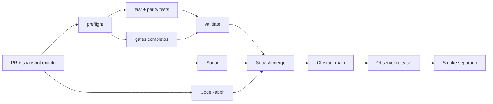

# GrindFlow — Último deploy

> **Candidato v0.1.95: interfaz más clara e i18n coherente por locale.** Base exacta `main` v0.1.94 `50a5d48f8b9a743d799d3c194b48b27cf04adeb7`; simplifica copy ES/EN, elimina strings visibles quemados y localiza metadata/upload sin cambiar datos ni backend.

## Progress convention
- ✅ ~~Completado~~ = verificado; 🚧 Pendiente = en curso; ⛔ bloqueado = dependencia externa.

## Fuentes de verdad
[AGENTS.md](AGENTS.md) · [Spec](docs/GRINDFLOW-SPEC.md) · [Requisitos](docs/REQUIREMENTS.md) · [Transición](docs/STACK-TRANSITION-SYMFONY.md) · [Roadmap #2](https://github.com/pl0n3r/GrindFlow/issues/2)

## Estado del deploy
| Señal | Estado | Evidencia |
| --- | --- | --- |
| Version objetivo | 🚧 **v0.1.95** | `config/version.php`; no publicada |
| Base exacta | ✅ ~~main v0.1.94~~ | `50a5d48f8b9a743d799d3c194b48b27cf04adeb7` |
| CI / Sonar / CodeRabbit del PR | 🚧 Pendiente | Revalidar HEAD final |
| CI del SHA exacto de main | 🚧 No observado para v0.1.94 | Señal post-merge separada |
| Deploy Observer | 🚧 Pendiente | No inferir checkout remoto |
| Production Smoke | ⛔ Login E2E no validado | #73 sigue independiente |
| Symfony en Hostinger | ⛔ NO desplegado | Sin cutover |
| Datos productivos | ✅ ~~No tocados~~ | Cambio de copy/i18n y metadata |

## Huella del cambio
<!-- grindflow:git-delta -->
| Archivos | Inserciones | Eliminaciones | Neto |
| ---: | ---: | ---: | ---: |
| **7** | **+170** | **−132** | **+38** |

## Calidad y entrega
<!-- grindflow:gate-plan -->
| Control | Estado / contrato |
| --- | --- |
| Gates seleccionados | **preflight · fast[contracts] · php-quality · PHPUnit · MariaDB · browser · real-stack · legacy** |
| Gate agregador obligatorio | **validate**: todos los seleccionados; Sonar y CodeRabbit aparte |
| Alcance | Copy ES/EN, catálogo i18n, upload UI y metadata por locale |
| Revisiones | CI/Sonar/CodeRabbit HEAD; exact-main, Observer y Smoke separados |

## Flujo de entrega

## Qué se hizo
- Simplifica etiquetas ES/EN para navegación, dashboard, métricas, cumplimiento y archivos por asignar.
- Mueve mensajes visibles del flujo de upload al catálogo i18n y elimina literales de error/progreso del componente.
- Corrige tildes y redacción española del catálogo sin alterar la variante válida `periodo`.
- El hint de revisión pendiente usa traducción en vez de texto quemado.
- El layout genera metadata por locale desde `app.name` y `app.tagline`, evitando descripción española en `/en`.
- No cambia migraciones, API, permisos, datos productivos ni contratos de backend.

## Archivos modificados en este deploy
Inventario de solo el deploy actual: candidato, no evidencia de publicación:
<!-- grindflow:changed-files -->
- `README.md`
- `config/version.php`
- `messages/en.json`
- `messages/es.json`
- `src/app/[locale]/(panel)/studio/page.tsx`
- `src/app/[locale]/layout.tsx`
- `src/app/[locale]/u/[token]/upload-client.tsx`

## Validación
- La rama debe pasar `validate`, Sonar y revisión final CodeRabbit sobre el mismo HEAD.
- El scope conserva `legacy` y, por clasificación conservadora del catálogo, ejecuta también PHP/DB/browser/real-stack.
- Esta entrega no acredita deploy Hostinger ni cambia el estado del Production Smoke.

## Qué sigue
[Roadmap canónico #2](https://github.com/pl0n3r/GrindFlow/issues/2)

| Lane | Trabajo | Estado |
| --- | --- | --- |
| **NOW** | 🚧 Copy/i18n de interfaz y metadata por locale | 🚧 v0.1.95 candidata |
| **NEXT** | 🚧 Inventario real autorizado + contrato de cutover por módulo | 🚧 GF-ARCH-002 |
| **LATER** | 🚧 Conmutación Symfony por módulo | 🚧 Sin deploy |
| **BLOCKED / EXTERNAL** | ⛔ Resolver login E2E productivo | ⛔ #73 |

## Panorama general pendiente
| Lane | Frente | Estado |
| --- | --- | --- |
| **DONE** | ✅ ~~v0.1.94 fusionada~~ | ✅ ~~aislamiento tenant post-restore~~ |
| **NOW** | 🚧 UI copy + i18n | 🚧 v0.1.95 |
| **NEXT** | 🚧 Snapshot real autorizado + contrato de cutover | 🚧 Sin cutover |
| **LATER** | 🚧 Symfony en Hostinger | 🚧 No desplegado |
| **BLOCKED / EXTERNAL** | ⛔ Smoke autenticado Laravel | ⛔ #73 |
