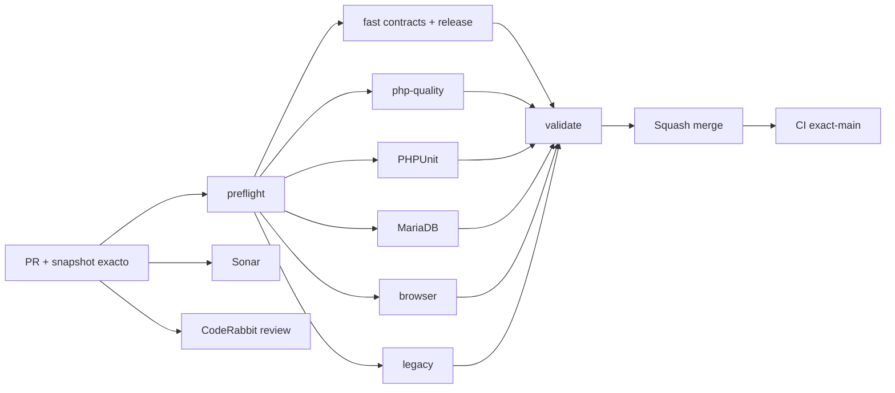

# GrindFlow — Último deploy

  
  
  

> **Snapshot del PR candidato v0.1.8; NO es evidencia de deploy. El contrato «solo el deploy actual» aplica al publicarse.** `main` v0.1.7 `02bdbcb3c5da234b32b06d9b140d1aa9c1f032c9`: CI #35453332338 success y Production Smoke #35453332333 success; SHA remoto Hostinger todavia no verificado.

## Progress convention
- ✅ ~~Completado~~ = concluido y verificado por las compuertas aplicables.
- 🚧 Pendiente = por hacer o en curso, sin tachado.

## Estado del deploy
| Señal | Estado | Evidencia |
| --- | --- | --- |
| Work line | 🚧 **GF-FR-006C · Traffic link lifecycle + CSV boundary** | [Roadmap #88](https://github.com/drpipe1098-commits/GrindFlow/issues/88) |
| Base exacta | ✅ **v0.1.7 · PR #97 fusionado** | `02bdbcb3c5da234b32b06d9b140d1aa9c1f032c9` |
| Version | 🚧 **v0.1.8** | pausa y reanudacion de links |
| CI del PR | 🚧 **pendiente** | validar nuevo SHA |
| Sonar | 🚧 **pendiente** | Quality Gate por SHA |
| CodeRabbit | 🚧 **pendiente** | full review head estable |
| CI del SHA exacto de main | ✅ **v0.1.7 validado** | validate #35453332338 |
| Production Smoke | ✅ **rutas autenticadas previas OK** | #35453332333; no prueba esta feature |
| Migraciones | ✅ **no requiere SQL nuevo** | schema previo sin pendientes |
| Deploy v0.1.8 | 🚧 **no confirmado** | no atribuir CI a Hostinger |

## Huella del cambio
<!-- grindflow:git-delta -->
| Archivos | Inserciones | Eliminaciones | Neto |
| ---: | ---: | ---: | ---: |
| **10** | **+383** | **−44** | **+339** |

## Calidad y entrega
<!-- grindflow:gate-plan -->
| Control | Estado / contrato |
| --- | --- |
| Gates seleccionados | **preflight · fast[contracts] · php-quality · PHPUnit · browser** |
| Lifecycle | PATCH tenant-scoped + transicion bloqueada por fila |
| Retencion | link y token estables, historial de clicks intacto |
| Redirect | disabled → 404 sin nuevo click; active → mismo short URL |
| CSV | maximo 366 fechas UTC inclusivas, 367 rechazadas |
| Produccion | sin SQL nuevo, sin publicacion a plataformas |

## Flujo de entrega

## Qué se hizo
- Tracked links permiten Disable/Enable desde Traffic sin borrar ni rotar el enlace.
- Deshabilitar corta redireccion y atribucion; reactivar restaura la URL corta anterior.
- El historial diario, asociaciones programadas y reportes siguen visibles.
- La autorizacion por rol+tenant se verifica en controller y manager, con lock en update y 503 antes de schema.
- Se corrige finding de CodeRabbit PR #97: exactamente 366 fechas inclusivas admitidas; 367 rechazadas.
- Tests cubren ciclo completo, idempotencia, permisos, cross-tenant, schema ausente y limite leap-year CSV.

## Archivos modificados en este deploy
- `AGENTS.md` — regla durable lifecycle y CSV fechas inclusivas.
- `README.md` — snapshot del candidato v0.1.8.
- `app/Http/Controllers/Traffic/TrafficController.php` — status patch y 366 fechas.
- `app/Services/Traffic/TrackedLinkManager.php` — transicion tenant-scoped atomica.
- `config/version.php` — version humana 0.1.8.
- `docs/GRINDFLOW-SPEC.md` — contrato de status/CSV.
- `docs/REQUIREMENTS.md` — GF-FR-006C.
- `resources/views/traffic/index.blade.php` — acciones Disable/Enable accesibles.
- `routes/web.php` — PATCH status migration-safe.
- `tests/Feature/TrafficAttributionTest.php` — regresiones status y CSV.

## Validación
- Base v0.1.7: CI validate #35453332338 y read-only Production Smoke #35453332333 exitosos.
- PR v0.1.8 requiere CI, Sonar y CodeRabbit del head final; no afirmar deploy ni produccion validada.
- Sin migracion nueva ni borrado, cambios de estado opt-in desde UI.

## Qué sigue
| Lane | Trabajo |
| --- | --- |
| **NOW** | 🚧 Validar/entregar Traffic lifecycle v0.1.8; [roadmap #88](https://github.com/drpipe1098-commits/GrindFlow/issues/88). |
| **NEXT** | 🚧 Storage S3/CORS y capacidad FFmpeg #40. |
| **LATER** | 🚧 E2E visual de Scheduler/Traffic/Distribution y Finance. |
| **BLOCKED / EXTERNAL** | 🚧 Identidad SHA checkout Hostinger verificable. |

## Panorama general pendiente
| Lane | Frente | Estado |
| --- | --- | --- |
| **DONE** | ✅ ~~Distribution audit #95 y Traffic CSV #97~~ | ✅ ~~v0.1.7 CI + Smoke~~ |
| **NOW** | 🚧 Pausa/reanudacion de tracked links | 🚧 v0.1.8 |
| **NEXT** | 🚧 S3 y FFmpeg runtime | 🚧 #40 |
| **LATER** | 🚧 E2E y paridad legado | 🚧 roadmap #88 |
| **BLOCKED / EXTERNAL** | 🚧 Observabilidad Git SHA realmente desplegado | 🚧 Hostinger |
