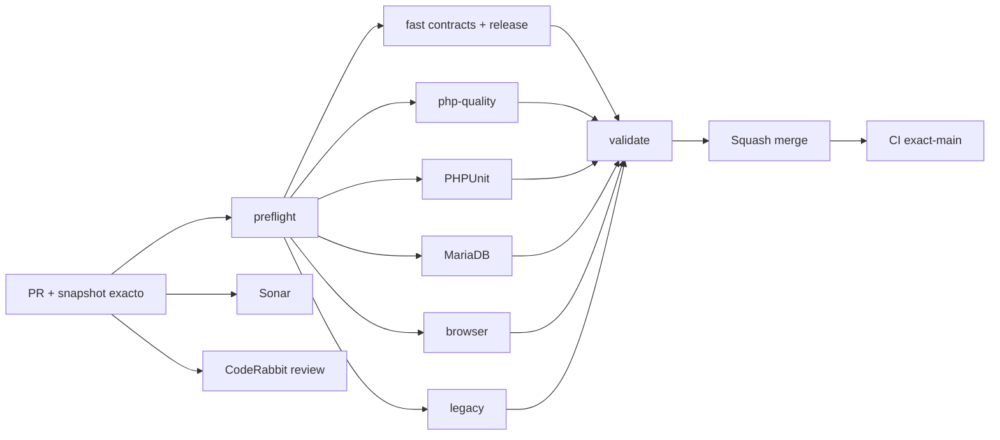

# GrindFlow — Último deploy

  
  
  

> **Snapshot del PR candidato v0.1.11: solo el deploy actual se valida contra el entorno, no solo con CI.** Base `main` v0.1.10 `6ae9e5489b0d758eb3c35f582c9a0d4ebfe2c127`: exact-main CI #35456229918 y Production Smoke read-only #35456229908 success. Identidad SHA checkout Hostinger pendiente.

## Progress convention
- ✅ ~~Completado~~ = concluido y verificado por las compuertas aplicables.
- 🚧 Pendiente = por hacer o en curso, sin tachado.

## Estado del deploy
| Señal | Estado | Evidencia |
| --- | --- | --- |
| Work line | 🚧 **GF-FR-004D · Calendario Scheduler completo y paginado** | [Roadmap #88](https://github.com/drpipe1098-commits/GrindFlow/issues/88) |
| Base exacta | ✅ **v0.1.10 · PR #100 fusionado** | `6ae9e5489b0d758eb3c35f582c9a0d4ebfe2c127` |
| Version | 🚧 **v0.1.11** | paginacion y filtros historicos |
| CI del PR | 🚧 **pendiente** | validar head estable |
| Sonar | 🚧 **pendiente** | Quality Gate por SHA |
| CodeRabbit | 🚧 **pendiente** | full review del head final |
| CI del SHA exacto de main | ✅ **v0.1.10 validado** | validate #35456229918 |
| Production Smoke | ✅ **v0.1.10 observado** | #35456229908, GET de modulos + CSV |
| Deploy v0.1.11 | 🚧 **no confirmado** | Smoke posterior necesario |
| Migraciones | ✅ **sin SQL nuevo** | consulta paginada sobre schema existente |

## Huella del cambio
<!-- grindflow:git-delta -->
| Archivos | Inserciones | Eliminaciones | Neto |
| ---: | ---: | ---: | ---: |
| **8** | **+0** | **−0** | **+0** |

## Calidad y entrega
<!-- grindflow:gate-plan -->
| Control | Estado / contrato |
| --- | --- |
| Gates seleccionados | **preflight · fast[contracts] · php-quality · PHPUnit · browser** |
| Paging | 25 filas, total real, orden UTC + UUID, paginas >100 |
| Filters | status, destination y fechas UTC preservados en Prev/Next |
| Tenancy | total y paginas organizacion-scoped sin datos ajenos |
| UI | muestra rango/total y advierte que el calendario es preview de pagina |
| History | destinos deshabilitados filtrables; nuevos schedules solo activos |
| Performance | delivery eager-loaded; selector de activos reutiliza lectura ordenada |

## Flujo de entrega

## Qué se hizo
- El listado Scheduler deja de ocultar publicaciones por un limite silencioso de 100: muestra paginas de 25 con conteo SQL real.
- Orden estable por scheduled_for_utc e id, evitando duplicados/omisiones de pagina con horarios identicos.
- Filtros de status/destino/fechas persisten en Previous y Next sin propagar parametros no validados; pagina positiva y acotada.
- Historial de destinos deshabilitados se puede filtrar sin exponerlos como seleccion para nueva publicacion.
- Mejor feedback para pagina fuera de rango y vista calendario claramente etiquetada como preview de la pagina actual.
- Eager-load de delivery reduce consultas repetidas para controles de editar/cancelar.
- Pruebas en >100 schedules, tenant ajeno, orden estable, filtro combinado, destinos inactivos y pagina invalida.
- Sin migraciones ni publicacion a plataformas externas.

## Archivos modificados en este deploy
- `AGENTS.md` — regla durable paginacion/seguridad.
- `README.md` — snapshot exacto v0.1.11.
- `app/Http/Controllers/Scheduling/SchedulerController.php` — query paginada, total, filtros y eager-loading.
- `config/version.php` — version humana 0.1.11.
- `docs/GRINDFLOW-SPEC.md` — calendario navegable.
- `docs/REQUIREMENTS.md` — GF-FR-004D.
- `resources/views/scheduling/index.blade.php` — navegacion, rango y filtro historico.
- `tests/Feature/SchedulingTest.php` — regresion de volumen y tenant.

## Validación
- Base v0.1.10: CI #35456229918, Production Smoke #35456229908 successful.
- v0.1.11 necesita CI, Sonar, CodeRabbit y comprobacion exact-main/Smoke sin writes productivos.
- Production Smoke read-only no cambia schedules y no verifica interacciones de cambio de pagina mediante navegador de produccion.

## Qué sigue
| Lane | Trabajo |
| --- | --- |
| **NOW** | 🚧 Calendario Scheduler paginado v0.1.11. [Roadmap #88](https://github.com/drpipe1098-commits/GrindFlow/issues/88). |
| **NEXT** | 🚧 Media Storage/CORS/FFmpeg runtime #40. |
| **LATER** | 🚧 Buscadores paginados para activos/enlaces y Finance reconciliation. |
| **BLOCKED / EXTERNAL** | 🚧 Marcador SHA exacto Hostinger no disponible. |

## Panorama general pendiente
| Lane | Frente | Estado |
| --- | --- | --- |
| **DONE** | ✅ ~~Traffic lifecycle + Scheduler link-edit #100~~ | ✅ ~~v0.1.10 CI + Smoke~~ |
| **NOW** | 🚧 Paginar Scheduler sin corte a 100 | 🚧 v0.1.11 |
| **NEXT** | 🚧 Media storage/FFmpeg | 🚧 #40 |
| **LATER** | 🚧 Búsqueda assets/enlaces, Finance | 🚧 roadmap #88 |
| **BLOCKED / EXTERNAL** | 🚧 Git SHA checkout Hostinger | 🚧 observabilidad |
