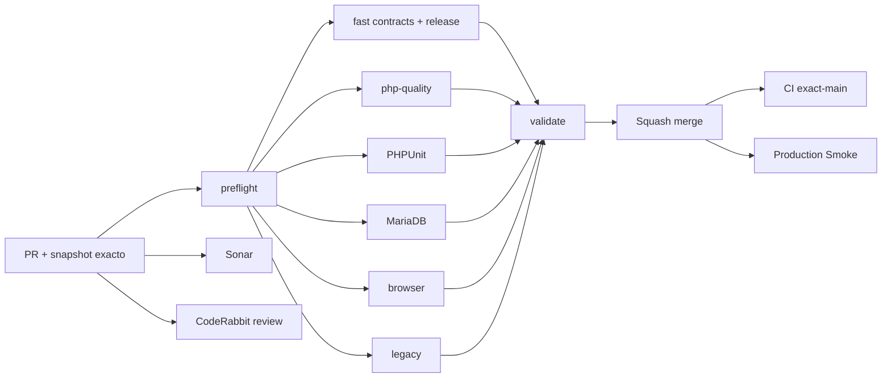

# GrindFlow — Último deploy

  
  
  

> **Snapshot del PR candidato v0.1.3; NO es evidencia de deploy.** El contrato «solo el deploy actual» aplica al publicarse; hoy el último main validado es v0.1.2 y producción requiere verificación separada.

## Progress convention

- ✅ ~~Completado~~ = concluido y verificado por las compuertas que correspondan.
- 🚧 Pendiente = por hacer o en curso, sin tachado.

## Estado del deploy

| Señal | Estado | Evidencia |
| --- | --- | --- |
| Work line | 🚧 **GF-OPS · Diagnóstico de esquema y Smoke** | [Roadmap #88](https://github.com/drpipe1098-commits/GrindFlow/issues/88) |
| Base exacta | ✅ **v0.1.2 · PR #91 fusionado** | `main` `98ad68b32fea1e56538b7386cd32f6eb7699b1d3` |
| Version | 🚧 **v0.1.3** | patch de observabilidad segura |
| CI del PR | ✅ **validado para v0.1.3** | #35430563622 sobre `9a8ec205` |
| Sonar | ✅ **Quality Gate OK** | 0 issues; `9a8ec205` |
| CodeRabbit | 🚧 **hallazgo README en resolución** | revisión del head `9a8ec205` |
| CI del SHA exacto de main | 🚧 **v0.1.3 por verificar tras merge** | v0.1.2 CI #35430357855 |
| Production Smoke | 🚧 **schema bloqueado** | [#69](https://github.com/drpipe1098-commits/GrindFlow/issues/69): 7 migraciones pendientes |
| Migraciones | 🚧 **no ejecutadas** | backup externo restaurable + aprobación expresa |

## Huella del cambio

<!-- grindflow:git-delta -->

| Archivos | Inserciones | Eliminaciones | Neto |
| ---: | ---: | ---: | ---: |
| **11** | **+289** | **−57** | **+232** |

## Calidad y entrega

<!-- grindflow:gate-plan -->

| Control | Estado / contrato |
| --- | --- |
| Gates seleccionados | **preflight · fast[contracts] · php-quality · PHPUnit · MariaDB · browser** |
| Tests | Admin System, esquema parcial, Smoke bloqueado, Vault 500 y enlace ausente |
| Autorización | solo admin; sin errores crudos, cookies ni credenciales en la UI |
| Producción | Smoke solo lectura; nunca ejecuta migraciones |

## Flujo de entrega

## Qué se hizo

- Admin > System separa la conexión MariaDB del inventario de migraciones: sin falsos Offline.
- Readiness de Vault, Scheduling, Distribution, Traffic y Finance según las tablas reales, incluso si otro módulo tiene migraciones pendientes.
- Un inventario desconocido bloquea el formulario; los errores internos no se muestran.
- Smoke reutiliza la sesión para comprobar Vault aunque haya migraciones pendientes y registra media storage sin nuevos requests.
- Si Vault responde 500 o Dashboard omite el enlace Vault, el issue distingue ambos incidentes; no reintenta logins ni aplica SQL.
- Tests PHP/MariaDB y contrato fake HTTP para esquema parcial, enlace ausente y bloqueos; regla duradera de avances sustanciales por mensaje.

## Archivos modificados en este deploy propuesto (PR #92; no desplegado)

- `README.md` — snapshot de v0.1.3.
- `config/version.php` — versión humana v0.1.3.
- `app/Http/Controllers/Admin/SystemController.php` — conexión, inventario y módulos.
- `resources/views/admin/system.blade.php` — panel de readiness.
- `tests/Feature/AdminSystemTest.php` — inventario fallido y esquema parcialmente migrado.
- `tests/Feature/AdminMigrationReadinessTest.php` — lote pendiente y módulos independientes.
- `scripts/production-smoke.sh` — Vault solo lectura pese a migraciones.
- `scripts/production-smoke-contract.sh` — bloqueo, Vault 500 y enlace ausente.
- `.github/workflows/production-smoke.yml` — incidentes concurrentes visibles.
- `AGENTS.md` — avance sustancial por mensaje.
- `docs/DEVELOPMENT-MODEL.md` — contrato operativo de diagnóstico.

## Validación

- v0.1.2 PR #91 fusionado; la identidad real del checkout Hostinger sigue sin verificar.
- v0.1.3 CI / validate #35430563622 y Sonar OK sobre el head `9a8ec205`; revisión del texto de entrega por CodeRabbit y exact-main tras merge pendientes.
- Las migraciones, backup externo y validación productiva requieren evidencia separada.

## Qué sigue

| Lane | Trabajo |
| --- | --- |
| **NOW** | 🚧 Validar v0.1.3; [roadmap #88](https://github.com/drpipe1098-commits/GrindFlow/issues/88). |
| **NEXT** | 🚧 Identidad desplegada y lote de [#69](https://github.com/drpipe1098-commits/GrindFlow/issues/69). |
| **LATER** | 🚧 Auditoría de intentos y browser de módulos. |
| **BLOCKED / EXTERNAL** | 🚧 Backup restaurable, aprobación, storage S3 y FFmpeg. |

## Panorama general pendiente

| Lane | Frente | Estado |
| --- | --- | --- |
| **DONE** | ✅ ~~Workflow #87 y navegación #90/#91 fusionados~~ | ✅ ~~CI del PR; no implica producción~~ |
| **NOW** | 🚧 Diagnósticos y Smoke | 🚧 v0.1.3 |
| **NEXT** | 🚧 Migraciones y storage | 🚧 [#34](https://github.com/drpipe1098-commits/GrindFlow/issues/34) · [#40](https://github.com/drpipe1098-commits/GrindFlow/issues/40) |
| **LATER** | 🚧 Finance y paridad legado | 🚧 Después del esquema |
| **BLOCKED / EXTERNAL** | 🚧 Producción | 🚧 Backup/aprobación y deploy |
