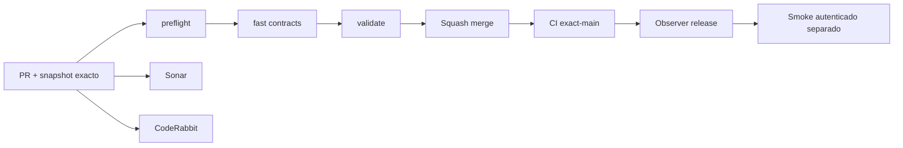

# GrindFlow — Último deploy

> **Candidato v0.1.67: programación semanal visible en el admin Symfony.** El runtime productivo continúa siendo Laravel en Hostinger; Symfony sigue aislado. Base exacta `main` v0.1.66 `51787682a4cd09cd49edb3cc9ffcbe3ab26f1417`, CI exact-main success (run 35602062735). El panel S3 permite configurar la regla y ver bloqueos reales sin crear publicaciones ni llamar plataformas externas.

## Progress convention
- ✅ ~~Completado~~ = verificado; 🚧 Pendiente = en curso; ⛔ bloqueado = dependencia externa.

## Fuentes de verdad
[AGENTS.md](AGENTS.md) · [Spec](docs/GRINDFLOW-SPEC.md) · [Requisitos](docs/REQUIREMENTS.md) · [Transición](docs/STACK-TRANSITION-SYMFONY.md) · [Roadmap #2](https://github.com/pl0n3r/GrindFlow/issues/2)

## Estado del deploy
| Señal | Estado | Evidencia |
| --- | --- | --- |
| Version objetivo | 🚧 **v0.1.67** | `config/version.php` |
| Base exacta | ✅ ~~main v0.1.66~~ | `51787682a4cd09cd49edb3cc9ffcbe3ab26f1417` |
| CI del PR | 🚧 Head v0.1.67 por validar | `GrindFlow CI / validate` |
| Sonar | 🚧 Pendiente | SonarCloud PR |
| CodeRabbit | 🚧 Pendiente | PR |
| CI del SHA exacto de main | ✅ ~~v0.1.66 success~~ | run `35602062735` |
| Deploy Observer | ✅ ~~v0.1.66 observado~~ | run `35602062793`; no prueba Symfony remoto ni SHA Hostinger |
| Production Smoke | ⛔ Credencial E2E productiva pendiente | [Issue #1](https://github.com/pl0n3r/GrindFlow/issues/1) |
| Symfony S3 en Hostinger | ⛔ NO desplegado | Solo entorno aislado CI |
| Migraciones | ✅ ~~Sin migración nueva en este candidato~~ | Producción intacta |

## Huella del cambio
<!-- grindflow:git-delta -->
| Archivos | Inserciones | Eliminaciones | Neto |
| ---: | ---: | ---: | ---: |
| **7** | **+000** | **−000** | **+000** |

## Calidad y entrega
<!-- grindflow:gate-plan -->
| Control | Estado / contrato |
| --- | --- |
| Gates seleccionados | **preflight · fast[contracts] · symfony-preview** |
| Alcance | S3 visible: editar regla semanal + consultar preview/backend y bloqueos desde admin móvil |
| Revisiones | CI/Sonar/CodeRabbit, exact-main y Hostinger independientes |

## Flujo de entrega

## Qué se hizo
- Nuevo panel React `Regla y vista previa semanal` dentro del admin Symfony, navegable desde Programación S3 y usable a 360 px.
- Editores autorizados configuran zona IANA, días, hora local y máximo diario usando el `PUT` tenant-safe y CSRF ya existente; roles sin escritura conservan lectura.
- El panel consume el preview real del backend y muestra las razones de bloqueo por recurso, sin duplicar reglas de elegibilidad en TypeScript.
- La UI mantiene explícitos `review_only` y `Publicación bloqueada`: no crea schedules, no llama proveedores y no transforma clasificación S2 en autorización.

## Archivos modificados en este deploy
Inventario de solo el deploy actual: cambio candidato en PR, NO prueba de deploy de Symfony en Hostinger.
- `README.md`
- `config/version.php`
- `docs/GRINDFLOW-SPEC.md`
- `symfony/frontend/admin/AdminApp.tsx`
- `symfony/frontend/admin/WeeklyPlannerPanel.tsx`
- `symfony/frontend/admin/admin.css`
- `symfony/tests/e2e/preview.spec.mjs`

## Validación
- CI/Sonar/CodeRabbit del candidato v0.1.67 por verificar; la base v0.1.66 está fusionada y su CI exact-main es success.
- Sin checkout local; GitHub Actions valida TypeScript/Vite, Symfony/MariaDB y Chromium móvil. Producción intacta.

## Qué sigue
[Roadmap canónico #2](https://github.com/pl0n3r/GrindFlow/issues/2)

| Lane | Trabajo | Estado |
| --- | --- | --- |
| **NOW** | 🚧 Validar planner semanal visible v0.1.67 | 🚧 CI y revisión |
| **NEXT** | 🚧 Contrato explícito de autorización de distribución y slots semanales | 🚧 Sin publicación externa |
| **LATER** | 🚧 Scheduler Symfony + distribución autorizada + Traffic | 🚧 S3–S5 |
| **BLOCKED / EXTERNAL** | ⛔ Cutover sin paridad/datos migrados; Smoke sin credencial | ⛔ Dependencia externa |

## Panorama general pendiente
| Lane | Frente | Estado |
| --- | --- | --- |
| **DONE** | ✅ ~~Dashboard Laravel v0.1.30~~ | ✅ ~~Vault Symfony clasificación v0.1.63~~ |
| **NOW** | 🚧 Planner semanal visible S3 v0.1.67 | 🚧 CI y revisión |
| **NEXT** | 🚧 Autorización de distribución + slots | 🚧 S3 |
| **LATER** | 🚧 Paridad del monolito modular | 🚧 S3–S5 |
| **BLOCKED / EXTERNAL** | ⛔ Sin cutover Symfony | ⛔ Sin credencial Smoke |
