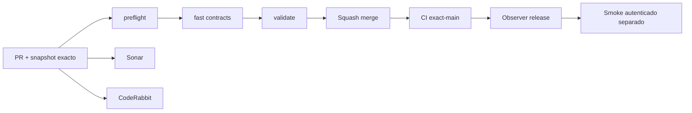

# GrindFlow — Último deploy

> **Snapshot v0.1.31: solo el deploy actual.** Base `main` v0.1.30 `6507ea2631aea5b485b3238b1c1dc7f4ca8fff4b`. S1: identidad, organizaciones y membresías Doctrine sobre MariaDB **aislada**. No se migran datos Laravel ni se habilita un login falso. Symfony continúa sin deploy/cutover, Laravel atiende producción.

## Progress convention
- ✅ ~~Completado~~ = verificado; 🚧 Pendiente = en curso; ⛔ bloqueado = dependencia externa.

## Fuentes de verdad
[AGENTS.md](AGENTS.md) · [Spec](docs/GRINDFLOW-SPEC.md) · [Requisitos](docs/REQUIREMENTS.md) · [Transición](docs/STACK-TRANSITION-SYMFONY.md) · [Roadmap #2](https://github.com/pl0n3r/GrindFlow/issues/2)

## Estado del deploy
| Señal | Estado | Evidencia |
| --- | --- | --- |
| Version objetivo | 🚧 **v0.1.31** | `config/version.php` |
| Base exacta | ✅ ~~main v0.1.30~~ | `6507ea2631aea5b485b3238b1c1dc7f4ca8fff4b` |
| CI del PR | 🚧 Pendiente head final | `GrindFlow CI / validate` |
| Sonar | 🚧 Pendiente | SonarCloud PR |
| CodeRabbit | 🚧 Revisión por comprobar | PR |
| CI del SHA exacto de main | 🚧 Después del merge | No inferir del PR |
| Deploy Observer | 🚧 Release v0.1.31 por observar | v0.1.30 observado como release humana |
| Production Smoke | ⛔ Sin credencial E2E de solo lectura | [Issue #1](https://github.com/pl0n3r/GrindFlow/issues/1) |
| Symfony S1 desplegado | ⛔ NO | Solo entorno aislado de código/CI |
| Migraciones | 🚧 Solo MariaDB CI descartable | No producción |

## Huella del cambio
<!-- grindflow:git-delta -->
| Archivos | Inserciones | Eliminaciones | Neto |
| ---: | ---: | ---: | ---: |
| **14** | **+378** | **−37** | **+341** |

## Calidad y entrega
<!-- grindflow:gate-plan -->
| Control | Estado / contrato |
| --- | --- |
| Gates seleccionados | **preflight · fast[contracts] · php-quality · PHPUnit · MariaDB · browser · real-stack · legacy · symfony-preview** |
| Alcance | Entidades Doctrine, migración reversible, pruebas MariaDB y versión pública |
| Revisiones | CI/Sonar/CodeRabbit, exact-main y Hostinger independientes |

## Flujo de entrega

## Qué se hizo
- S1 de arquitectura objetivo: entidades para usuarios globales, organizaciones y membresías, más índices, unicidad y FKs.
- Tablas `gf_identity_*` nuevas, nunca las `users/organizations/memberships` actuales de Laravel; no compartir escritor o migrar producción.
- CI inicia y revierte Doctrine Migrations exclusivamente sobre MariaDB descartable y prueba aislamiento/duplicados; PHP de Symfony lee versión dinámica, no quedó fijo en 0.1.24.
- Version humana consecutiva **0.1.30 → 0.1.31** en footer; sin prometer login/admin Symfony operativo hasta S1 siguiente slice.

## Archivos modificados en este deploy
- `.github/workflows/grindflow-ci.yml`
- `README.md`
- `config/version.php`
- `symfony/README.md`
- `symfony/config/packages/doctrine.yaml`
- `symfony/config/packages/doctrine_migrations.yaml`
- `symfony/migrations/Version20260920093100.php`
- `symfony/src/Identity/Entity/IdentityMembership.php`
- `symfony/src/Identity/Entity/IdentityOrganization.php`
- `symfony/src/Identity/Entity/IdentityUser.php`
- `symfony/templates/base.html.twig`
- `symfony/tests/php/IdentitySchemaTest.php`
- `symfony/tests/php/PreviewTest.php`

- `symfony/config/packages/test/doctrine.yaml`

## Validación
- CI del PR y SHA exact-main, después observación de release Hostinger, después Smoke autenticado.
- Nunca lanzar migración Doctrine contra la base Laravel actual o Hostinger.

## Qué sigue
| Lane | Trabajo |
| --- | --- |
| **NOW** | 🚧 Comprobar migración identidad y revertir en CI, [roadmap #2](https://github.com/pl0n3r/GrindFlow/issues/2) |
| **NEXT** | 🚧 S1 sesión/login seguro y selector explícito de tenant Symfony |
| **LATER** | 🚧 S2 Vault móvil → reglas → distribución autorizada → piloto |
| **BLOCKED / EXTERNAL** | ⛔ Cutover Symfony sin paridad; credencial Smoke |

## Panorama general pendiente
| Lane | Frente | Estado |
| --- | --- | --- |
| **DONE** | ✅ ~~Home y dashboard Laravel v0.1.30~~ | ✅ ~~Observer release v0.1.30~~ |
| **NOW** | 🚧 Esquema aislado S1 v0.1.31 | 🚧 Pruebas/revisión |
| **NEXT** | 🚧 Login y organizaciones Symfony | 🚧 Sin cuentas productivas |
| **LATER** | 🚧 Automatización completa | 🚧 S2–S5 |
| **BLOCKED / EXTERNAL** | ⛔ No cutover Symfony | ⛔ Sin credencial Smoke |
