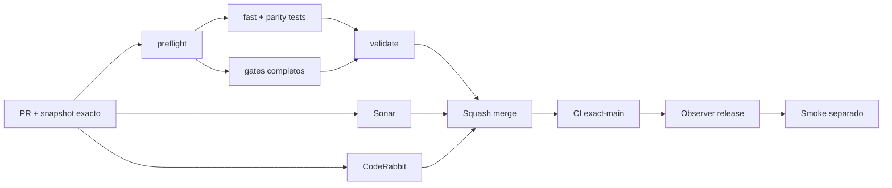

# GrindFlow — Último deploy

> **Candidato v0.1.99: cadena offline de evidencia single-writer para GF-ARCH-002.** Base exacta `main` v0.1.98 `8a371ae471f40f3a0b92a1eab9997e90ff9a3b02`; verifica referencias de un ensayo no productivo sin congelar escritores reales ni autorizar cutover.

## Progress convention
- ✅ ~~Completado~~ = verificado; 🚧 Pendiente = en curso; ⛔ bloqueado = dependencia externa.

## Fuentes de verdad
[AGENTS.md](AGENTS.md) · [Spec](docs/GRINDFLOW-SPEC.md) · [Requisitos](docs/REQUIREMENTS.md) · [Transición](docs/STACK-TRANSITION-SYMFONY.md) · [Roadmap #2](https://github.com/pl0n3r/GrindFlow/issues/2)

## Estado del deploy
| Señal | Estado | Evidencia |
| --- | --- | --- |
| Version objetivo | 🚧 **v0.1.99** | `config/version.php`; no publicada |
| Base exacta | ✅ ~~main v0.1.98~~ | `8a371ae471f40f3a0b92a1eab9997e90ff9a3b02` |
| CI del PR | 🚧 Pendiente | Revalidar HEAD final |
| Sonar del PR | 🚧 Pendiente | Revalidar HEAD final |
| CodeRabbit del PR | 🚧 Pendiente | Revalidar HEAD final |
| CI del SHA exacto de main | 🚧 No observado para v0.1.98 | Production Smoke separado y no validado |
| Deploy Observer | 🚧 Pendiente | No inferir checkout remoto |
| Production Smoke | ⛔ Login E2E no validado | #73 sigue independiente |
| Symfony en Hostinger | ⛔ NO desplegado | Sin cutover |
| Datos productivos | ✅ ~~No tocados~~ | Referencias offline; sin datos ni secretos productivos |

## Huella del cambio
<!-- grindflow:git-delta -->
| Archivos | Inserciones | Eliminaciones | Neto |
| ---: | ---: | ---: | ---: |
| **6** | **+799** | **−32** | **+767** |

## Calidad y entrega
<!-- grindflow:gate-plan -->
| Control | Estado / contrato |
| --- | --- |
| Gates seleccionados | **preflight · fast[operational contracts + automation syntax + README dashboard] · php-quality · PHPUnit · MariaDB · browser · real-stack · legacy · symfony-preview** |
| Gate agregador obligatorio | **validate**: todos los seleccionados; Sonar y CodeRabbit aparte |
| Alcance | GF-ARCH-002: cadena single-writer redacted, sin ejecución de cutover |
| Revisiones | CI/Sonar/CodeRabbit HEAD; exact-main, Observer y Smoke separados |

## Flujo de entrega

## Qué se hizo
- Nuevo `scripts/single-writer-rehearsal-evidence.py`: valida receipts mínimos del ensayo de escritor único sin ejecutar operaciones.
- Conecta el reporte previo de evidencia de operador al nuevo receipt mediante hashes SHA-256, módulo y huella del inventario.
- Vuelve a comprobar la huella del inventario contra las migraciones del checkout y rechaza módulos sin ownership revisado.
- Exige escritor anterior y rollback Laravel, escritor candidato Symfony, freeze declarado, exclusividad del candidato y ausencia de writers concurrentes.
- Rechaza reutilizar huellas de inventario o bundle como digest de referencias, o evidencia single-writer entre etapas; también rechaza observaciones cronológicamente anteriores, campos adicionales, enteros como booleanos y JSON con claves duplicadas o números no finitos.
- Limita stdin a 1.000.000 bytes UTF-8; no usa red, SQL, procesos externos ni rutas proporcionadas por el caller.
- El reporte mantiene `receipt_content_verified=false`, `production_ready=false` y `production_authorized=false`; autorización y smoke siguen pendientes.
- Suite de regresión incluida en el gate `fast`. No cambia la infraestructura productiva ni el dueño real de escritura.

## Archivos modificados en esta entrega candidata
Inventario de solo esta entrega candidata: no constituye evidencia de publicación:
<!-- grindflow:changed-files -->
- `.github/workflows/grindflow-ci.yml`
- `README.md`
- `config/version.php`
- `docs/DATA-CUTOVER-INVENTORY.md`
- `scripts/single-writer-rehearsal-evidence.py`
- `tests/test_single_writer_rehearsal_evidence.py`

## Validación
- Exigir `validate`, Sonar y full review CodeRabbit sobre el HEAD final.
- Por tocar workflow, CI incluye los gates completos y `symfony-preview`.
- Los recibos anteriores y el single-writer deben compartir módulo e inventario del checkout, con hashes de evidencia distintos y orden temporal correcto.
- Rechazar hashes inventados aunque coincidan entre etapas, módulos no revisados, JSON UTF-16/UTF-32 y duplicación de claves.
- Ningún receipt demuestra por sí solo freeze efectivo, autorización del propietario, backup real validado, despliegue o Production Smoke.

## Qué sigue
[Roadmap canónico #2](https://github.com/pl0n3r/GrindFlow/issues/2)

| Lane | Trabajo | Estado |
| --- | --- | --- |
| **NOW** | 🚧 Contrato offline single-writer | 🚧 v0.1.99 candidata |
| **NEXT** | 🚧 Revisión humana de evidencia + autorización separada | 🚧 GF-ARCH-002 |
| **LATER** | 🚧 Conmutación Symfony por módulo | 🚧 Sin deploy |
| **BLOCKED / EXTERNAL** | ⛔ Resolver login E2E productivo | ⛔ #73 |

## Panorama general pendiente
| Lane | Frente | Estado |
| --- | --- | --- |
| **DONE** | ✅ ~~v0.1.98 fusionada~~ | ✅ ~~verificador de evidencia de operador~~ |
| **NOW** | 🚧 Single-writer evidence verifier | 🚧 v0.1.99 |
| **NEXT** | 🚧 Evidencia revisada fuera de banda + autorización separada | 🚧 Sin cutover |
| **LATER** | 🚧 Symfony en Hostinger | 🚧 No desplegado |
| **BLOCKED / EXTERNAL** | ⛔ Smoke autenticado Laravel | ⛔ #73 |
