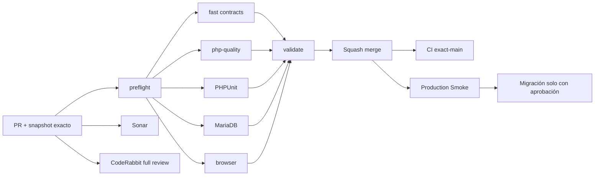

# GrindFlow — Último deploy

  
  
  

> **Development dashboard** · snapshot profesional de **solo el deploy actual**. CI, deploy y validación en producción son evidencias distintas.

## Estado del deploy

| Señal | Estado actual | Evidencia |
| --- | --- | --- |
| Work line | ✅ **GF-FR-006 · Traffic attribution core v1** | MERGED en `main` |
| Commit exacto de main | ✅ **main** | `5ca1818952cbc93990b366cc0034b7e36ad38ecc` |
| Validación del feature | ✅ **PR #73** | GrindFlow CI #307 completo + Sonar Quality Gate passed |
| Code review | 🟠 **sin findings abiertos al merge** | CodeRabbit seguía `pending`; no se atribuye review final no emitido |
| Privacidad | ✅ **sin identificadores crudos** | no se persisten IP, User-Agent, referrer ni country |
| CI del SHA exacto de main | ⚪ **no observable por el conector** | evidencia de PR separada de exact-main |
| Production Smoke | 🟠 **pendiente de evidencia exact-main** | no se confunde con CI del PR |
| Migraciones | 🟠 **traffic attribution sin aplicar** | requiere aprobación operacional explícita |

## Huella del cambio

<!-- grindflow:git-delta -->

| Archivos | Inserciones | Eliminaciones | Neto |
| ---: | ---: | ---: | ---: |
| **1** | **+35** | **−59** | **-24** |

La huella se calcula con `git diff --numstat`; CI rechaza este dashboard si queda desactualizado.

## Calidad y entrega

<!-- grindflow:gate-plan -->

| Control | Estado / contrato |
| --- | --- |
| Gates seleccionados | **preflight · fast[contracts]** |
| GrindFlow CI | docs-only: contratos + dashboard exacto |
| Sonar | análisis independiente del PR documental |
| CodeRabbit | review documental no bloquea evidencia histórica ya registrada |
| Migración | no se ejecuta desde este PR |
| Producción | no se modifica desde este PR documental |

## Flujo de entrega

## Qué se hizo

- Sincroniza el dashboard después del squash merge de Traffic attribution core v1.
- Registra el nuevo `main` exacto `5ca1818952cbc93990b366cc0034b7e36ad38ecc`.
- Conserva CI #307 y Sonar del head de PR #73 como evidencia del feature, separados de exact-main.
- Registra que CodeRabbit seguía pendiente al merge sin inventar una aprobación final.
- Mantiene Production Smoke y la migración de Traffic como pasos operacionales separados.
- Mueve el carril activo del roadmap a **GF-FR-007 Finance**.
- No cambia runtime, schema, secrets, redirects ni contenido de producción.

## Archivos modificados en este deploy

- `README.md` — snapshot post-merge de Traffic y transición del roadmap a Finance.

## Validación

- Traffic attribution core v1 está **MERGED** en `main`.
- Commit exacto: `5ca1818952cbc93990b366cc0034b7e36ad38ecc`.
- PR #73 pasó GrindFlow CI #307 completo y Sonar Quality Gate antes del merge.
- CodeRabbit no había emitido review final; no existían threads abiertos al momento del merge.
- La privacidad del slice sigue basada en HMAC por link y ausencia de identificadores crudos persistidos.
- La migración de Traffic **no** se ejecutó desde CI ni desde este cierre documental.
- Production Smoke del nuevo main sigue siendo evidencia separada.

## Qué sigue

| Lane | Trabajo |
| --- | --- |
| **NOW** | Diseñar e implementar **GF-FR-007 Finance core v1** con aislamiento tenant, roles y ledger auditable. |
| **NEXT** | Integrar tracked links dentro del flujo de Distribution/campañas. |
| **NEXT** | Validar exact-main + Production Smoke antes de cualquier migración productiva. |
| **BLOCKED / EXTERNAL** | Migraciones de Scheduling/Distribution/Traffic requieren aprobación operacional. |
| **LATER** | Providers reales de Distribution y retiro progresivo del legacy. |

## Panorama general pendiente

| Lane | Frente | Estado |
| --- | --- | --- |
| **NOW** | Finance | GF-FR-007 · siguiente slice funcional |
| **NEXT** | Distribution providers | adapters reales + auth/reconnect |
| **NEXT** | Traffic + Distribution | integración de tracked links por campaña |
| **BLOCKED / EXTERNAL** | Scheduling/Distribution/Traffic producción | migrations + Smoke |
| **BLOCKED / EXTERNAL** | Hosting / storage | FFmpeg real + S3-compatible |
| **LATER** | Legacy retirement | solo tras GF-MIG |
