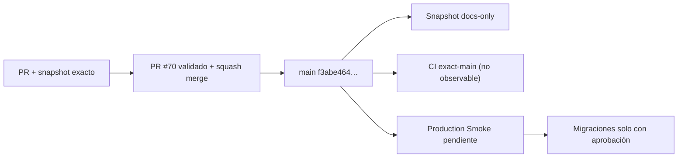

# GrindFlow — Último deploy

  
  
  

> **Development dashboard** · snapshot profesional de **solo el deploy actual**. CI, deploy y validación en producción son evidencias distintas.

## Estado del deploy

| Señal | Estado actual | Evidencia |
| --- | --- | --- |
| Work line | ✅ **GF-FR-005 · Distribution core v1** | MERGED por squash en PR #70 |
| Main exacto | ✅ **main** | `f3abe464565bbccab8ec1e3be4c2e4597164cb04` |
| Validación del feature | ✅ **PR #70 validado** | GrindFlow CI #297 completo + Sonar Quality Gate passed |
| Code review | ✅ **findings funcionales corregidos** | starvation, queue outage, lease fencing y rate-limit budget cubiertos por regresiones |
| CI del SHA exacto de main | ⚪ **no observable por el conector** | no se atribuye evidencia `push` que el conector no expone |
| Producción | ⚪ **sin cambios** | ningún provider real, secret ni publicación externa habilitada |
| Migraciones | 🟠 **pendientes de aprobación** | Scheduling/Distribution permanecen deploy-before-migration safe |

## Huella del cambio

<!-- grindflow:git-delta -->

| Archivos | Inserciones | Eliminaciones | Neto |
| ---: | ---: | ---: | ---: |
| **1** | **+49** | **−74** | **-25** |

La huella se calcula con `git diff --numstat`; CI rechaza este dashboard si queda desactualizado.

## Calidad y entrega

<!-- grindflow:gate-plan -->

| Control | Estado / contrato |
| --- | --- |
| Gates seleccionados | **preflight · fast[contracts]** |
| GrindFlow CI | snapshot docs-only: contratos + dashboard exacto |
| Feature CI | PR #70 → CI #297 completo ✅ |
| Sonar | Quality Gate passed en PR #70 |
| Migraciones | no se ejecutan desde este PR documental |
| Producción | no se modifica desde este PR documental |

## Flujo de entrega

## Qué se hizo

- Sincroniza el dashboard después del merge de Distribution core v1.
- Registra `main` exacto en `f3abe464565bbccab8ec1e3be4c2e4597164cb04`.
- Registra CI #297 y Sonar como evidencia del head final del PR #70.
- Mantiene exact-main CI, Production Smoke y migraciones como evidencias/acciones separadas.
- No cambia runtime, schema, providers, secrets ni producción.

## Archivos modificados en este deploy

- `README.md` — snapshot documental post-merge de GF-FR-005.

## Validación

- Distribution core v1 ya está **MERGED en `main`**.
- PR #70 pasó GrindFlow CI #297 completo y Sonar Quality Gate.
- Los findings funcionales previos de CodeRabbit quedaron corregidos con regresiones dedicadas.
- La revisión final de CodeRabbit seguía procesándose al momento del merge y no tenía threads abiertos.
- El conector no expone CI `push` para el SHA exacto de `main`; no se atribuye esa evidencia.
- La migración `publication_deliveries` **no se ha ejecutado en producción**.
- No hay providers reales registrados ni mutaciones externas habilitadas.

## Qué sigue

| Lane | Trabajo |
| --- | --- |
| **NOW** | Cerrar snapshot post-merge de Distribution. |
| **NEXT** | GF-FR-006 Traffic attribution sobre publicaciones distribuidas. |
| **NEXT** | Diseñar primer adapter real detrás de `DistributionProvider`, con sandbox y credenciales cifradas. |
| **BLOCKED / EXTERNAL** | Migraciones Scheduling/Distribution y providers reales requieren aprobación/configuración operacional. |
| **LATER** | Production Smoke exact-main cuando exista evidencia observable. |

## Panorama general pendiente

| Lane | Frente | Estado |
| --- | --- | --- |
| **NOW** | Distribution | core v1 MERGED en `main` |
| **NEXT** | Traffic attribution | GF-FR-006 |
| **NEXT** | Distribution providers | adapters reales + auth/reconnect por plataforma |
| **BLOCKED / EXTERNAL** | Scheduling/Distribution producción | migration approval + Smoke |
| **BLOCKED / EXTERNAL** | Hosting / storage | FFmpeg real + S3-compatible |
| **LATER** | Legacy retirement | solo tras los requisitos GF-MIG pendientes |

| Lane | Frente | Estado |
| --- | --- | --- |
| **NOW** | Distribution | core v1 IMPLEMENTED · PR #70 abierto · review fixes en revalidación |
| **NEXT** | Distribution providers | adapters reales + auth/reconnect por plataforma |
| **NEXT** | Scheduling producción | migration approval + Production Smoke |
| **BLOCKED / EXTERNAL** | Hosting / storage | FFmpeg real + S3-compatible |
| **LATER** | Traffic attribution | GF-FR-006 |
| **LATER** | Legacy retirement | solo tras los requisitos GF-MIG pendientes |
