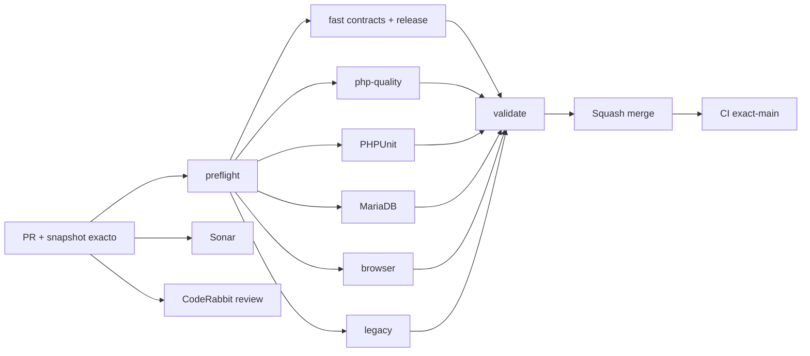

# GrindFlow — Último deploy

  
  
  

> **Snapshot candidato v0.1.9, no evidencia de deploy. El contrato «solo el deploy actual» requiere observacion del entorno.** Base `main` v0.1.8 `298615285a82d56df492a1216178c12b1a7842a0`: CI #35454799196 y Smoke #35454799194 success; faltaba verificar GETs de los modulos. El Git SHA remoto de Hostinger sigue sin marcador verificable.

## Progress convention
- ✅ ~~Completado~~ = concluido y verificado por las compuertas aplicables.
- 🚧 Pendiente = por hacer o en curso, sin tachado.

## Estado del deploy
| Señal | Estado | Evidencia |
| --- | --- | --- |
| Work line | 🚧 **GF-OPS-009 · Smoke autentico vertical de modulos** | [Roadmap #88](https://github.com/drpipe1098-commits/GrindFlow/issues/88) |
| Base exacta | ✅ **v0.1.8 · PR #98 fusionado** | `298615285a82d56df492a1216178c12b1a7842a0` |
| Version | 🚧 **v0.1.9** | workspace smoke read-only |
| CI del PR | 🚧 **pendiente** | validar SHA estable |
| Sonar | 🚧 **pendiente** | Quality Gate |
| CodeRabbit | 🚧 **pendiente** | full review head estable |
| CI del SHA exacto de main | ✅ **v0.1.8 validado** | validate #35454799196 |
| Production Smoke | ✅ **basico v0.1.8** | #35454799194 |
| Nuevos checks en prod | 🚧 **no verificados** | Scheduler, Distribution, Traffic, Finance, CSV |
| Migraciones | ✅ **sin SQL nuevo** | continua schema vigente |

## Huella del cambio
<!-- grindflow:git-delta -->
| Archivos | Inserciones | Eliminaciones | Neto |
| ---: | ---: | ---: | ---: |
| **8** | **+216** | **−59** | **+157** |

## Calidad y entrega
<!-- grindflow:gate-plan -->
| Control | Estado / contrato |
| --- | --- |
| Gates seleccionados | **preflight · fast[contracts]** |
| Session | una sola sesion E2E: Vault + Scheduler + Distribution + Traffic + Finance |
| CSV | GET agregado comprueba 200, content-type, disposition y header |
| Release | Admin System muestra v0.1.9 observada; no equivale a SHA Hostinger |
| Faults | modulo real roto detiene smoke sin logins repetidos |
| Schema pendiente | conserva Vault read-only e inventario; omite probes dependientes |

## Flujo de entrega

## Qué se hizo
- Production Smoke ahora inspecciona cuatro pantallas funcionales y el CSV en una sola sesion existente.
- Verifica las etiquetas de readiness de cada modulo y cabeceras/encabezado del reporte sin publicar filas.
- Compara la version humana del System real con la version del workflow, sin fingir exact deployed SHA.
- La ruta bajo migracion pendiente conserva su comportamiento previo y nunca hace mutaciones.
- Contract mock cubre modulo 500, CSV corrupto, version desactualizada, sesion unica y schema pendiente.
- Mensajes de issues y summary identifican GITHUB_SHA como fuente del workflow, no checkout observado.

## Archivos modificados en este deploy
- `.github/workflows/production-smoke.yml` — reporta cobertura ampliada y evidencia de release.
- `AGENTS.md` — protocolo durable del smoke vertical no destructivo.
- `README.md` — snapshot de entrega v0.1.9.
- `config/version.php` — version humana 0.1.9.
- `docs/GRINDFLOW-SPEC.md` — contrato operativo de smoke.
- `docs/REQUIREMENTS.md` — requisito GF-OPS-009.
- `scripts/production-smoke-contract.sh` — pruebas de fake HTTP y fallos seguros.
- `scripts/production-smoke.sh` — probes autenticados y release UI observado.

## Validación
- Base v0.1.8: exact-main CI #35454799196 y Production Smoke #35454799194 success.
- Candidato v0.1.9: CI, Sonar, CodeRabbit y luego exact-main/production pendientes.
- No nuevo schema SQL, POST de publicaciones, clicks sinteticos ni subida de medios.

## Qué sigue
| Lane | Trabajo |
| --- | --- |
| **NOW** | 🚧 Validar y entregar smoke vertical v0.1.9; [roadmap #88](https://github.com/drpipe1098-commits/GrindFlow/issues/88). |
| **NEXT** | 🚧 S3/CORS y media runtime #40; diagnosticar error si modulo falla en produccion. |
| **LATER** | 🚧 Browser E2E persistente y Finance. |
| **BLOCKED / EXTERNAL** | 🚧 Prueba exacta del checkout Git SHA Hostinger, release humano no basta. |

## Panorama general pendiente
| Lane | Frente | Estado |
| --- | --- | --- |
| **DONE** | ✅ ~~Distribution audit, Traffic CSV/lifecycle~~ | ✅ ~~v0.1.8 CI+Smoke basico~~ |
| **NOW** | 🚧 Smoke workspace y CSV autenticos | 🚧 v0.1.9 |
| **NEXT** | 🚧 S3/CORS y FFmpeg operacional | 🚧 #40 |
| **LATER** | 🚧 E2E browser y Finance | 🚧 roadmap #88 |
| **BLOCKED / EXTERNAL** | 🚧 SHA real Hostinger | 🚧 observabilidad |
