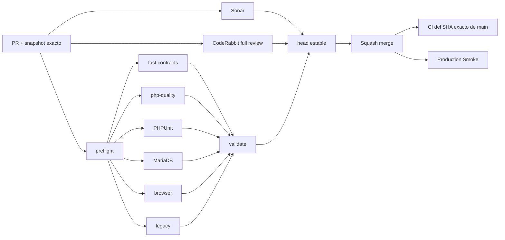

# GrindFlow — Último deploy

  
  
  

> **Development dashboard** · snapshot profesional de **solo el deploy actual**. CI, deploy y validación en producción son evidencias distintas.

## Estado del deploy

| Señal | Estado actual | Evidencia |
| --- | --- | --- |
| Work line | 🟠 **GF-FR-003 · FFmpeg video preview_v1** | IMPLEMENTED en rama enfocada |
| Base exacta | ✅ **main** | `df7663819d9955b65321faf060135995768e8537` |
| Calidad de la base | ✅ **PR #65 validado** | CI #241 completo + Sonar OK; exact-main/Smoke siguen como evidencia separada |
| Migraciones | ✅ **0 pendientes en este slice** | no hay cambios de schema |
| Feature gates | 🔒 **off por defecto** | `MEDIA_FFPROBE_ENABLED=false` · `MEDIA_FFMPEG_DERIVATIVES_ENABLED=false` |

## Huella del cambio

<!-- grindflow:git-delta -->

| Archivos | Inserciones | Eliminaciones | Neto |
| ---: | ---: | ---: | ---: |
| **7** | **+0000** | **−0000** | **+0000** |

La huella se calcula con `git diff --numstat`; CI rechaza este dashboard si queda desactualizado.

## Calidad y entrega

<!-- grindflow:gate-plan -->

| Control | Estado / contrato |
| --- | --- |
| Gates seleccionados | **preflight · fast[contracts] · php-quality · PHPUnit · MariaDB · browser · legacy** |
| GrindFlow CI | `validate` exige success real para cada gate seleccionado |
| Sonar | análisis independiente + comentario estable de detalles del PR |
| CodeRabbit | full review sobre el head estable |
| Exact-main | CI vuelve a validar el SHA exacto después del squash merge |
| Producción | FFmpeg no se habilita automáticamente aunque el código se despliegue |

## Flujo de entrega

## Qué se hizo

- Conserva v4/v5 como contrato histórico **thumbnail-only** para jobs FFmpeg ya encolados.
- Introduce v6/v7 como perfil actual: thumbnail determinista y, solo para video, `preview_v1`.
- Genera `preview_v1` como MP4 H.264/yuv420p sin audio, metadata ni capítulos, con máximo 720 px y 15 fps.
- Acota la duración a 3–15 segundos, 8 segundos por defecto mediante `MEDIA_FFMPEG_PREVIEW_SECONDS`.
- Mantiene imágenes en thumbnail-only aunque el procesador actual sea v6/v7.
- Usa claves deterministas por organización + SHA-256 + perfil; los retries sobrescriben el mismo artefacto.
- Persiste MIME, disk, key, byte size y SHA-256 solo después de una escritura exitosa.
- Añade regresiones para upgrade disabled → preview, compatibilidad v4 y exclusión de preview en imágenes.

## Archivos modificados en este deploy

- `.env.example` — duración configurable del preview.
- `README.md` — snapshot exacto de esta entrega.
- `app/Services/Media/FfmpegMediaDerivativeGenerator.php` — `preview_v1` y perfiles deterministas.
- `app/Services/Media/MediaAssetProcessor.php` — versiones 6/7 preservando v4/v5.
- `config/grindflow.php` — configuración bounded del preview.
- `docs/REQUIREMENTS.md` — contrato verificable actualizado de GF-FR-003.
- `tests/Feature/MediaProcessingJobTest.php` — regresiones de preview, legacy e imágenes.

## Validación

- Estado actual: **IMPLEMENTED** en `feat/ffmpeg-video-preview-v1`.
- Base exacta: `df7663819d9955b65321faf060135995768e8537`.
- PR #65 dejó CI #241 completo verde y Sonar con 0 issues / 0 Security Hotspots antes del squash.
- Esta rama no contiene migraciones, cambios de secretos ni mutaciones de producción.
- `MEDIA_FFMPEG_DERIVATIVES_ENABLED=false` por defecto: desplegar código no activa FFmpeg.
- Antes del merge se exige matriz completa, Sonar, CodeRabbit y recheck del SHA actual de `main`.

## Qué sigue

| Lane | Trabajo |
| --- | --- |
| **NOW** | Abrir PR y validar matriz completa + Sonar + revisión del contrato `preview_v1`. |
| **NEXT** | Tras merge, CI exacto + Production Smoke; luego evaluar normalización adicional versionada. |
| **BLOCKED / EXTERNAL** | FFmpeg real en Hostinger y object storage S3-compatible requieren configuración externa. |
| **LATER** | Continuar Scheduling/Distribution P2 cuando GF-FR-003 quede cerrado operacionalmente. |

## Panorama general pendiente

| Lane | Frente | Estado |
| --- | --- | --- |
| **NOW** | Media processing | `preview_v1` IMPLEMENTED, gate off |
| **NEXT** | Media processing | validación exact-main/producción y normalización adicional |
| **NEXT** | Media Vault producción | Quick Upload disponible; Direct Upload espera object storage |
| **BLOCKED / EXTERNAL** | Hosting / storage | FFmpeg real y S3-compatible requieren configuración externa |
| **LATER** | Operación | queues, scheduler, retries y backups |
| **LATER** | Legacy retirement | solo tras GF-MIG-003 / GF-MIG-004 |
| **LATER** | Producto P2 | scheduling, distribución, atribución y finanzas |
