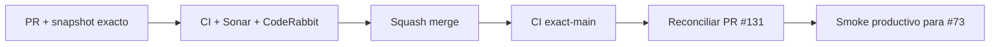

# GrindFlow — Último deploy

> **Candidato v0.1.122: fail-closed para cuentas sintéticas vinculadas a organizaciones.** Base exacta main v0.1.121 `30ffd5b9cb9c04f88c76f4dc32179eaf3570741c`. Entrega de seguridad independiente del bootstrap OIDC bloqueado en PR #131; no supone Production Smoke verde.

## Progress convention
- ✅ ~~Completado~~ = verificado; 🚧 Pendiente = en curso; ⛔ bloqueado = dependencia externa.

## Fuentes de verdad
[AGENTS.md](AGENTS.md) · [Spec](docs/GRINDFLOW-SPEC.md) · [Requisitos](docs/REQUIREMENTS.md) · [Transición](docs/STACK-TRANSITION-SYMFONY.md) · [Roadmap #2](https://github.com/pl0n3r/GrindFlow/issues/2)

## Estado del deploy
| Señal | Estado | Evidencia |
| --- | --- | --- |
| Version objetivo | 🚧 **v0.1.122** | `config/version.php`; candidata |
| Base exacta | ✅ ~~main v0.1.121~~ | `30ffd5b9cb9c04f88c76f4dc32179eaf3570741c` |
| CI del PR | 🚧 pendiente | validar HEAD final |
| Sonar del PR | 🚧 pendiente | Quality Gate del HEAD final |
| CodeRabbit del PR | 🚧 pendiente | máximo 3 rondas |
| CI del SHA exacto de main | ✅ ~~success~~ | #35927165744 sobre `30ffd5b…` |
| Production Smoke base | ⛔ #73 | #35927165714 failure; login sintético |
| Producción objetivo | 🚧 pendiente | PR #131 bloqueada; no declarar verde |

## Huella del cambio
<!-- grindflow:git-delta -->
| Archivos | Inserciones | Eliminaciones | Neto |
| ---: | ---: | ---: | ---: |
| **4** | **+87** | **−38** | **+49** |

## Calidad y entrega
<!-- grindflow:gate-plan -->
| Control | Estado / contrato |
| --- | --- |
| Gates seleccionados | **preflight · fast[operational contracts + automation syntax + README dashboard] · php-quality · PHPUnit · real-stack** |
| Gate agregador obligatorio | **validate**: todos los seleccionados; Sonar y CodeRabbit aparte |
| Alcance | #121: negar colisión con memberships antes de cambiar rol/clave |
| Rol del PR | **Application Security · Backend Laravel · QA** |
| Revisiones | máximo 3 rondas automáticas; sin polling |

## Flujo de entrega

## Qué se hizo
- El comando de aprovisionamiento rechaza una cuenta sintética preexistente con memberships antes de tocar contraseña, rol, nombre o estado de verificación.
- Conserva el lock transaccional, el error sanitizado y el caso positivo de identidad aislada. Sin borrados ni cambios a tenants.
- Las pruebas cubren colisión con rol Model, rechazo aun cuando el usuario Admin ya esté reconciliado, cero nuevos backups y preservación de hash/asociaciones.

## Archivos modificados en esta entrega candidata
Inventario del diff exacto:
<!-- grindflow:changed-files -->
- `README.md`
- `app/Console/Commands/ProvisionSmokeUser.php`
- `config/version.php`
- `tests/Feature/ProvisionSmokeUserCommandTest.php`

## Validación
- PHPUnit protege la colisión con memberships sin tocar filas, roles, contraseña ni backup previo.
- Los gates del HEAD del PR y la revisión terminal CodeRabbit siguen pendientes; no confundir propuesta con producción.

## Qué sigue
[Roadmap canónico #2](https://github.com/pl0n3r/GrindFlow/issues/2)

## Panorama general pendiente
| Lane | Frente | Estado |
| --- | --- | --- |
| **NOW** | 🚧 #121: proteger aprovisionamiento sintético | 🚧 v0.1.122 |
| **NEXT** | 🚧 revisar PR #131 y ejecutar Smoke #73 | 🚧 tras merge seguro |
| **BLOCKED / EXTERNAL** | ⛔ PR #131 sin CodeRabbit terminal | ⛔ no desplegar |
| **LATER** | 🚧 Roadmap de producto | 🚧 solo después de producción verde |
