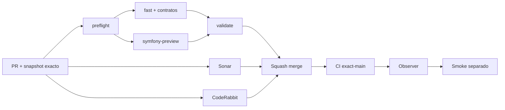

# GrindFlow — Último deploy

> **Candidato v0.1.120: regresión de autenticación Laravel con sesiones sintéticas descartables.** Base exacta main v0.1.119 `620012179f843338accea21c84742d306b6eb229`. No modifica el flujo de login ni corrige por sí solo el incidente productivo #73.

## Progress convention
- ✅ ~~Completado~~ = verificado; 🚧 Pendiente = en curso; ⛔ bloqueado = dependencia externa.

## Fuentes de verdad
[AGENTS.md](AGENTS.md) · [Spec](docs/GRINDFLOW-SPEC.md) · [Requisitos](docs/REQUIREMENTS.md) · [Transición](docs/STACK-TRANSITION-SYMFONY.md) · [Roadmap #2](https://github.com/pl0n3r/GrindFlow/issues/2)

## Estado del deploy
| Señal | Estado | Evidencia |
| --- | --- | --- |
| Version objetivo | 🚧 **v0.1.120** | `config/version.php`; candidata, no publicada |
| Base exacta | ✅ ~~main v0.1.119~~ | `620012179f843338accea21c84742d306b6eb229` |
| CI del PR | 🚧 Pendiente | `validate` sobre HEAD final |
| Sonar del PR | 🚧 Pendiente | Quality Gate sobre HEAD final |
| CodeRabbit del PR | 🚧 Pendiente | Revisión terminada del mismo SHA |
| CI del SHA exacto de main | 🚧 En ejecución | #35906880198 sobre `62001217…` |
| Deploy Observer base | ✅ ~~Marcador observado~~ | #35906880205; no acredita SHA remoto |
| Production Smoke | ⛔ Bloqueo externo #73 | #35906880233 failure |
| Symfony en Hostinger | ⛔ NO desplegado | Sin cutover |
| Datos productivos | ✅ ~~No tocados~~ | Solo test, requisitos y versión de código |

## Huella del cambio
<!-- grindflow:git-delta -->
| Archivos | Inserciones | Eliminaciones | Neto |
| ---: | ---: | ---: | ---: |
| **4** | **+70** | **−19** | **+51** |

## Calidad y entrega
<!-- grindflow:gate-plan -->
| Control | Estado / contrato |
| --- | --- |
| Gates seleccionados | **preflight · fast[operational contracts + automation syntax + README dashboard] · php-quality · PHPUnit** |
| Gate agregador obligatorio | **validate**: todos los seleccionados; Sonar y CodeRabbit aparte |
| Alcance | GF-SEC-003: estabilidad de sesión anónima ante fallo de login y bloqueo |
| Revisiones | CI/Sonar/CodeRabbit HEAD; exact-main, Observer y Smoke separados |

## Flujo de entrega

## Qué se hizo
- PHPUnit con cuenta sintética exige conservar token CSRF y marcador de sesión después de un POST de contraseña errónea; confirma que un POST válido posterior inicia sesión.
- El test de rate limiting existente añade la misma comprobación de estabilidad de CSRF ante el sexto intento bloqueado, sin modificar el límite.
- GF-SEC-003 documenta la expectativa Laravel y distingue pruebas descartables de un smoke auténtico en Hostinger. No cambia controlador, credenciales ni datos reales.

## Archivos modificados en esta entrega candidata
Inventario de esta entrega candidata, no prueba publicación:
<!-- grindflow:changed-files -->
- `README.md`
- `config/version.php`
- `docs/REQUIREMENTS.md`
- `tests/Feature/AuthenticationTest.php`

## Validación
- CI exact-main v0.1.119 primero, luego `preflight`, `fast`, `php-quality`, `PHPUnit`, `validate`, Sonar y CodeRabbit sobre HEAD final.
- Smoke #73 sigue independiente; esta entrega no reintenta el login productivo ni atribuye una causa sin evidencia.
- No ejecutar migraciones ni escrituras de datos productivos.

## Qué sigue
[Roadmap canónico #2](https://github.com/pl0n3r/GrindFlow/issues/2)

## Panorama general pendiente
| Lane | Frente | Estado |
| --- | --- | --- |
| **NOW** | 🚧 GF-SEC-003: regresión de sesión y CSRF ante login fallido | 🚧 v0.1.120 candidata |
| **NEXT** | 🚧 Diagnosticar causa de autenticación productiva #73 por vía operativa autorizada | 🚧 pendiente |
| **BLOCKED / EXTERNAL** | ⛔ Smoke autenticado Laravel | ⛔ #73 |
| **LATER** | 🚧 Cutover Symfony por módulo | 🚧 sin deploy |
