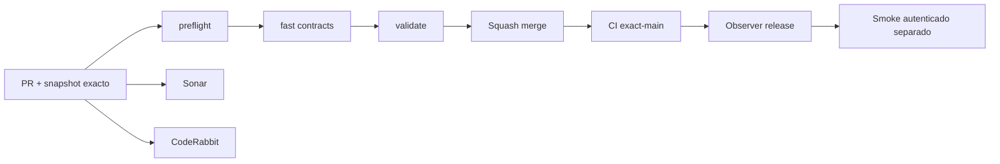

# GrindFlow — Último deploy

> **Snapshot v0.1.46: solo el deploy actual, renombrado privado de imágenes en Vault S2.** Base `main` v0.1.45 `b31304748051cf18204c98678a03b80f2917564d`, CI exact-main success. Los gestores de contenido pueden renombrar una imagen activa sin cambiar bytes, SHA-256 ni clave privada; adjunto y listado reflejan el nuevo nombre. Symfony aún no desplegado en Hostinger.

## Progress convention
- ✅ ~~Completado~~ = verificado; 🚧 Pendiente = en curso; ⛔ bloqueado = dependencia externa.

## Fuentes de verdad
[AGENTS.md](AGENTS.md) · [Spec](docs/GRINDFLOW-SPEC.md) · [Requisitos](docs/REQUIREMENTS.md) · [Transición](docs/STACK-TRANSITION-SYMFONY.md) · [Roadmap #2](https://github.com/pl0n3r/GrindFlow/issues/2)

## Estado del deploy
| Señal | Estado | Evidencia |
| --- | --- | --- |
| Version objetivo | 🚧 **v0.1.46** | `config/version.php` |
| Base exacta | ✅ ~~main v0.1.45~~ | `b31304748051cf18204c98678a03b80f2917564d` |
| CI del PR | 🚧 Head final pendiente | `GrindFlow CI / validate` |
| Sonar | 🚧 Pendiente | SonarCloud PR |
| CodeRabbit | 🚧 Revisión por comprobar | PR |
| CI del SHA exacto de main | 🚧 Después del merge | CI PR no lo sustituye |
| Deploy Observer | 🚧 Release humano por observar | No prueba Symfony en remoto |
| Production Smoke | ⛔ Credencial E2E productiva pendiente | [Issue #1](https://github.com/pl0n3r/GrindFlow/issues/1) |
| Symfony S1 en Hostinger | ⛔ NO desplegado | Solo entorno aislado CI |
| Migraciones | ✅ ~~Ningún esquema productivo modificado~~ | DB Symfony descartable |

## Huella del cambio
<!-- grindflow:git-delta -->
| Archivos | Inserciones | Eliminaciones | Neto |
| ---: | ---: | ---: | ---: |
| **8** | **+0** | **−0** | **+0** |

## Calidad y entrega
<!-- grindflow:gate-plan -->
| Control | Estado / contrato |
| --- | --- |
| Gates seleccionados | **preflight · fast[contracts] · symfony-preview** |
| Alcance | S2: nombre editable tenant-safe sin alterar almacenamiento privado |
| Revisiones | CI/Sonar/CodeRabbit, exact-main y Hostinger son independientes |

## Flujo de entrega

## Qué se hizo
- Nueva API `POST /api/admin/vault/{id}/name`: nombre visible editable en imagen activa, sin mutar UUID, SHA-256, original privado o cuota.
- CSRF de gestión, rol y membresía revalidados bajo bloqueo de organización; archivos de otro tenant o en papelera no son editables.
- React móvil ofrece formulario por imagen con feedback, evita fuga de datos y conserva el enlace privado de descarga.
- PHP/MariaDB sintéticos y Chromium de 360 px prueban validación, permisos, rechazo CSRF, ausencia de escritura externa y actualización de UI.

## Archivos modificados en este deploy
- `README.md`
- `config/version.php`
- `symfony/README.md`
- `symfony/frontend/admin/VaultPanel.tsx`
- `symfony/frontend/admin/admin.css`
- `symfony/src/Http/Controller/VaultController.php`
- `symfony/tests/e2e/preview.spec.mjs`
- `symfony/tests/php/VaultTrashTest.php`

## Validación
- Los tests PHP/MariaDB y Chromium se comprueban en CI del PR; sin checkout local en esta sesión.
- CI exact-main v0.1.45 success; CI/Sonar/CodeRabbit del nuevo head y Hostinger son señales separadas. Sin migración ni cutover Symfony.

## Qué sigue
[Roadmap canónico #2](https://github.com/pl0n3r/GrindFlow/issues/2)

| Lane | Trabajo | Estado |
| --- | --- | --- |
| **NOW** | 🚧 Validar renombrado privado Vault S2 v0.1.46 | 🚧 CI y revisión |
| **NEXT** | 🚧 Storage durable, backup y purga con política explícita | 🚧 Pendiente de definir política de retención y backup |
| **LATER** | 🚧 Vault móvil → reglas → distribución autorizada → piloto | 🚧 Planificado |
| **BLOCKED / EXTERNAL** | ⛔ Cutover sin paridad/datos migrados; Smoke sin credencial | ⛔ Dependencia externa |

## Panorama general pendiente
| Lane | Frente | Estado |
| --- | --- | --- |
| **DONE** | ✅ ~~Dashboard Laravel v0.1.30~~ | ✅ ~~Esquema Symfony S1 v0.1.31~~ |
| **NOW** | 🚧 Validar renombrado privado Vault S2 v0.1.46 | 🚧 CI y revisión |
| **NEXT** | 🚧 Storage durable, backup y retención | 🚧 Pendiente de definir política de retención y backup |
| **LATER** | 🚧 Automatización de contenido | 🚧 S2–S5 |
| **BLOCKED / EXTERNAL** | ⛔ Sin cutover Symfony | ⛔ Sin credencial Smoke |
