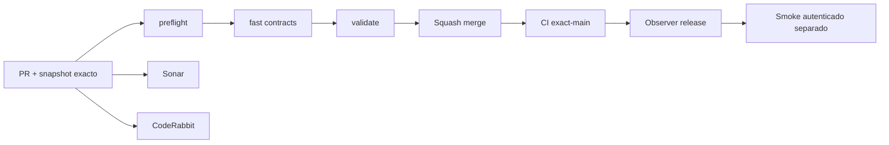

# GrindFlow — Último deploy

> **Candidato v0.1.63: clasificación múltiple de hasta 30 imágenes visibles, transaccional y tenant-safe.** El alcance «solo el deploy actual» sigue siendo Laravel en Hostinger; Symfony continúa aislado. Base exacta `main` v0.1.62 `311cbcbe015c039d719527f2c3d417ab8d1c4ac8`, CI exact-main success (run 35571685244). No se cambiaron datos ni migraciones productivas.

## Progress convention
- ✅ ~~Completado~~ = verificado; 🚧 Pendiente = en curso; ⛔ bloqueado = dependencia externa.

## Fuentes de verdad
[AGENTS.md](AGENTS.md) · [Spec](docs/GRINDFLOW-SPEC.md) · [Requisitos](docs/REQUIREMENTS.md) · [Transición](docs/STACK-TRANSITION-SYMFONY.md) · [Roadmap #2](https://github.com/pl0n3r/GrindFlow/issues/2)

## Estado del deploy
| Señal | Estado | Evidencia |
| --- | --- | --- |
| Version objetivo | 🚧 **v0.1.63** | `config/version.php` |
| Base exacta | ✅ ~~main v0.1.62~~ | `311cbcbe015c039d719527f2c3d417ab8d1c4ac8` |
| CI del PR | 🚧 Nuevo head por validar | `GrindFlow CI / validate` |
| Sonar | 🚧 Pendiente | SonarCloud PR |
| CodeRabbit | 🚧 Pendiente | PR |
| CI del SHA exacto de main | 🚧 Después del merge | CI PR no lo sustituye |
| Deploy Observer | 🚧 Release humano por observar | No prueba Symfony remoto |
| Production Smoke | ⛔ Credencial E2E productiva pendiente | [Issue #1](https://github.com/pl0n3r/GrindFlow/issues/1) |
| Symfony S2 en Hostinger | ⛔ NO desplegado | Solo entorno aislado CI |
| Migraciones | ✅ ~~Ningún esquema productivo modificado~~ | DB Symfony descartable |

## Huella del cambio
<!-- grindflow:git-delta -->
| Archivos | Inserciones | Eliminaciones | Neto |
| ---: | ---: | ---: | ---: |
| **10** | **+547** | **−45** | **+502** |

## Calidad y entrega
<!-- grindflow:gate-plan -->
| Control | Estado / contrato |
| --- | --- |
| Gates seleccionados | **preflight · fast[contracts] · symfony-preview** |
| Alcance | S2: clasificar selección visible en una sola transacción y conservar guardas de tenant |
| Revisiones | CI/Sonar/CodeRabbit, exact-main y Hostinger independientes |

## Flujo de entrega

## Qué se hizo
- Selección explícita de 1 a 30 imágenes activas de la página actual con confirmación, opción de seleccionar/quitar visibles, estado accesible y vista móvil 360 px.
- API de clasificación masiva: CSRF, membresía y rol revalidados bajo bloqueo SQL; lote mixto con imagen ajena, en papelera o ausente se rechaza completo sin escrituras parciales.
- Repetir la misma clasificación devuelve cero recursos cambiados, sin duplicación ni efectos externos. UI mantiene la selección tras rechazo y la limpia al guardar o cambiar filtros/vista/página.
- PHPUnit/MariaDB con fixtures descartables y Chromium sintético cubren transacción, tenant, IDOR, rol de lectura, reintento y errores.
## Archivos modificados en este deploy
Inventario del **cambio candidato en PR**, NO prueba de deploy de Symfony en Hostinger.
- `README.md`
- `config/version.php`
- `docs/GRINDFLOW-SPEC.md`
- `docs/REQUIREMENTS.md`
- `symfony/README.md`
- `symfony/frontend/admin/VaultPanel.tsx`
- `symfony/frontend/admin/admin.css`
- `symfony/src/Http/Controller/VaultController.php`
- `symfony/tests/e2e/preview.spec.mjs`
- `symfony/tests/php/VaultBulkUsageTest.php`
## Validación
- CI/Sonar/CodeRabbit del candidato v0.1.63 por verificar; el CI exact-main v0.1.62 tuvo resultado success.
- Sin checkout local de PHP/MariaDB/Chromium; GitHub Actions valida el cambio. No se tocó producción.

## Qué sigue
[Roadmap canónico #2](https://github.com/pl0n3r/GrindFlow/issues/2)

| Lane | Trabajo | Estado |
| --- | --- | --- |
| **NOW** | 🚧 Validar clasificación múltiple v0.1.63 | 🚧 CI y revisión |
| **NEXT** | 🚧 Reglas de elegibilidad y ensayo real backup MariaDB + blobs | 🚧 Sin autorización implícita |
| **LATER** | 🚧 Vault móvil → reglas → distribución autorizada → piloto | 🚧 Planificado |
| **BLOCKED / EXTERNAL** | ⛔ Cutover sin paridad/datos migrados; Smoke sin credencial | ⛔ Dependencia externa |

## Panorama general pendiente
| Lane | Frente | Estado |
| --- | --- | --- |
| **DONE** | ✅ ~~Dashboard Laravel v0.1.30~~ | ✅ ~~Esquema Symfony S1 v0.1.31~~ |
| **NOW** | 🚧 Clasificación múltiple S2 v0.1.63 | 🚧 CI y revisión |
| **NEXT** | 🚧 Backup MariaDB y ensayo integral de restauración | 🚧 Retención y operación pendientes |
| **LATER** | 🚧 Automatización de contenido | 🚧 S2–S5 |
| **BLOCKED / EXTERNAL** | ⛔ Sin cutover Symfony | ⛔ Sin credencial Smoke |
