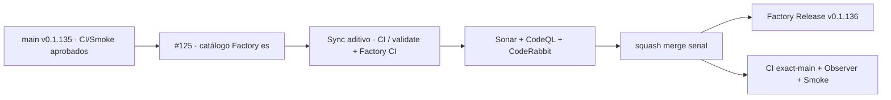

# GrindFlow — Último deploy

> **Candidata v0.1.136 · Issue #125.** Catálogo canónico Factory en español, con sincronización aditiva y sin borrar etiquetas legadas.

## Progress convention
- ✅ ~~Completado~~ = verificado; 🚧 Pendiente = en curso; ⛔ bloqueado = dependencia externa.

## Fuentes de verdad
[AGENTS.md](AGENTS.md) · [Spec](docs/GRINDFLOW-SPEC.md) · [Requisitos](docs/REQUIREMENTS.md) · [Roadmap #2](https://github.com/pl0n3r/GrindFlow/issues/2)

## Estado del deploy
| Señal | Estado | Evidencia |
| --- | --- | --- |
| SHA exacto de main (base) | ✅ **e0b5fd0d5a9f0b8128d1cf4cd99eb5ab03019019** | v0.1.135 fusionada (#166) |
| Tag y GitHub Release (base) | ✅ **v0.1.135** | tag anotado apunta a main |
| CI del SHA exacto de main (base) | ✅ **success** | validate job 107970916546 |
| Deploy Observer base | ✅ **success** | job 107970273045 |
| Production Smoke base | ✅ **success** | job 107970272778 |
| Version objetivo | 🚧 **v0.1.136** | PHP, npm y lock en paridad |
| CI/Sonar/CodeRabbit del PR | 🚧 pendiente | HEAD final de #125 |
| Producción objetivo | 🚧 pendiente | verificación independiente tras merge |

## Huella del cambio
<!-- grindflow:git-delta -->
| Archivos | Inserciones | Eliminaciones | Neto |
| ---: | ---: | ---: | ---: |
| **6** | **+119** | **−37** | **+82** |

## Calidad y entrega
<!-- grindflow:gate-plan -->
| Control | Estado / contrato |
| --- | --- |
| Gates seleccionados | **preflight · fast[operational contracts + automation syntax + README dashboard] · php-quality · PHPUnit · MariaDB · browser · real-stack · legacy · symfony-preview** |
| PR + snapshot exacto | **Issue #125 · v0.1.136**; diff y README deben coincidir con HEAD final |
| Gate agregador obligatorio | **validate** conserva gates seleccionados + privacidad; Sonar, CodeQL y CodeRabbit separados |
| Release Factory v1 | Solo push main; tag anotado y GitHub Release sin deploy productivo |
| CI local canónico | `GrindFlow CI / validate` sigue obligatorio, Factory CI corre en paralelo |
| Rol del PR | **Infraestructura · Seguridad · QA** |

## Flujo de entrega

## Qué se hizo
- Completa 22 etiquetas canónicas Factory v1 en `.github/labels.json`: 11 tipos, 4 prioridades (incluye `prioridad: baja`) y 7 estados.
- Conserva los tres labels legados `calidad`, `seguridad` y `deuda técnica`, con sus descripciones/colores; no renombra Issues históricos.
- Añade regresión de catálogo vs contrato local de validación, unicidad, colores y preservación de legacy.
- El sincronizador existente solo **crea/actualiza**, nunca elimina etiquetas remotas.
- No cambia automatización de herencia/comentarios/barrido ni garantiza branch protection; #125 permanece abierto.

## Archivos modificados en esta entrega candidata
<!-- grindflow:changed-files -->
- `.github/labels.json`
- `README.md`
- `config/version.php`
- `package-lock.json`
- `package.json`
- `tests/test_label_selection_contract.py`

## Validación
- Regresión de catálogo coteja el conjunto completo con `TYPES | PRIORITIES | STATES` y preserva etiquetas legadas.
- Sync en push main solo al cambiar labels JSON; verificar job real tras merge, no confundir existencia del catálogo con etiquetas remotas ya sincronizadas.
- Registro independiente de CI exact-main, Observer y Smoke tras merge; #[146] media storage queda externamente bloqueado.

## Qué sigue
[Roadmap canónico #2](https://github.com/pl0n3r/GrindFlow/issues/2)

## Panorama general pendiente
| Lane | Frente | Estado |
| --- | --- | --- |
| **NOW** | 🚧 #125 · catálogo canónico | 🚧 candidata v0.1.136 |
| **NEXT** | 🚧 #125/#129 · herencia, barrido y deploy/rollback | 🚧 próximo slice |
| **BLOCKED / EXTERNAL** | ⛔ #139 Dependabot + #146 media storage | ⛔ evidencia/configuración externa |
| **LATER** | 🚧 #122 helper CodeRabbit + #138 Sentry | 🚧 preservados tras TANDA 2 |
