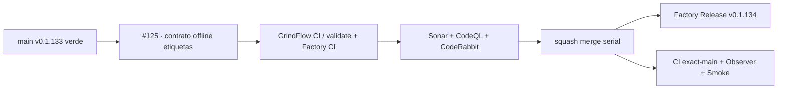

# GrindFlow — Último deploy

> **Candidata v0.1.134 · Issue #125.** Contrato offline de etiquetas con dos tipos justificados. No activa el gate ni modifica etiquetas reales.

## Progress convention
- ✅ ~~Completado~~ = verificado; 🚧 Pendiente = en curso; ⛔ bloqueado = dependencia externa.

## Fuentes de verdad
[AGENTS.md](AGENTS.md) · [Spec](docs/GRINDFLOW-SPEC.md) · [Requisitos](docs/REQUIREMENTS.md) · [Roadmap #2](https://github.com/pl0n3r/GrindFlow/issues/2)

## Estado del deploy
| Señal | Estado | Evidencia |
| --- | --- | --- |
| SHA exacto de main (base) | ✅ **fa471fddd6fc8a2e17a5377f7b3de75fa7e1ff30** | v0.1.133 fusionada (#164) |
| Tag y GitHub Release (base) | ✅ **v0.1.133** | tag anotado del SHA exacto |
| CI del SHA exacto de main (base) | ✅ **success** | validate job 107954020261 |
| Deploy Observer base | ✅ **success** | job 107953389738 |
| Production Smoke base | ✅ **success** | job 107953389340; SHA exacto y login sintético |
| Version objetivo | 🚧 **v0.1.134** | PHP, npm y lock en paridad |
| CI/Sonar/CodeRabbit del PR | 🚧 pendiente | HEAD final de #125 |
| Producción objetivo | 🚧 pendiente | comprobación tras merge |

## Huella del cambio
<!-- grindflow:git-delta -->
| Archivos | Inserciones | Eliminaciones | Neto |
| ---: | ---: | ---: | ---: |
| **7** | **+207** | **−30** | **+177** |

## Calidad y entrega
<!-- grindflow:gate-plan -->
| Control | Estado / contrato |
| --- | --- |
| Gates seleccionados | **preflight · fast[operational contracts + automation syntax + README dashboard] · php-quality · PHPUnit · MariaDB · browser · real-stack · legacy · symfony-preview** |
| PR + snapshot exacto | **Issue #125 · v0.1.134**; diff y README deben coincidir con HEAD final |
| Gate agregador obligatorio | **validate** conserva gates seleccionados + privacidad; Sonar, CodeQL y CodeRabbit separados |
| Release Factory v1 | Solo push main; tag anotado y GitHub Release sin deploy productivo |
| CI local canónico | `GrindFlow CI / validate` sigue obligatorio, Factory CI corre en paralelo |
| Rol del PR | **Infraestructura · Seguridad · QA** |

## Flujo de entrega

## Qué se hizo
- Añade validador offline de etiquetas del catálogo Factory español: uno o dos tipos, una prioridad y un estado. Dos tipos exigen justificación humana; no se elimina la marca de seguridad de #127.
- Rechaza dimensiones faltantes, prioridad/estado duplicados, etiquetas no canónicas y entradas malformadas o demasiado grandes.
- Integra siete regresiones del contrato en fast; sin llamadas a GitHub ni efectos secundarios.
- Conserva el sincronizador aditivo; el reusable Factory actual exige exactamente un tipo y no se activa aquí.
- No altera base de datos, datos personales ni producción.

## Archivos modificados en esta entrega candidata
<!-- grindflow:changed-files -->
- `.github/workflows/grindflow-ci.yml`
- `README.md`
- `config/version.php`
- `package-lock.json`
- `package.json`
- `scripts/validate-label-selection.py`
- `tests/test_label_selection_contract.py`

## Validación
- Contrato offline con selección simple, dos tipos legítimos, etiquetas GitHub en formato objeto, CLI read-only y tamaño acotado.
- Gate metadata-only, herencia, aviso editable y barrido diario siguen para próximos slices de #125.
- CI, Factory Release, Observer y Smoke son señales independientes.

## Qué sigue
[Roadmap canónico #2](https://github.com/pl0n3r/GrindFlow/issues/2)

## Panorama general pendiente
| Lane | Frente | Estado |
| --- | --- | --- |
| **NOW** | 🚧 #125 · contrato offline etiquetas | 🚧 candidata v0.1.134 |
| **NEXT** | 🚧 #125/#129 · gate metadata y deploy/rollback | 🚧 próximo slice |
| **BLOCKED / EXTERNAL** | ⛔ #139 Dependabot + #146 media storage | ⛔ evidencia/configuración externa |
| **LATER** | 🚧 #122 helper CodeRabbit + #138 Sentry | 🚧 preservados tras TANDA 2 |
