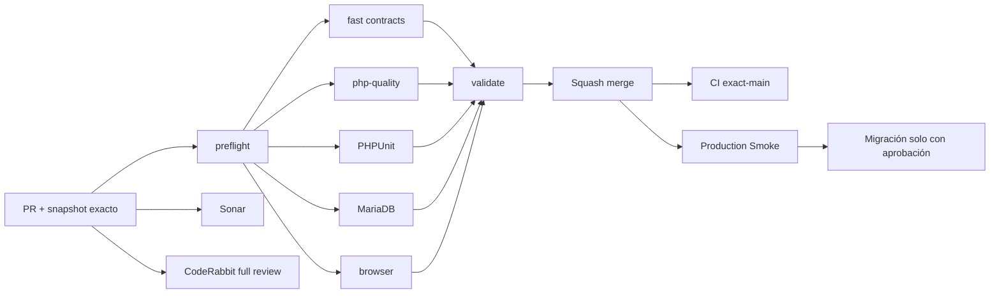

# GrindFlow — Último deploy

  
  
  

> **Development dashboard** · snapshot profesional de **solo el deploy actual**. CI, deploy y validación en producción son evidencias distintas.

## Estado del deploy

| Señal | Estado actual | Evidencia |
| --- | --- | --- |
| Work line | 🟠 **GF-FR-006 · Traffic attribution core v1** | IMPLEMENTED en rama enfocada |
| Base exacta | ✅ **main** | `04c991ab80b1903793f40cc62c9780b39490cd49` |
| Distribution dependency | ✅ **GF-FR-005 merged** | PR #70 + snapshot/cleanup post-merge |
| Privacidad | ✅ **sin identificadores crudos** | no se persisten IP, User-Agent, referrer ni country |
| CI del SHA exacto de main | ⚪ **no observable por el conector** | no se atribuye evidencia `push` no expuesta |
| Producción | ⚪ **sin cambios** | redirects/providers reales no se habilitan desde esta rama |
| Migraciones | 🟠 **1 nueva en este slice** | traffic attribution; no se aplica automáticamente |

## Huella del cambio

<!-- grindflow:git-delta -->

| Archivos | Inserciones | Eliminaciones | Neto |
| ---: | ---: | ---: | ---: |
| **1** | **+3** | **−16** | **-13** |

La huella se calcula con `git diff --numstat`; CI rechaza este dashboard si queda desactualizado.

## Calidad y entrega

<!-- grindflow:gate-plan -->

| Control | Estado / contrato |
| --- | --- |
| Gates seleccionados | **preflight · fast[contracts] · php-quality · PHPUnit · MariaDB · browser** |
| GrindFlow CI | `validate` exige success real de cada gate seleccionado |
| Sonar | análisis independiente + comentario estable del PR |
| CodeRabbit | full review sobre el head estable |
| Migración | nunca se ejecuta automáticamente desde este PR |
| Producción | el public redirect no se activa en producción hasta deploy aprobado |

## Flujo de entrega

## Qué se hizo

- Añade links tenant-owned con token público aleatorio de 22 caracteres.
- Añade redirect `/l/{token}` con 302, `no-store` y `no-referrer`.
- El redirect calcula un HMAC server-side por link y despacha la métrica after-response.
- No se persisten IP, User-Agent, referrer, country ni eventos click-by-click.
- Dedupe autoritativo en MariaDB: ventana fija de **10 minutos**, no controlable por request.
- Los hashes son distintos por link para impedir correlación entre campañas.
- Los clicks aceptados incrementan agregados diarios por link.
- Los hashes de dedupe se podan después de 24 h mediante scheduler horario.
- La gestión autenticada permite crear links y ver clicks acumulados en Traffic.
- Admin/Studio/Editor pueden administrar Traffic; Model no puede crear links.
- El redirect público revalida token globalmente único + estado activo fuera del tenant scope.
- Deploy-before-migration es seguro: GET informa bloqueo, POST responde 503 y redirect devuelve 404.

## Archivos modificados en este deploy

- `AGENTS.md` — reglas durables de privacidad/dedupe.
- `README.md` — dashboard exacto del slice.
- `app/Http/Controllers/Traffic/TrackedLinkRedirectController.php` — redirect público.
- `app/Http/Controllers/Traffic/TrafficController.php` — gestión tenant.
- `app/Http/Middleware/RequireTrafficSchema.php` — 503 antes del FormRequest.
- `app/Http/Requests/Traffic/StoreTrackedLinkRequest.php` — autorización + URL segura.
- `app/Jobs/RecordTrackedLinkClick.php` — atribución after-response sin IP cruda.
- `app/Models/TrackedLink.php` — link tenant-owned.
- `app/Models/TrackedLinkDailyMetric.php` — agregado diario.
- `app/Models/User.php` — capability de Traffic.
- `app/Services/Traffic/TrackedLinkManager.php` — creación/token globalmente único.
- `app/Services/Traffic/TrafficAttributionRecorder.php` — dedupe + agregado + pruning.
- `app/Services/Traffic/VisitorFingerprint.php` — HMAC por link.
- `config/grindflow.php` — hash key server-side.
- `database/migrations/2026_09_19_033000_create_traffic_attribution_tables.php` — schema Traffic.
- `docs/REQUIREMENTS.md` — verificación GF-FR-006.
- `resources/views/dashboard.blade.php` — acceso a Traffic.
- `resources/views/traffic/index.blade.php` — UI de links/métricas.
- `routes/console.php` — pruning horario.
- `routes/web.php` — rutas tenant + redirect público.
- `tests/Feature/TrafficAttributionTest.php` — privacidad, tenant, dedupe, redirect y migration safety.

## Validación

- Estado actual: **IMPLEMENTED** en `feat/traffic-attribution-core-v1`.
- Base exacta: `04c991ab80b1903793f40cc62c9780b39490cd49`.
- La ventana de dedupe vive como constante de servidor; el visitante no puede alterarla.
- `Request::ip()` resuelve la IP según proxies confiables de Laravel; el código no parsea `X-Forwarded-For` manualmente.
- `TRAFFIC_HASH_KEY` puede separar la clave de HMAC; si no existe, usa `APP_KEY`.
- La migración nueva no se ejecuta desde CI ni desde esta rama.
- No se habilitan providers, publicaciones externas ni mutaciones de producción.

## Qué sigue

| Lane | Trabajo |
| --- | --- |
| **NOW** | Abrir PR de Traffic attribution core v1 y validar CI, Sonar y CodeRabbit. |
| **NEXT** | Squash merge + snapshot post-merge; mantener migración/Smoke separados. |
| **NEXT** | Integrar tracked links dentro del flujo de Distribution/campañas. |
| **BLOCKED / EXTERNAL** | Migraciones y configuración de proxy/hash key requieren aprobación operacional. |
| **LATER** | GF-FR-007 Finance. |

## Panorama general pendiente

| Lane | Frente | Estado |
| --- | --- | --- |
| **NOW** | Traffic attribution | core v1 IMPLEMENTED · pendiente PR/gates |
| **NEXT** | Distribution providers | adapters reales + auth/reconnect |
| **NEXT** | Finance | GF-FR-007 |
| **BLOCKED / EXTERNAL** | Scheduling/Distribution/Traffic producción | migrations + Smoke |
| **BLOCKED / EXTERNAL** | Hosting / storage | FFmpeg real + S3-compatible |
| **LATER** | Legacy retirement | solo tras GF-MIG |
