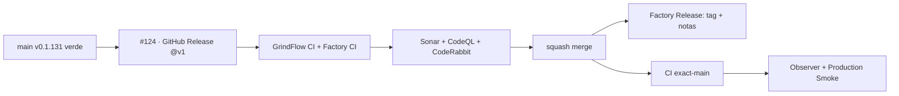

# GrindFlow — Último deploy

> **Candidato v0.1.132 · TANDA 2.** GitHub Releases por el kit Factory v1, sin alterar runtime, despliegue ni migraciones.

## Progress convention
- ✅ ~~Completado~~ = verificado; 🚧 Pendiente = en curso; ⛔ bloqueado = dependencia externa.

## Fuentes de verdad
[AGENTS.md](AGENTS.md) · [Spec](docs/GRINDFLOW-SPEC.md) · [Requisitos](docs/REQUIREMENTS.md) · [Roadmap #2](https://github.com/pl0n3r/GrindFlow/issues/2)

## Estado del deploy
| Señal | Estado | Evidencia |
| --- | --- | --- |
| SHA exacto de main (base) | ✅ **f5f2a00e5bfed2669b01a204cc2be475f9db5387** | v0.1.131 fusionada |
| Versión observada en producción (base) | ✅ **v0.1.131** | Production Smoke `36086540476` (SHA exacto) |
| CI del SHA exacto de main (base) | ✅ **success** | GrindFlow CI `36086540475`, intento 2 |
| Deploy Observer base | ✅ **success** | run `36086540472` |
| Production Smoke base | ✅ **success** | autenticado, checkout exacto |
| Version objetivo | 🚧 **v0.1.132** | PHP, npm y lock en paridad |
| CI/Sonar/CodeRabbit del PR | 🚧 pendiente | HEAD final de PR #162 |
| Tag y GitHub Release objetivo | 🚧 pendiente | únicamente después del merge |
| Producción objetivo | 🚧 pendiente | CI exact-main + observer + smoke independientes |

## Huella del cambio
<!-- grindflow:git-delta -->
| Archivos | Inserciones | Eliminaciones | Neto |
| ---: | ---: | ---: | ---: |
| **9** | **+0** | **−0** | **+0** |

## Calidad y entrega
<!-- grindflow:gate-plan -->
| Control | Estado / contrato |
| --- | --- |
| Gates seleccionados | **preflight · fast[operational contracts + automation syntax + README dashboard] · php-quality · PHPUnit · MariaDB · browser · real-stack · legacy · symfony-preview** |
| PR + snapshot exacto | **PR #162 / Issue #124 · v0.1.132**; diff y README deben coincidir con el HEAD final |
| Gate agregador obligatorio | **validate** conserva gates seleccionados + privacidad; Sonar, CodeQL y CodeRabbit separados |
| Release Factory v1 | Solo push main; tag anotado y GitHub Release sin deploy productivo |
| CI local canónico | `GrindFlow CI / validate` sigue obligatorio, Factory CI corre en paralelo |
| Rol del PR | **Infraestructura · Seguridad · QA** |

## Flujo de entrega

## Qué se hizo
- Añade `.github/workflows/tag-release.yml` para invocar `pl0n3r/factory/.github/workflows/release.yml@v1` exclusivamente en push main, con escritura solo en el job.
- Lee `config/version.php` como `php-array` clave `number`, sin ejecutar PHP.
- Sincroniza 0.1.132 en versión PHP, `package.json` y dos versiones raíz de `package-lock.json`, sin cambiar dependencias.
- Añade regresiones negativas de eventos, herencia de secretos, permisos, refs e inputs en `fast`.
- Ni el tag ni el GitHub Release prueban por sí solos el checkout de Hostinger. No hubo escrituras productivas en esta PR.

## Archivos modificados en esta entrega candidata
<!-- grindflow:changed-files -->
- `.github/workflows/grindflow-ci.yml`
- `.github/workflows/tag-release.yml`
- `AGENTS.md`
- `README.md`
- `config/version.php`
- `docs/GOVERNANCE.md`
- `package-lock.json`
- `package.json`
- `tests/test_release_adoption.py`

## Validación
- El CI anterior conserva todos sus gates; Factory es dueño de idempotencia, carreras y tag anotado.
- CodeRabbit debe finalizar sobre el HEAD final, con cero hilos accionables; merge y deploy son señales distintas.

## Qué sigue
[Roadmap canónico #2](https://github.com/pl0n3r/GrindFlow/issues/2)

## Panorama general pendiente
| Lane | Frente | Estado |
| --- | --- | --- |
| **NOW** | 🚧 #124 · release Factory v1 | 🚧 candidata v0.1.132 |
| **NEXT** | 🚧 #129 · siguiente slice Factory | 🚧 coordinación/etiquetas y deploy/rollback |
| **BLOCKED / EXTERNAL** | ⛔ #139 Dependabot + #146 media storage | ⛔ evidencia/configuración externa |
| **LATER** | 🚧 #122 helper CodeRabbit + #138 Sentry | 🚧 preservados tras TANDA 2 |
