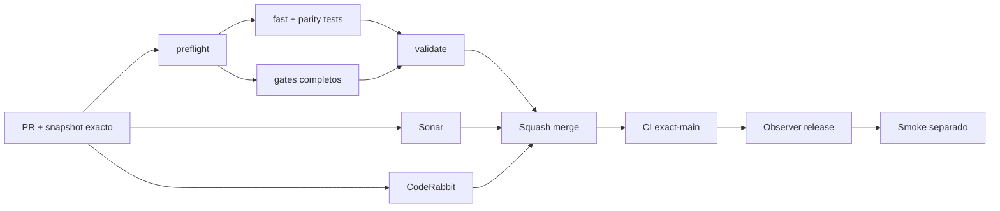

# GrindFlow — Último deploy

> **Candidato v0.1.97: recibos mínimos de rehearsal descartable para GF-ARCH-002.** Base exacta `main` v0.1.96 `59351bceb55d85223308e4e06815bc63408f38fb`; enlaza evidencia CI de paridad, reversibilidad, restore e IDOR sin declarar producción lista ni autorizada.

## Progress convention
- ✅ ~~Completado~~ = verificado; 🚧 Pendiente = en curso; ⛔ bloqueado = dependencia externa.

## Fuentes de verdad
[AGENTS.md](AGENTS.md) · [Spec](docs/GRINDFLOW-SPEC.md) · [Requisitos](docs/REQUIREMENTS.md) · [Transición](docs/STACK-TRANSITION-SYMFONY.md) · [Roadmap #2](https://github.com/pl0n3r/GrindFlow/issues/2)

## Estado del deploy
| Señal | Estado | Evidencia |
| --- | --- | --- |
| Version objetivo | 🚧 **v0.1.97** | `config/version.php`; no publicada |
| Base exacta | ✅ ~~main v0.1.96~~ | `59351bceb55d85223308e4e06815bc63408f38fb` |
| CI del PR | 🚧 Pendiente | Revalidar HEAD final |
| Sonar del PR | 🚧 Pendiente | Revalidar HEAD final |
| CodeRabbit del PR | 🚧 Pendiente | Revalidar HEAD final |
| CI del SHA exacto de main | ✅ ~~validate success~~ | v0.1.96 `59351bce`; Production Smoke separado y rojo |
| Deploy Observer | 🚧 Pendiente | No inferir checkout remoto |
| Production Smoke | ⛔ Login E2E no validado | #73 sigue independiente |
| Symfony en Hostinger | ⛔ NO desplegado | Sin cutover |
| Datos productivos | ✅ ~~No tocados~~ | Evidencia CI descartable; sin datos ni secretos reales |

## Huella del cambio
<!-- grindflow:git-delta -->
| Archivos | Inserciones | Eliminaciones | Neto |
| ---: | ---: | ---: | ---: |
| **6** | **+849** | **−34** | **+815** |

## Calidad y entrega
<!-- grindflow:gate-plan -->
| Control | Estado / contrato |
| --- | --- |
| Gates seleccionados | **preflight · fast[operational contracts + automation syntax + README dashboard] · php-quality · PHPUnit · MariaDB · browser · real-stack · legacy · symfony-preview** |
| Gate agregador obligatorio | **validate**: todos los seleccionados; Sonar y CodeRabbit aparte |
| Alcance | GF-ARCH-002: recibos CI descartables identity/Vault, no evidencia productiva |
| Revisiones | CI/Sonar/CodeRabbit HEAD; exact-main, Observer y Smoke separados |

## Flujo de entrega

## Qué se hizo
- Nuevo `scripts/disposable-rehearsal-evidence.py`: construye y valida recibos reducidos de rehearsal para `identity` y `vault`.
- Los recibos solo aceptan provenance de GitHub Actions, SHA de 40 hex, run id positivo y `disposable=true`, y conservan ese flag en la provenance reducida.
- Cada recibo vuelve a comprobar el ownership report contra las migraciones del mismo checkout; evidencia forjada o alterada falla cerrado.
- Solo se aceptan cuatro checks descartables: paridad estructural, reversibilidad de migraciones, restore MariaDB+Vault y guards post-restore tenant/roles.
- `production_ready` y `production_authorized` quedan fijados siempre en `false`; los prechecks reales permanecen explícitamente pendientes.
- El parser limita stdin a 1.000.000 bytes, exige UTF-8 estricto, rechaza UTF-16/UTF-32 y no reproduce payloads fallidos.
- La suite instala una audit barrier para detectar intentos de sockets o subprocess externos y valida que el CLI siga siendo offline.
- `symfony-preview` crea los recibos únicamente después de que pasen los checks anteriores del job y escribe resultados temporales ligados al mismo SHA/run id; `--template` los consume por stdin y ya no puede autodeclarar los checks como `passed`.
- Los resultados temporales de gates y los envelopes completos se borran antes del upload; solo los reportes mínimos se suben como artifact `gf-arch-002-disposable-evidence`.
- El artifact conserva retención de **1 día** y no contiene credenciales, row data, blobs ni un permiso de cutover.
- No toca Hostinger, MariaDB productiva, cuentas reales ni ownership efectivo.

## Archivos modificados en esta entrega candidata
Inventario de solo esta entrega candidata: no constituye evidencia de publicación:
<!-- grindflow:changed-files -->
- `.github/workflows/grindflow-ci.yml`
- `README.md`
- `config/version.php`
- `docs/DATA-CUTOVER-INVENTORY.md`
- `scripts/disposable-rehearsal-evidence.py`
- `tests/test_disposable_rehearsal_evidence.py`

## Validación
- La rama debe pasar `validate`, Sonar y revisión final CodeRabbit sobre el mismo HEAD.
- Por modificar `.github/workflows/grindflow-ci.yml`, el scope es completo e incluye `symfony-preview`.
- La evidencia se genera solo después de paridad, reversibilidad, restore y guards post-restore exitosos dentro del mismo job.
- Los receipts `identity` y `vault` deben conservar `ci.disposable=true`, `production_ready=false` y `production_authorized=false`, con SHA/run id iguales a los resultados de gates recibidos por stdin.
- Exact-main, Deploy Observer y Production Smoke siguen siendo señales separadas del artifact descartable.
- Esta entrega no acredita backup real, RPO/RTO, freeze/single-writer ni inventario autorizado de producción.

## Qué sigue
[Roadmap canónico #2](https://github.com/pl0n3r/GrindFlow/issues/2)

| Lane | Trabajo | Estado |
| --- | --- | --- |
| **NOW** | 🚧 Recibos de rehearsal descartable | 🚧 v0.1.97 candidata |
| **NEXT** | 🚧 Inventario real autorizado + restore real observado | 🚧 GF-ARCH-002 |
| **LATER** | 🚧 Conmutación Symfony por módulo | 🚧 Sin deploy |
| **BLOCKED / EXTERNAL** | ⛔ Resolver login E2E productivo | ⛔ #73 |

## Panorama general pendiente
| Lane | Frente | Estado |
| --- | --- | --- |
| **DONE** | ✅ ~~v0.1.96 fusionada~~ | ✅ ~~ownership plan offline identity/Vault~~ |
| **NOW** | 🚧 Disposable rehearsal evidence | 🚧 v0.1.97 |
| **NEXT** | 🚧 Snapshot real autorizado + restore real reversible | 🚧 Sin cutover |
| **LATER** | 🚧 Symfony en Hostinger | 🚧 No desplegado |
| **BLOCKED / EXTERNAL** | ⛔ Smoke autenticado Laravel | ⛔ #73 |
