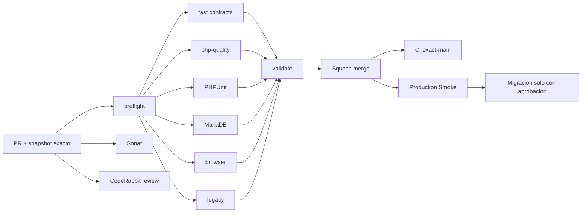

# GrindFlow — Último deploy

  
  
  

> **Development dashboard** · snapshot profesional de **solo el deploy actual**. CI, deploy y validación en producción son evidencias distintas.

## Estado del deploy

| Señal | Estado actual | Evidencia |
| --- | --- | --- |
| Work line | ✅ **GF-OPS · Production Smoke workflow repair** | PR #83 MERGED en `main` |
| Feature merge SHA | ✅ **main** | `de61c59723584da30412db389a6e2382406371aa` |
| CI del PR | ✅ **GrindFlow CI #354 / validate** | fast, php-quality, PHPUnit, MariaDB, browser y legacy pasaron en head `7b5bd7f4…` |
| Sonar | ✅ **Quality Gate OK** | PR #83: 0 issues y 0 hotspots |
| CodeRabbit | 🟠 **revisión advisory sin aprobación final constatada** | 0 threads visibles en revisión |
| CI del SHA exacto de main | ⚪ **sin evidencia confirmada aquí** | no sustituir por CI de PR |
| Production Smoke | 🟠 **BLOCKED: 6 migraciones pendientes** | run #35422737561 contra producción, asociado a `de61c597…`; issue #69 |
| Migraciones | 🟠 **sin ejecutar por este cambio** | backup externo restaurable y aprobación explícita pendientes |

## Huella del cambio

<!-- grindflow:git-delta -->

| Archivos | Inserciones | Eliminaciones | Neto |
| ---: | ---: | ---: | ---: |
| **1** | **+32** | **−33** | **-1** |

La huella se calcula con `git diff --numstat`; CI rechaza este dashboard si queda desactualizado.

## Calidad y entrega

<!-- grindflow:gate-plan -->

| Control | Estado / contrato |
| --- | --- |
| Gates seleccionados | **preflight · fast[contracts]** |
| GrindFlow CI | docs-only: dashboard y contratos, sin cambios de runtime |
| Sonar / CodeRabbit | controles del PR documental separados de la evidencia del PR #83 |
| Migración | solo por acción explícita del operador, nunca desde este PR |
| Producción | Smoke nuevo informa seis migraciones; no acredita esquema actualizado |

## Flujo de entrega

## Qué se hizo

- Registró el merge de la reparación de Smoke de PR #83 en el SHA `de61c597…`.
- Conservó el CI #354 y Sonar del head del PR como evidencias de código, distintas del SHA de `main`.
- El primer reporte de Smoke visible del SHA fusionado clasifica **seis migraciones pendientes**, no una aplicación HTTP 500.
- Smoke detiene los reintentos ante esquema pendiente; el workflow conserva diagnóstico en artefacto de tres días y no migra automáticamente.
- Este PR solo documenta evidencias operativas, sin ejecutar migraciones, tocar backups, secretos o datos productivos.

## Archivos modificados en este deploy

- `README.md` — actualiza evidencia del merge, Smoke bloqueado y secuencia operativa.

## Validación

- PR #83 fusionado: `de61c59723584da30412db389a6e2382406371aa`.
- CI #354 del head `7b5bd7f47de5eb8b506ee7186029f5dc9022c030`: `validate` y todos los gates seleccionados en success.
- Sonar reportó Quality Gate OK, 0 issues y 0 hotspots. CodeRabbit seguía sin revisión final verificada ni threads visibles.
- Issue #69 contiene run de Smoke `35422737561` para el merge SHA y marcador seguro `Pending migration count: 6`.
- No hay prueba disponible aquí de backup restaurable, aplicación de migraciones ni recuperación del Smoke.

## Qué sigue

| Lane | Trabajo |
| --- | --- |
| **NOW** | Confirmar CI exact-main y estado del despliegue del SHA `de61c597…` en Hostinger. |
| **NEXT** | Revisar los seis nombres y fingerprint en Admin > System; verificar un backup externo realmente restaurable. |
| **NEXT** | Migrar solo tras aprobación explícita del operador, y después repetir Smoke autenticado. |
| **BLOCKED / EXTERNAL** | Aprobación/backup de migración, S3, FFmpeg y configuración de hosting. |
| **LATER** | Providers reales en sandbox y conciliación Finance. |

## Panorama general pendiente

| Lane | Frente | Estado |
| --- | --- | --- |
| **NOW** | Exact-main delivery | PR #83 MERGED; CI de merge por comprobar |
| **NEXT** | Migraciones productivas | seis pendientes en Smoke; inventario + backup + aprobación |
| **NEXT** | Scheduling/Distribution/Traffic/Finance | confirmar schema productivo tras migraciones |
| **BLOCKED / EXTERNAL** | Hosting/storage | S3 + FFmpeg |
| **LATER** | Provider adapters | sandbox y credenciales cifradas |
| **LATER** | Legacy retirement | tras GF-MIG |
