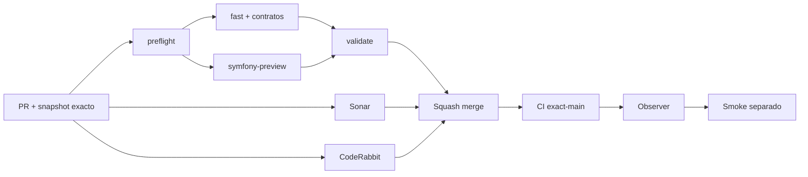

# GrindFlow — Último deploy

> **Candidato v0.1.116: Vault S2 multimedia.** Base exacta `main` v0.1.115 `28590766e7b8671a9b983cc90ed8d124ccff7196`; el quick upload Symfony añade MP4/WebM privados hasta 8 MiB, filtros y preview de video sin habilitar procesamiento ni distribución.

## Progress convention
- ✅ ~~Completado~~ = verificado; 🚧 Pendiente = en curso; ⛔ bloqueado = dependencia externa.

## Fuentes de verdad
[AGENTS.md](AGENTS.md) · [Spec](docs/GRINDFLOW-SPEC.md) · [Requisitos](docs/REQUIREMENTS.md) · [Transición](docs/STACK-TRANSITION-SYMFONY.md) · [Roadmap #2](https://github.com/pl0n3r/GrindFlow/issues/2)

## Estado del deploy
| Señal | Estado | Evidencia |
| --- | --- | --- |
| Version objetivo | 🚧 **v0.1.116** | `config/version.php`; no publicada |
| Base exacta | ✅ ~~main v0.1.115~~ | `28590766e7b8671a9b983cc90ed8d124ccff7196` |
| CI del PR | 🚧 Pendiente | Exigir `validate` del HEAD final en `success` |
| Sonar del PR | 🚧 Pendiente | Exigir `SonarCloud Code Analysis` del HEAD final en `success` |
| CodeRabbit del PR | 🚧 Pendiente | Exigir revisión completada del HEAD final |
| CI del SHA exacto de main | ✅ ~~success~~ | `35871470653` sobre `28590766e7b8671a9b983cc90ed8d124ccff7196` |
| Deploy Observer | ✅ ~~Marcador humano observado~~ | `35871470660` success; no acredita SHA remoto |
| Production Smoke | ⛔ Login E2E no validado | `35871470895` failure, #73; independiente |
| Symfony en Hostinger | ⛔ NO desplegado | Sin cutover |
| Datos productivos | ✅ ~~No tocados~~ | Solo código/tests/docs en rama aislada |

## Huella del cambio
<!-- grindflow:git-delta -->
| Archivos | Inserciones | Eliminaciones | Neto |
| ---: | ---: | ---: | ---: |
| **11** | **+642** | **−207** | **+435** |

## Calidad y entrega
<!-- grindflow:gate-plan -->
| Control | Estado / contrato |
| --- | --- |
| Gates seleccionados | **preflight · fast[operational contracts + automation syntax + README dashboard] · symfony-preview** |
| Gate agregador obligatorio | **validate**: todos los seleccionados; Sonar y CodeRabbit aparte |
| Alcance | GF-FR-019: quick upload y preview privado MP4/WebM en Vault Symfony |
| Revisiones | CI/Sonar/CodeRabbit HEAD; exact-main, Observer y Smoke separados |

## Flujo de entrega

## Qué se hizo
- Quick upload S2 acepta JPEG/PNG/WebP y ahora MP4/WebM hasta 8 MiB, con detección real de MIME y firma de contenedor; extensión/MIME cliente no bastan.
- El bootstrap S2 aún no desplegado define `ck_gf_vault_assets_mime` con fotos + MP4/WebM; no se añade un ALTER no aditivo ni se toca una base productiva.
- Listado incorpora filtros `mp4`/`webm`; cuota, deduplicación, clasificación, nota, papelera, integridad y descarga siguen tenant-safe y comunes a todos los originales.
- Preview privado de video verifica sesión, tenant, estado, tamaño y SHA-256 antes de servir el MIME real con headers privados y filename fijo.
- React admite selección múltiple de fotos/videos, preview local y detalle con controles nativos, `preload=metadata`, `playsInline` y sin autoplay.
- PHPUnit/MariaDB y Chromium 360 px fijan contenedores válidos/inválidos, cross-tenant, filtros, headers, upload y preview móvil. No se ejecuta FFmpeg ni se llama ningún proveedor.

## Archivos modificados en esta entrega candidata
Inventario exclusivo de esta entrega candidata; no prueba publicación:
<!-- grindflow:changed-files -->
- `README.md`
- `config/version.php`
- `docs/GRINDFLOW-SPEC.md`
- `docs/REQUIREMENTS.md`
- `docs/SYMFONY-VAULT-STORAGE.md`
- `symfony/frontend/admin/VaultPanel.tsx`
- `symfony/frontend/admin/admin.css`
- `symfony/migrations/Version20260920164500.php`
- `symfony/src/Http/Controller/VaultController.php`
- `symfony/tests/e2e/preview.spec.mjs`
- `symfony/tests/php/VaultVideoTest.php`

## Validación
- Exigir `preflight`, `fast`, `symfony-preview`, `validate`, Sonar y CodeRabbit sobre el HEAD final.
- La prueba Symfony usa MariaDB y media sintética; no demuestra video productivo ni almacenamiento durable en Hostinger.
- Production Smoke #73 permanece separado y esta entrega no reintenta credenciales ni muta producción.

## Qué sigue
[Roadmap canónico #2](https://github.com/pl0n3r/GrindFlow/issues/2)

## Panorama general pendiente
| Lane | Frente | Estado |
| --- | --- | --- |
| **NOW** | 🚧 GF-FR-019: Vault S2 multimedia | 🚧 v0.1.116 candidata |
| **NEXT** | 🚧 Pipeline/direct upload de media grande en Symfony | 🚧 pendiente de slice |
| **BLOCKED / EXTERNAL** | ⛔ Smoke autenticado Laravel | ⛔ #73 |
| **LATER** | 🚧 Cutover Symfony por módulo | 🚧 sin deploy |
