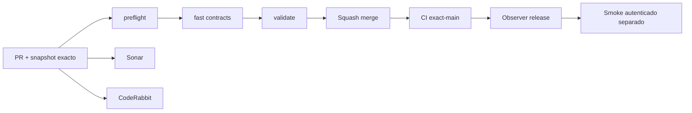

# GrindFlow — Último deploy

> **Snapshot v0.1.38: solo el deploy actual, primer Vault privado S2 en código, Symfony aún sin despliegue.** Base `main` v0.1.37 `061e0315724731f4be4259f7bcfe0dac9655ffb5`. Imágenes JPEG/PNG/WebP con subida móvil, lista privada y descarga de la organización seleccionada; CSRF y membresía actual en servidor. Laravel sigue como runtime; **Symfony no está desplegado ni se migraron cuentas o archivos**.

## Progress convention
- ✅ ~~Completado~~ = verificado; 🚧 Pendiente = en curso; ⛔ bloqueado = dependencia externa.

## Fuentes de verdad
[AGENTS.md](AGENTS.md) · [Spec](docs/GRINDFLOW-SPEC.md) · [Requisitos](docs/REQUIREMENTS.md) · [Transición](docs/STACK-TRANSITION-SYMFONY.md) · [Roadmap #2](https://github.com/pl0n3r/GrindFlow/issues/2)

## Estado del deploy
| Señal | Estado | Evidencia |
| --- | --- | --- |
| Version objetivo | 🚧 **v0.1.38** | `config/version.php` |
| Base exacta | ✅ ~~main v0.1.37~~ | `061e0315724731f4be4259f7bcfe0dac9655ffb5` |
| CI del PR | 🚧 Head final pendiente | `GrindFlow CI / validate` |
| Sonar | 🚧 Pendiente | SonarCloud PR |
| CodeRabbit | 🚧 Revisión por comprobar | PR |
| CI del SHA exacto de main | 🚧 Después del merge | CI PR no lo sustituye |
| Deploy Observer | 🚧 Release humano por observar | No prueba Symfony en remoto |
| Production Smoke | ⛔ Credencial E2E productiva pendiente | [Issue #1](https://github.com/pl0n3r/GrindFlow/issues/1) |
| Symfony S1 en Hostinger | ⛔ NO desplegado | Solo entorno aislado CI |
| Migraciones | ✅ ~~Ningún esquema productivo modificado~~ | DB Symfony descartable |

## Huella del cambio
<!-- grindflow:git-delta -->
| Archivos | Inserciones | Eliminaciones | Neto |
| ---: | ---: | ---: | ---: |
| **12** | **+704** | **−23** | **+681** |

## Calidad y entrega
<!-- grindflow:gate-plan -->
| Control | Estado / contrato |
| --- | --- |
| Gates seleccionados | **preflight · fast[contracts] · php-quality · PHPUnit · MariaDB · browser · real-stack · legacy · symfony-preview** |
| Alcance | Biblioteca S2 real: archivos privados por tenant, imagen validada, UI móvil, reversión Doctrine, pruebas PHP y Chromium |
| Revisiones | CI/Sonar/CodeRabbit, exact-main y Hostinger son independientes |

## Flujo de entrega

## Qué se hizo
- Primera biblioteca privada Symfony S2: subida desde móvil de JPEG/PNG/WebP hasta 8 MiB, listado de hasta 30 imágenes y descarga autorizada sin URL pública.
- Directorio privado `symfony/var/vault/`, hashes SHA-256 solo en BD, nombres opacos y respuestas JSON sin rutas de almacenamiento; valida bytes e imagen real.
- CSRF específico y membresía/rol revalidados por petición y al insertar; clientes no pueden elegir el tenant; sin permisos se deniega subir.
- Migración Doctrine S2 reversible en MariaDB Symfony aislada, PHPUnit de identidad/tenant/revocación y Chromium de UI móvil. Sin videos, conectores ni cambios productivos.

## Archivos modificados en este deploy
- `.github/workflows/grindflow-ci.yml`
- `README.md`
- `config/version.php`
- `symfony/README.md`
- `symfony/frontend/admin/AdminApp.tsx`
- `symfony/frontend/admin/VaultPanel.tsx`
- `symfony/frontend/admin/admin.css`
- `symfony/migrations/Version20260920164500.php`
- `symfony/src/Http/Controller/AdminContextController.php`
- `symfony/src/Http/Controller/VaultController.php`
- `symfony/tests/e2e/preview.spec.mjs`
- `symfony/tests/php/VaultTest.php`

## Validación
- PHPUnit sobre MariaDB descartable: CSRF, MIME, IDOR, membresía y storage privado; Chromium comprueba subida responsive y API anónima.
- CI de PR, Sonar/CodeRabbit, CI exact-main y Hostinger se comprueban separadamente; no se acredita cutover Symfony.

## Qué sigue
| Lane | Trabajo |
| --- | --- |
| **NOW** | 🚧 Validar biblioteca S2 v0.1.38, [roadmap #2](https://github.com/pl0n3r/GrindFlow/issues/2) |
| **NEXT** | 🚧 Paginación y cuotas del Vault; video/almacenamiento remoto tras verificar hosting |
| **LATER** | 🚧 Vault móvil → reglas → distribución autorizada → piloto |
| **BLOCKED / EXTERNAL** | ⛔ Cutover sin paridad/datos migrados; Smoke sin credencial |

## Panorama general pendiente
| Lane | Frente | Estado |
| --- | --- | --- |
| **DONE** | ✅ ~~Dashboard Laravel v0.1.30~~ | ✅ ~~Esquema Symfony S1 v0.1.31~~ |
| **NOW** | 🚧 Biblioteca privada S2 v0.1.38 | 🚧 CI y revisión |
| **NEXT** | 🚧 Mejoras S2 | 🚧 Paginación, cuotas y fallos parciales |
| **LATER** | 🚧 Automatización de contenido | 🚧 S2–S5 |
| **BLOCKED / EXTERNAL** | ⛔ Sin cutover Symfony | ⛔ Sin credencial Smoke |
