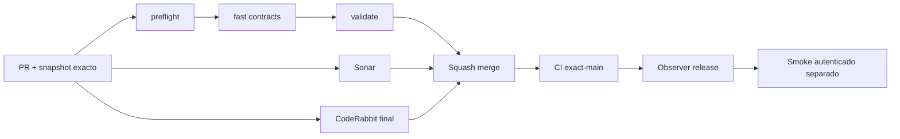

# GrindFlow — Último deploy

> **Candidato v0.1.78: diagnóstico seguro del acceso y smoke sin intentos repetidos.** Base exacta `main` v0.1.77 `4b5ebeba23e535b845caec943e1b713dd5379165`; sin cutover ni migraciones productivas.

## Progress convention
- ✅ ~~Completado~~ = verificado; 🚧 Pendiente = en curso; ⛔ bloqueado = dependencia externa.

## Fuentes de verdad
[AGENTS.md](AGENTS.md) · [Spec](docs/GRINDFLOW-SPEC.md) · [Requisitos](docs/REQUIREMENTS.md) · [Transición](docs/STACK-TRANSITION-SYMFONY.md) · [Roadmap #2](https://github.com/pl0n3r/GrindFlow/issues/2)

## Estado del deploy
| Señal | Estado | Evidencia |
| --- | --- | --- |
| Version objetivo | 🚧 **v0.1.78** | `config/version.php` |
| Base exacta | ✅ ~~main v0.1.77~~ | `4b5ebeba23e535b845caec943e1b713dd5379165` |
| CI del PR | 🚧 Head v0.1.78 por validar | `GrindFlow CI / validate` |
| Sonar | 🚧 Pendiente del head estable | SonarCloud PR |
| CodeRabbit | 🚧 Esperar revisión completa del head final | PR y AGENTS.md |
| CI del SHA exacto de main | 🚧 v0.1.77 ejecutándose | run `35667874191` |
| Deploy Observer | 🚧 v0.1.77 en observación | run `35667874090`; versión humana, NO SHA Hostinger |
| Production Smoke | ⛔ Auth E2E sin verificar | [Issue #73](https://github.com/pl0n3r/GrindFlow/issues/73), run `35664937043`; #1 resuelto |
| Symfony en Hostinger | ⛔ NO desplegado | Solo entorno aislado CI |
| Migraciones | ✅ ~~Sin cambios de esquema~~ | Producción intacta |

## Huella del cambio
<!-- grindflow:git-delta -->
| Archivos | Inserciones | Eliminaciones | Neto |
| ---: | ---: | ---: | ---: |
| **4** | **+0** | **−0** | **+0** |

## Calidad y entrega
<!-- grindflow:gate-plan -->
| Control | Estado / contrato |
| --- | --- |
| Gates seleccionados | **preflight · fast[contracts]** |
| Alcance | #73: inspección segura de redirect login/dashboard, manejo 419, abortar reintentos deterministas |
| Revisiones | CI/Sonar/CodeRabbit sobre el mismo SHA antes del merge; exact-main y Hostinger separados |

## Flujo de entrega

## Qué se hizo
- Captura `Location` del POST login y GET dashboard; emite solo rutas estáticas permitidas, sin consultas, dominios, identificadores o secretos. El logger general también excluye `Location` cruda.
- Redirecciones de autenticación y HTTP 401/403/419/422/429 se detienen tras un solo login, evitando 15 intentos repetidos; fallos transitorios conservan su política.
- Contrato sin acceso a producción con curl simulado: vuelta a login, HTTP 419, dashboard→login/organizaciones y ruta privada censurada.
- #73 sigue abierto: instrumentación NO equivale a corregir las credenciales/sesión reales ni demuestra deploy. Sin cambios de datos, cuenta ni Symfony.

## Archivos modificados en este deploy
Inventario del candidato v0.1.78, no evidencia de archivos publicados. «solo el deploy actual» conserva el marcador de control del snapshot README.
- `README.md`
- `config/version.php`
- `scripts/production-smoke-contract.sh`
- `scripts/production-smoke.sh`

## Validación
- CI/Sonar/CodeRabbit del candidato todavía pendientes. El gate `fast[contracts]` debe ejecutar mocks y no usa contraseña E2E real.
- Smoke #59 encontró `/dashboard HTTP 302` sin `Location`; una vez integrado v0.1.78 se registrará solo el destino saneado para investigar #73.
- No repetir pruebas manuales ciegas ni inferir deploy exacto desde el número de versión.

## Qué sigue
[Roadmap canónico #2](https://github.com/pl0n3r/GrindFlow/issues/2)

| Lane | Trabajo | Estado |
| --- | --- | --- |
| **NOW** | 🚧 Validar diagnóstico seguro v0.1.78 #73 | 🚧 CI/Sonar/CodeRabbit |
| **NEXT** | 🚧 Determinar causa real del redirect con una prueba posterior | 🚧 Evidencia saneada |
| **LATER** | 🚧 S4, Distribution + Traffic Symfony | 🚧 Sin cutover |
| **BLOCKED / EXTERNAL** | ⛔ Smoke autenticado #73 y paridad cutover | ⛔ Producción no verificada |

## Panorama general pendiente
| Lane | Frente | Estado |
| --- | --- | --- |
| **DONE** | ✅ ~~Navegación de identidad + CodeRabbit obligatorio v0.1.77; secret #1~~ | ✅ ~~PR #74 fusionada con revisión final~~ |
| **NOW** | 🚧 Smoke seguro y fail-fast v0.1.78 | 🚧 Head pendiente de CI/revisión |
| **NEXT** | 🚧 Corregir causa #73 después de conocer destino 302 | 🚧 No inferir fallo de contraseña |
| **LATER** | 🚧 Distribution + Traffic Symfony | 🚧 Sin cutover |
| **BLOCKED / EXTERNAL** | ⛔ Smoke autenticado y cutover sin paridad | ⛔ Hostinger no verificado |
