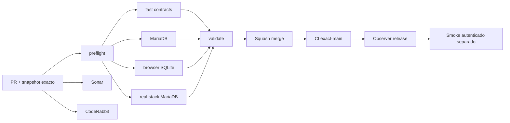

# GrindFlow — Último deploy

> **Snapshot v0.1.21: solo el deploy actual.** Base `main` v0.1.20 `9206524801a86b4c603f802ce512b8ee01ff04b6`. [CI exact-main anterior](https://github.com/pl0n3r/GrindFlow/actions/runs/35472591631) exitoso; smoke anterior falló por secreto ausente. Sin checkout de Hostinger comprobado.

## Progress convention
- ✅ ~~Completado~~ = verificado; 🚧 Pendiente = en curso; ⛔ bloqueado = depende del exterior.

## Fuentes de verdad
[AGENTS.md](AGENTS.md) · [Especificación](docs/GRINDFLOW-SPEC.md) · [Requisitos](docs/REQUIREMENTS.md) · [Roadmap general #2](https://github.com/pl0n3r/GrindFlow/issues/2)

## Estado del deploy
| Señal | Estado | Evidencia |
| --- | --- | --- |
| Work line | 🚧 **Paridad técnica con BRVTAL adaptada** | v0.1.21 |
| Base exacta | ✅ **main v0.1.20** | `9206524801a86b4c603f802ce512b8ee01ff04b6` |
| Version | 🚧 **v0.1.21 objetivo** | config/version.php |
| CI del PR | 🚧 **pendiente** | validate |
| Sonar | 🚧 **Quality Gate aún sin confirmar** | `pl0n3r_GrindFlow` |
| CodeRabbit | 🚧 **full review pendiente** | head estable |
| CI del SHA exacto de main | 🚧 **posterior al merge** | base verde #35472591631 |
| Deploy Observer | 🚧 **nuevo, solo versión** | SHA Hostinger no observado |
| Production Smoke | ⛔ **sin credencial** | [Issue #1](https://github.com/pl0n3r/GrindFlow/issues/1) |
| Deploy/producción v0.1.21 | ⛔ **no verificados** | Hostinger pendiente |
| Migraciones | ✅ **sin SQL productivo** | no hay cambios de esquema |

## Huella del cambio
<!-- grindflow:git-delta -->
| Archivos | Inserciones | Eliminaciones | Neto |
| ---: | ---: | ---: | ---: |
| **20** | **+466** | **−98** | **+368** |

## Calidad y entrega
<!-- grindflow:gate-plan -->
| Control | Estado / contrato |
| --- | --- |
| Gates seleccionados | **preflight · fast[contracts] · php-quality · PHPUnit · MariaDB · browser · real-stack · legacy** |
| Real-stack | MariaDB 11.4 + PHP 8.5 + Chrome + seeder sintético |
| Observer | GET `/_deployment`, `exact=false`, sin SHA remoto inferido |
| Revisiones | CI/Sonar/CodeRabbit y exact-main independientes |

## Flujo de entrega

## Qué se hizo
- Memoria y agentes alineados con Laravel/MariaDB; decisiones legadas archivadas.
- Real-stack E2E autenticado en MariaDB complementa Chromium SQLite y es obligatorio al seleccionarse.
- Release observer read-only y marcador público sin credenciales, DB ni SHA inventado.
- Roadmap #2, plantilla PR, badge Sonar y contratos sincronizados.

## Archivos modificados en este deploy
- `.github/agents/grindflow-test-specialist.md` — MariaDB como contrato del agente.
- `.github/agents/grindflow-ux-accessibility.md` — agente de UI accesible.
- `.github/copilot-instructions.md` — instrucciones actualizadas.
- `.github/pull_request_template.md` — roadmap maestro #2.
- `.github/workflows/grindflow-ci.yml` — real-stack MariaDB autenticado.
- `.github/workflows/production-deploy-observer.yml` — observación read-only de release.
- `.sonarcloud.properties` — Python de análisis declarado.
- `AGENTS.md` — memoria vigente y legado histórico separado.
- `README.md` — snapshot exacto del candidato.
- `config/version.php` — v0.1.21.
- `docs/DEPLOY-HOSTINGER.md` — release observado vs SHA.
- `docs/DEVELOPMENT-MODEL.md` — topología y enlaces.
- `docs/GRINDFLOW-SPEC.md` — contratos observer/E2E.
- `docs/PRUEBAS.md` — MariaDB/Chromium.
- `routes/web.php` — marcador público sin secretos.
- `scripts/ci-scope-contract.sh` — selección de gates.
- `scripts/ci-scope.sh` — flag real-stack.
- `scripts/readme-dashboard.py` — plan actualizado.
- `scripts/workflow-syntax-check.rb` — contrato read-only observer.
- `tests/Feature/DeploymentMarkerTest.php` — pruebas del marcador.

## Validación
- Base: [CI #35472591631](https://github.com/pl0n3r/GrindFlow/actions/runs/35472591631), ocho gates exitosos.
- Candidato: ejecutar CI, real-stack y revisiones antes de merge; no se declaran aprobados anticipadamente.
- Observer no demuestra SHA remoto ni comportamiento autenticado. Smoke real bloqueado por credencial #1.

## Qué sigue
| Lane | Trabajo |
| --- | --- |
| **NOW** | 🚧 Validar candidato [roadmap #2](https://github.com/pl0n3r/GrindFlow/issues/2) |
| **NEXT** | 🚧 Hostinger, marcadores y configuraciones |
| **LATER** | 🚧 Paridad funcional y retiro controlado del legado |
| **BLOCKED / EXTERNAL** | 🚧 Smoke sintético y Sonar [#1](https://github.com/pl0n3r/GrindFlow/issues/1) / [#4](https://github.com/pl0n3r/GrindFlow/issues/4) |

## Panorama general pendiente
| Lane | Frente | Estado |
| --- | --- | --- |
| **DONE** | ✅ ~~CI exact-main v0.1.20~~ | ✅ ~~ocho gates verdes~~ |
| **NOW** | 🚧 Real-stack y observer | 🚧 validación PR |
| **NEXT** | 🚧 Vault/storage, procesamiento real, admin | 🚧 roadmap |
| **LATER** | 🚧 Paridad legado, rendimiento y recuperación | 🚧 pendiente |
| **BLOCKED / EXTERNAL** | 🚧 Smoke, Hostinger e integraciones reales | 🚧 sin validar |
