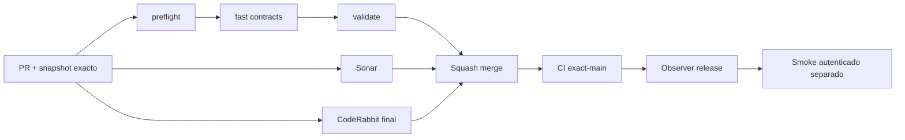

# GrindFlow — Último deploy

> **Candidato v0.1.79: diagnóstico seguro de acceso y smoke sin reintentos ciegos.** Base exacta `main` v0.1.78 `1872c40c69eb6c815007980b874ce19b83eb2c90`; sin cutover ni migraciones productivas.

## Progress convention
- ✅ ~~Completado~~ = verificado; 🚧 Pendiente = en curso; ⛔ bloqueado = dependencia externa.

## Fuentes de verdad
[AGENTS.md](AGENTS.md) · [Spec](docs/GRINDFLOW-SPEC.md) · [Requisitos](docs/REQUIREMENTS.md) · [Transición](docs/STACK-TRANSITION-SYMFONY.md) · [Roadmap #2](https://github.com/pl0n3r/GrindFlow/issues/2)

## Estado del deploy
| Señal | Estado | Evidencia |
| --- | --- | --- |
| Version objetivo | 🚧 **v0.1.79** | `config/version.php` |
| Base exacta | ✅ ~~main v0.1.78~~ | `1872c40c69eb6c815007980b874ce19b83eb2c90` |
| CI del PR | ✅ ~~VALIDATED IN CODE v0.1.79~~ | run `35672909846` success sobre `144619846cca5b80395f9016697669492801151f`; revalidar SHA final |
| Sonar | ✅ ~~Quality Gate v0.1.79 success~~ | SonarCloud PR; revalidar SHA final |
| CodeRabbit | 🚧 Esperar revisión completa del head final | PR y AGENTS.md |
| CI del SHA exacto de main | ✅ ~~v0.1.78 success~~ | run `35672544872` |
| Deploy Observer | ✅ ~~v0.1.78 release observado~~ | run `35672544877`; versión humana, NO SHA Hostinger |
| Production Smoke | ⛔ Auth E2E sin verificar | [Issue #73](https://github.com/pl0n3r/GrindFlow/issues/73), run `35664937043`; #1 resuelto |
| Symfony en Hostinger | ⛔ NO desplegado | Solo entorno aislado CI |
| Migraciones | ✅ ~~Sin cambios de esquema~~ | Producción intacta |

## Huella del cambio
<!-- grindflow:git-delta -->
| Archivos | Inserciones | Eliminaciones | Neto |
| ---: | ---: | ---: | ---: |
| **4** | **+188** | **−61** | **+127** |

## Calidad y entrega
<!-- grindflow:gate-plan -->
| Control | Estado / contrato |
| --- | --- |
| Gates seleccionados | **preflight · fast[contracts]** |
| Alcance | #73: sanitización de redirect y HTTP 401/403/419/422/429, diagnósticos sin body y fail-fast |
| Revisiones | CI/Sonar/CodeRabbit sobre el mismo SHA antes del merge; exact-main y Hostinger separados |

## Flujo de entrega

## Qué se hizo
- Captura `Location` del POST login y GET dashboard; emite solo rutas locales permitidas (nunca URL con esquema/host), sin consultas, dominios, identificadores o secretos. El logger general también excluye `Location` cruda.
- Redirecciones de autenticación y HTTP 401/403/419/422/429 del login **o dashboard** se detienen tras un solo login; fallos transitorios conservan su política.
- Contrato sintético: login/dashboard HTTP 401/403/419/422/429, redirects 302/303, rutas censuradas y aserciones negativas fail-closed. No se imprimen cuerpos HTTP.
- #73 sigue abierto: instrumentación NO equivale a corregir las credenciales/sesión reales ni demuestra deploy. Sin cambios de datos, cuenta ni Symfony.

## Archivos modificados en este deploy
Inventario del candidato v0.1.79, no evidencia de archivos publicados. «solo el deploy actual» conserva el marcador de control del snapshot README.
- `README.md`
- `config/version.php`
- `scripts/production-smoke-contract.sh`
- `scripts/production-smoke.sh`

## Validación
- CI `35672909846` y Sonar success sobre el head `144619846cca5b80395f9016697669492801151f`; verificar CI/Sonar del SHA final después de documentar esta evidencia. CodeRabbit final sigue pendiente. `fast[contracts]` usa mocks, nunca la contraseña E2E real.
- Smoke #59 encontró `/dashboard HTTP 302` sin `Location`; una vez integrado v0.1.79 se registrará solo el destino saneado para investigar #73.
- No repetir pruebas manuales ciegas ni inferir deploy exacto desde el número de versión.

## Qué sigue
[Roadmap canónico #2](https://github.com/pl0n3r/GrindFlow/issues/2)

| Lane | Trabajo | Estado |
| --- | --- | --- |
| **NOW** | 🚧 Validar diagnóstico seguro v0.1.79 #73 | 🚧 CI/Sonar/CodeRabbit |
| **NEXT** | 🚧 Determinar causa real del redirect con una prueba posterior | 🚧 Evidencia saneada |
| **LATER** | 🚧 S4, Distribution + Traffic Symfony | 🚧 Sin cutover |
| **BLOCKED / EXTERNAL** | ⛔ Smoke autenticado #73 y paridad cutover | ⛔ Producción no verificada |

## Panorama general pendiente
| Lane | Frente | Estado |
| --- | --- | --- |
| **DONE** | ✅ ~~Navegación de identidad + CodeRabbit obligatorio v0.1.77; secret #1~~ | ✅ ~~PR #74 fusionada con revisión final~~ |
| **NOW** | 🚧 Smoke seguro y fail-fast v0.1.79 | 🚧 Head pendiente de CI/revisión |
| **NEXT** | 🚧 Corregir causa #73 después de conocer destino 302 | 🚧 No inferir fallo de contraseña |
| **LATER** | 🚧 Distribution + Traffic Symfony | 🚧 Sin cutover |
| **BLOCKED / EXTERNAL** | ⛔ Smoke autenticado y cutover sin paridad | ⛔ Hostinger no verificado |
