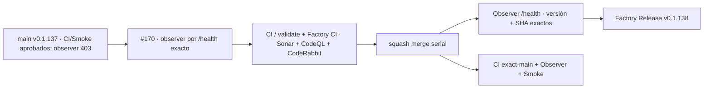

# GrindFlow — Último deploy

> **Candidata v0.1.138 · Issue #170.** Recupera el Deploy Observer usando la identidad exacta ya expuesta por `/health`, sin escrituras productivas.

## Progress convention
- ✅ ~~Completado~~ = verificado; 🚧 Pendiente = en curso; ⛔ bloqueado = dependencia externa.

## Fuentes de verdad
[AGENTS.md](AGENTS.md) · [Spec](docs/GRINDFLOW-SPEC.md) · [Requisitos](docs/REQUIREMENTS.md) · [Roadmap #2](https://github.com/pl0n3r/GrindFlow/issues/2)

## Estado del deploy
| Señal | Estado | Evidencia |
| --- | --- | --- |
| SHA exacto de main (base) | ✅ **af31ff256c26b529730b6f8145773f0175116bea** | v0.1.137 fusionada (#168) |
| Tag y GitHub Release (base) | ✅ **v0.1.137** | Release Factory success |
| CI del SHA exacto de main (base) | ✅ **success** | run 36118866455 |
| Deploy Observer base | ⛔ **failure** | `/_deployment` devolvió 403 en run 36118866592 |
| Production Smoke base | ✅ **success** | run 36118866607; `/health` exacto + auth |
| Version objetivo | 🚧 **v0.1.138** | PHP, npm y lock en paridad |
| CI/Sonar/CodeRabbit del PR | 🚧 pendiente | Issue #170 · observer exacto/read-only |
| Producción objetivo | 🚧 pendiente | verificación independiente tras merge |

## Huella del cambio
<!-- grindflow:git-delta -->
| Archivos | Inserciones | Eliminaciones | Neto |
| ---: | ---: | ---: | ---: |
| **7** | **+000** | **−000** | **+000** |

## Calidad y entrega
<!-- grindflow:gate-plan -->
| Control | Estado / contrato |
| --- | --- |
| Gates seleccionados | **preflight · fast[operational contracts + automation syntax + README dashboard] · php-quality · PHPUnit · MariaDB · browser · real-stack · legacy · symfony-preview** |
| PR + snapshot exacto | **Issue #170 · v0.1.138**; diff y README deben coincidir con HEAD final |
| Gate agregador obligatorio | **validate** conserva gates seleccionados + privacidad; Sonar, CodeQL y CodeRabbit separados |
| Release Factory v1 | Solo push main; tag anotado y GitHub Release sin deploy productivo |
| CI local canónico | `GrindFlow CI / validate` sigue obligatorio, Factory CI corre en paralelo |
| Rol del PR | **SRE · Infraestructura · QA** |

## Flujo de entrega

## Qué se hizo
- Sustituye el endpoint legacy `/_deployment`, hoy bloqueado con 403, por `/health` read-only.
- El observer exige `status=ok`, versión esperada, `exact=true` y SHA exacto de `github.sha`.
- Reduce la espera máxima del observer y mantiene `concurrency` + permisos `contents: read`.
- Fija `actions/checkout` del observer a SHA.
- Añade regresión offline para impedir volver al marcador release-only o perder la identidad exacta.

## Archivos modificados en esta entrega candidata
<!-- grindflow:changed-files -->
- `.github/workflows/grindflow-ci.yml`
- `.github/workflows/production-deploy-observer.yml`
- `README.md`
- `config/version.php`
- `package-lock.json`
- `package.json`
- `tests/test_production_deploy_observer.py`

## Validación
- Contrato offline comprueba endpoint, campos exactos, read-only, timeout y pin de checkout.
- `fast` ejecuta la regresión en cada cambio relevante.
- Tras merge deben pasar por separado CI exact-main, Deploy Observer y Production Smoke.

## Qué sigue
[Roadmap canónico #2](https://github.com/pl0n3r/GrindFlow/issues/2)

## Panorama general pendiente
| Lane | Frente | Estado |
| --- | --- | --- |
| **NOW** | 🚧 #170 · recuperar Deploy Observer | 🚧 candidata v0.1.138 |
| **NEXT** | 🚧 #125/#129 · herencia, barrido y deploy/rollback | 🚧 tras recuperar GREEN |
| **BLOCKED / EXTERNAL** | ⛔ #139 Dependabot + #146 media storage | ⛔ evidencia/configuración externa |
| **LATER** | 🚧 #122 helper CodeRabbit + #138 Sentry | 🚧 preservados tras TANDA 2 |
