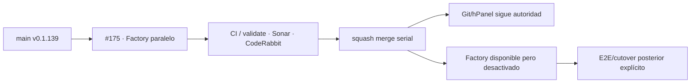

# GrindFlow — Último deploy

> **Candidata v0.1.140 · Issue #175.** Adopción paralela del deploy reversible Factory v1 sin cambiar la autoridad Git/hPanel.

## Progress convention
- ✅ ~~Completado~~ = verificado; 🚧 Pendiente = en curso; ⛔ bloqueado = dependencia externa.

## Fuentes de verdad
[AGENTS.md](AGENTS.md) · [Spec](docs/GRINDFLOW-SPEC.md) · [Requisitos](docs/REQUIREMENTS.md) · [Roadmap #2](https://github.com/pl0n3r/GrindFlow/issues/2)

## Estado del deploy
| Señal | Estado | Evidencia |
| --- | --- | --- |
| SHA exacto de main (base) | ✅ **7e165f6c412310a0e3b8da9cf64d670fa1b16e61** | v0.1.139 |
| CI del SHA exacto de main (base) | ✅ evidencia previa de la entrega | GitHub Actions |
| Autoridad productiva | ✅ **Git/hPanel** | Factory permanece inactivo |
| Version objetivo | 🚧 **v0.1.140** | PHP, npm y lock en paridad |
| CI/Sonar/CodeRabbit del PR | 🚧 pendiente | HEAD candidata #175 |
| Producción objetivo | 🚧 sin cutover | este slice no cambia autoridad |

## Huella del cambio
<!-- grindflow:git-delta -->
| Archivos | Inserciones | Eliminaciones | Neto |
| ---: | ---: | ---: | ---: |
| **14** | **+486** | **−39** | **+447** |

## Calidad y entrega
<!-- grindflow:gate-plan -->
| Control | Estado / contrato |
| --- | --- |
| Gates seleccionados | **preflight · fast[operational contracts + automation syntax + README dashboard] · php-quality · PHPUnit · MariaDB · browser · real-stack · legacy · symfony-preview** |
| PR + snapshot exacto | **Issue #175 · v0.1.140**; README debe coincidir con HEAD final |
| Gate agregador obligatorio | **validate** conserva matriz completa; Sonar y CodeRabbit separados |
| Factory deploy | Manual + flag; `migration_mode: none`; SSH estricto; rollback solo artefacto |
| CI local canónico | **GrindFlow CI / validate** |
| Rol del PR | **Ingeniería · Infraestructura · SRE · Seguridad · DBA · QA** |

## Flujo de entrega

## Qué se hizo
- Añade caller manual de `factory/deploy.yml@v1`, bloqueado salvo `FACTORY_DEPLOY_ENABLED=true`.
- Añade adapters `build/backup/migrate/deploy/rollback` bajo `ops/factory/`.
- Backup registra el release `current` antes de preparar otro artefacto; si se solicita migración aditiva, falla cerrado antes de SSH.
- Deploy usa release por SHA, `shared/.env` y `shared/storage`, reutiliza `scripts/deploy-hostinger.sh` y conmuta `current` solo al final.
- Rollback valida `.release-sha` y cambia únicamente el symlink al release anterior; nunca restaura datos.
- AGENTS conserva Git/hPanel como autoridad y prohíbe presentar este slice como cutover productivo.

## Archivos modificados en esta entrega candidata
<!-- grindflow:changed-files -->
- `.github/workflows/deploy-factory.yml`
- `.github/workflows/grindflow-ci.yml`
- `AGENTS.md`
- `README.md`
- `config/version.php`
- `ops/factory/adapter.py`
- `ops/factory/backup`
- `ops/factory/build`
- `ops/factory/deploy`
- `ops/factory/migrate`
- `ops/factory/rollback`
- `package-lock.json`
- `package.json`
- `tests/test_factory_deploy_adapters.py`

## Validación
- Contratos prueban paths/SHA, wrappers ejecutables, caller inactivo, migración fail-closed, SSH estricto, release exacto y rollback artifact-only.
- El core CI ejecuta el contrato nuevo y por tocar `grindflow-ci.yml` selecciona la matriz completa.
- No se ejecutaron SSH, migraciones, cambios Hostinger, DNS, backups productivos ni cutover en este PR.
- Estado final exige CI/Sonar/CodeRabbit del mismo HEAD antes de fusionar.

## Qué sigue
[Roadmap canónico #2](https://github.com/pl0n3r/GrindFlow/issues/2)

## Panorama general pendiente
| Lane | Frente | Estado |
| --- | --- | --- |
| **NOW** | 🚧 #175 · deploy Factory paralelo | 🚧 candidata v0.1.140 |
| **NEXT** | 🚧 #140 · PHPStan/Rector | 🚧 recuperar tras #175 |
| **BLOCKED / EXTERNAL** | ⛔ #139 Dependabot + #146 media storage | ⛔ dependencias externas |
| **LATER** | 🚧 #138 Sentry y producto | 🚧 preservado |
