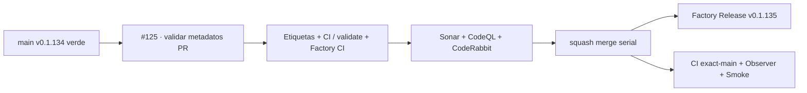

# GrindFlow — Último deploy

> **Candidata v0.1.135 · Issue #125.** Comp puerta de etiquetas en cada PR: solo metadatos y validador leído del SHA base. No autocorrige Issues ni modifica producción.

## Progress convention
- ✅ ~~Completado~~ = verificado; 🚧 Pendiente = en curso; ⛔ bloqueado = dependencia externa.

## Fuentes de verdad
[AGENTS.md](AGENTS.md) · [Spec](docs/GRINDFLOW-SPEC.md) · [Requisitos](docs/REQUIREMENTS.md) · [Roadmap #2](https://github.com/pl0n3r/GrindFlow/issues/2)

## Estado del deploy
| Señal | Estado | Evidencia |
| --- | --- | --- |
| SHA exacto de main (base) | ✅ **72ff4fafec053883021c9b4de8f7a71ce2ece2ef** | v0.1.134 fusionada (#165) |
| Tag y GitHub Release (base) | ✅ **v0.1.134** | tag anotado apunta a main |
| CI del SHA exacto de main (base) | ✅ **success** | validate job 107965159419 |
| Deploy Observer base | ✅ **success** | job 107964502805 |
| Production Smoke base | ✅ **success** | job 107964502236 |
| Versión objetivo | 🚧 **v0.1.135** | PHP, npm y lock en paridad |
| CI/Sonar/CodeRabbit del PR | 🚧 pendiente | HEAD final de #125 |
| Producción objetivo | 🚧 pendiente | verificación independiente tras merge |

## Huella del cambio
<!-- grindflow:git-delta -->
| Archivos | Inserciones | Eliminaciones | Neto |
| ---: | ---: | ---: | ---: |
| **8** | **+0** | **−0** | **+0** |

## Calidad y entrega
<!-- grindflow:gate-plan -->
| Control | Estado / contrato |
| --- | --- |
| Gates seleccionados | **preflight · fast[operational contracts + automation syntax + README dashboard] · php-quality · PHPUnit · MariaDB · browser · real-stack · legacy · symfony-preview** |
| PR + snapshot exacto | **Issue #125 · v0.1.135**; diff y README deben coincidir con HEAD final |
| Gate agregador obligatorio | **validate** conserva gates seleccionados + privacidad; Sonar, CodeQL y CodeRabbit separados |
| Release Factory v1 | Solo push main; tag anotado y GitHub Release sin deploy productivo |
| CI local canónico | `GrindFlow CI / validate` sigue obligatorio, Factory CI corre en paralelo |
| Rol del PR | **Infraestructura · Seguridad · QA** |

## Flujo de entrega

## Qué se hizo
- Crea workflow `Etiquetas` sobre eventos de PR y cambios de clasificación, solo con `contents: read`, checkout del SHA base y token no persistido.
- Valida etiquetas usando el contrato integrado v0.1.134: uno o dos tipos legítimos, una prioridad y un estado, preservando #127.
- Añade contrato negativo offline para permisos, eventos, checkout, job y ejecución en `fast`.
- Añade regla operativa de clasificación en AGENTS.md sin modificar el sincronizador aditivo.
- **No** habilita todavía branch protection requerida ni herencia/avisos/barrido de Issues; confirmar las capacidades de la integración GitHub al intentar leer branch protection (403).

## Archivos modificados en esta entrega candidata
<!-- grindflow:changed-files -->
- `.github/workflows/grindflow-ci.yml`
- `.github/workflows/validar-etiquetas.yml`
- `AGENTS.md`
- `README.md`
- `config/version.php`
- `package-lock.json`
- `package.json`
- `tests/test_label_workflow_contract.py`

## Validación
- Contrato offline del workflow falla si deriva evento, permisos, base SHA, nombre del job o cambia entrada de la CLI.
- La validación lee metadatos en `pull_request` sin ejecutar el código del PR ni secretos; no escribe etiquetas.
- Pendiente observar ejecución de `Etiquetas` y CI del HEAD final. Un check existente no implica que branch protection lo exija.

## Qué sigue
[Roadmap canónico #2](https://github.com/pl0n3r/GrindFlow/issues/2)

## Panorama general pendiente
| Lane | Frente | Estado |
| --- | --- | --- |
| **NOW** | 🚧 #125 · gate metadata PR | 🚧 candidata v0.1.135 |
| **NEXT** | 🚧 #125/#129 · herencia, avisos y deploy/rollback | 🚧 próximo slice |
| **BLOCKED / EXTERNAL** | ⛔ #139 Dependabot + #146 media storage | ⛔ evidencia/configuración externa |
| **LATER** | 🚧 #122 helper CodeRabbit + #138 Sentry | 🚧 preservados tras TANDA 2 |
