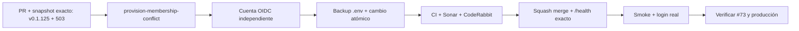

# GrindFlow — Último deploy

> **Candidato v0.1.126: identidad técnica OIDC separada.** `main` v0.1.125 SHA `3255a2473f1d51f3343ead1991c95c9b8cfe327b`: CI exact-main #35983175459 y Observer #35983175482 pasaron; Smoke #35983175642 verificó el SHA y tipificó HTTP 503 `provision-membership-conflict` antes del login. La cuenta anterior tiene membresías y no debe convertirse en administradora.

## Progress convention
- ✅ ~~Completado~~ = verificado; 🚧 Pendiente = en curso; ⛔ bloqueado = dependencia externa.

## Fuentes de verdad
[AGENTS.md](AGENTS.md) · [Spec](docs/GRINDFLOW-SPEC.md) · [Requisitos](docs/REQUIREMENTS.md) · [Roadmap #2](https://github.com/pl0n3r/GrindFlow/issues/2)

## Estado del deploy
| Señal | Estado | Evidencia |
| --- | --- | --- |
| Version objetivo | 🚧 **v0.1.126** | `config/version.php`; candidata |
| Base exacta | ✅ ~~main v0.1.125~~ | `3255a2473f1d51f3343ead1991c95c9b8cfe327b` |
| CI/Sonar/CodeRabbit del PR | 🚧 pendiente | exigen HEAD final |
| CI del SHA exacto de main (base) | ✅ ~~success~~ | #35983175459 |
| Health productivo base | ✅ ~~SHA exacto~~ | Smoke #35983175642 |
| Deploy Observer base | ✅ ~~success~~ | #35983175482 |
| Production Smoke base | ⛔ #73 · HTTP 503 provision-user | #35983175642; código `provision-membership-conflict`, sin login |
| Producción objetivo | 🚧 pendiente | aprovisionar cuenta técnica separada y verificar login |

## Huella del cambio
<!-- grindflow:git-delta -->
| Archivos | Inserciones | Eliminaciones | Neto |
| ---: | ---: | ---: | ---: |
| **12** | **+145** | **−40** | **+105** |

## Calidad y entrega
<!-- grindflow:gate-plan -->
| Control | Estado / contrato |
| --- | --- |
| Gates seleccionados | **preflight · fast[operational contracts + automation syntax + README dashboard] · php-quality · PHPUnit · MariaDB · browser · real-stack** |
| Gate agregador obligatorio | **validate**: todos los seleccionados; Sonar y CodeRabbit aparte |
| Alcance | #121/#73: evitar promoción de cuenta con membresía; identidad OIDC exclusiva |
| Rol del PR | **SRE · Backend Laravel · DBA · Application Security** |
| Revisiones | CodeRabbit terminal del HEAD; sin excepciones ni deploy antes de CI exacto |

## Flujo de entrega

## Qué se hizo
- El Smoke #35983175642 acreditó `provision-membership-conflict`: la identidad antigua tiene membresías y el comando se negó correctamente a elevarla.
- El bootstrap OIDC y el workflow usan un correo sintético reservado nuevo, sin renombrar ni tocar la cuenta anterior.
- El writer persiste correo y secreto juntos con backup cifrado y rollback; el comando mantiene la guarda de membresías.
- Tests cubren migración de `.env`, idempotencia y preservación de la identidad antigua mientras se aprovisiona la nueva.

## Archivos modificados en esta entrega candidata
Inventario del diff exacto:
<!-- grindflow:changed-files -->
- `.env.example`
- `.github/workflows/production-smoke.yml`
- `README.md`
- `app/Http/Controllers/Operations/ProductionSmokeBootstrapController.php`
- `app/Support/Deployment/ProductionEnvironmentWriter.php`
- `config/grindflow.php`
- `config/version.php`
- `docs/DEPLOY-HOSTINGER.md`
- `scripts/production-smoke.sh`
- `tests/Feature/ProductionSmokeBootstrapTest.php`
- `tests/Feature/ProvisionSmokeUserCommandTest.php`
- `tests/Unit/ProductionEnvironmentWriterTest.php`

## Validación
- PHPUnit cubre cambio atómico del correo, backup/rollback e identidad antigua asociada intacta; el comando conserva el rechazo por membresías.
- CI/Sonar/CodeRabbit del HEAD deben aprobar antes del merge. Smoke exact-SHA verificará el login; CI verde no equivale a producción verde.

## Qué sigue
[Roadmap canónico #2](https://github.com/pl0n3r/GrindFlow/issues/2)

## Panorama general pendiente
| Lane | Frente | Estado |
| --- | --- | --- |
| **NOW** | 🚧 #121 / #73 · cuenta antigua con membresía | 🚧 v0.1.126 separación |
| **NEXT** | 🚧 integrar y repetir Smoke real | 🚧 después de compuertas |
| **BLOCKED / EXTERNAL** | ⛔ login productivo aún no acreditado | ⛔ 503 en v0.1.125 |
| **LATER** | 🚧 Roadmap de producto | 🚧 tras producción verde |
