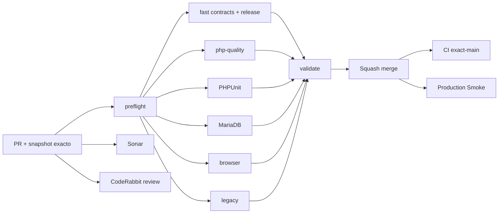

# GrindFlow — Último deploy

  
  
  

> **Development dashboard** de **solo el deploy actual**. Implementado, CI, deploy y validación productiva son estados distintos.

## Progress convention

- ✅ ~~Completado~~ = concluido y verificado por las compuertas que correspondan.
- 🚧 Pendiente = por hacer o en curso, sin tachado.

## Estado del deploy

| Señal | Estado | Evidencia |
| --- | --- | --- |
| Work line | 🚧 **GF-UX · Navegación móvil y Vault** | [Roadmap #88](https://github.com/drpipe1098-commits/GrindFlow/issues/88) |
| Base exacta | ✅ **v0.1.1 · PR #90 fusionado** | `main` `9c183dab05690d78b7b08f5b226d54b058187187` |
| Version | 🚧 **v0.1.2** | patch de navegación accesible |
| CI del PR | 🚧 **pendiente del head final** | GrindFlow CI / validate |
| Sonar | 🚧 **pendiente** | Quality Gate del PR |
| CodeRabbit | 🚧 **pendiente** | review sobre head estable |
| CI del SHA exacto de main | 🚧 **v0.1.2 por verificar tras merge** | v0.1.1 verde: #35428328028 |
| Production Smoke | 🚧 **schema bloqueado** | [#69](https://github.com/drpipe1098-commits/GrindFlow/issues/69): 7 migraciones pendientes en run #35428327988 |
| Migraciones | 🚧 **no ejecutadas** | backup externo restaurable + aprobación expresa |

## Huella del cambio

<!-- grindflow:git-delta -->

| Archivos | Inserciones | Eliminaciones | Neto |
| ---: | ---: | ---: | ---: |
| **6** | **+127** | **−39** | **+88** |

## Calidad y entrega

<!-- grindflow:gate-plan -->

| Control | Estado / contrato |
| --- | --- |
| Gates seleccionados | **preflight · fast[contracts] · php-quality · PHPUnit · browser** |
| Tests | enlaces reales, organización visible/ajena, empty state y versión |
| Autorización | sin cambios de roles ni permiso por UI; rutas tenant-scoped ya protegidas |
| Producción | migraciones y deploy siguen controles separados |

## Flujo de entrega

## Qué se hizo

- En móviles el rail inferior permite desplazarse entre todos los destinos autorizados; ya no oculta la quinta ruta en adelante.
- En pantallas medianas los nombres del rail compacto conservan accesibilidad para lectores de pantalla.
- Vault enlaza Distribution y Traffic; Finance aparece solo para roles con permiso y en la organización activa.
- Incorpora regresiones tenant-scoped, de roles y CSS. Bump v0.1.2, sin schema ni publicación externa.

## Archivos modificados en este deploy

- `README.md` — snapshot de v0.1.2
- `config/version.php` — versión humana v0.1.2
- `public/css/grindflow.css` — navegación móvil y accesibilidad
- `resources/views/vault/index.blade.php` — enlaces tenant-scoped y Finance por rol
- `tests/Feature/MediaVaultTest.php` — regresiones de navegación y roles
- `tests/Feature/VisualShellTest.php` — contrato de navegación móvil

## Validación

- CI / validate del SHA exacto de main v0.1.1 verde (#35428328028); Smoke #35428327988 reportó siete migraciones pendientes.
- v0.1.2 requiere CI / validate, Sonar y CodeRabbit sobre head estable; después, CI exact-main.
- Migraciones, backup externo, identidad desplegada y pruebas productivas permanecen independientes.

## Qué sigue

| Lane | Trabajo |
| --- | --- |
| **NOW** | 🚧 Validar navegación móvil v0.1.2; [roadmap #88](https://github.com/drpipe1098-commits/GrindFlow/issues/88). |
| **NEXT** | 🚧 Identidad desplegada y preparación segura de [#69](https://github.com/drpipe1098-commits/GrindFlow/issues/69). |
| **LATER** | 🚧 Enlaces cruzados restantes y auditoría de intentos. |
| **BLOCKED / EXTERNAL** | 🚧 Backup restaurable, aprobación de migraciones, storage S3 y FFmpeg. |

## Panorama general pendiente

| Lane | Frente | Estado |
| --- | --- | --- |
| **DONE** | ✅ ~~Workflow #87 y navegación #90 fusionados~~ | ✅ ~~CI de PR aprobado; no implica producción~~ |
| **NOW** | 🚧 Navegación móvil | 🚧 v0.1.2 |
| **NEXT** | 🚧 Migraciones y storage | 🚧 [#34](https://github.com/drpipe1098-commits/GrindFlow/issues/34) · [#40](https://github.com/drpipe1098-commits/GrindFlow/issues/40) |
| **LATER** | 🚧 Finance y paridad legado | 🚧 Después del esquema |
| **BLOCKED / EXTERNAL** | 🚧 Producción | 🚧 Backup/aprobación y deploy |
