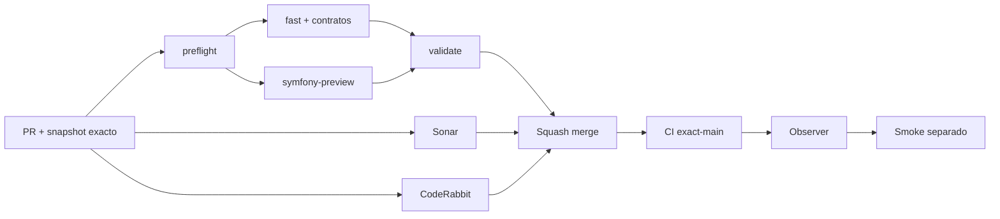

# GrindFlow — Último deploy

> **Candidato v0.1.117: fundamento fail-closed de direct upload S2.** Base exacta `main` v0.1.116 `6395c875bd85dd93d057a3818f3e1c7797c80072`; prepara contratos y readiness de media grande sin habilitar proveedor, endpoints de carga directa ni mutaciones productivas.

## Progress convention
- ✅ ~~Completado~~ = verificado; 🚧 Pendiente = en curso; ⛔ bloqueado = dependencia externa.

## Fuentes de verdad
[AGENTS.md](AGENTS.md) · [Spec](docs/GRINDFLOW-SPEC.md) · [Requisitos](docs/REQUIREMENTS.md) · [Transición](docs/STACK-TRANSITION-SYMFONY.md) · [Roadmap #2](https://github.com/pl0n3r/GrindFlow/issues/2)

## Estado del deploy
| Señal | Estado | Evidencia |
| --- | --- | --- |
| Version objetivo | 🚧 **v0.1.117** | `config/version.php`; no publicada |
| Base exacta | ✅ ~~main v0.1.116~~ | `6395c875bd85dd93d057a3818f3e1c7797c80072` |
| CI del PR | 🚧 Pendiente | Exigir `validate` del HEAD final en `success` |
| Sonar del PR | 🚧 Pendiente | Exigir `SonarCloud Code Analysis` del HEAD final en `success` |
| CodeRabbit del PR | 🚧 Pendiente | Exigir revisión completada del HEAD final |
| CI del SHA exacto de main | ✅ ~~success~~ | `35887675602` sobre `6395c875bd85dd93d057a3818f3e1c7797c80072` |
| Deploy Observer | ✅ ~~Marcador humano observado~~ | `35887675473` success; no acredita SHA remoto |
| Production Smoke | ⛔ Autenticación productiva no validada | `35887675478` failure, #73; independiente |
| Symfony en Hostinger | ⛔ NO desplegado | Sin cutover |
| Datos productivos | ✅ ~~No tocados~~ | Solo código/tests/docs en rama aislada |

## Huella del cambio
<!-- grindflow:git-delta -->
| Archivos | Inserciones | Eliminaciones | Neto |
| ---: | ---: | ---: | ---: |
| **23** | **+1527** | **−29** | **+1498** |

## Calidad y entrega
<!-- grindflow:gate-plan -->
| Control | Estado / contrato |
| --- | --- |
| Gates seleccionados | **preflight · fast[operational contracts + automation syntax + README dashboard] · symfony-preview** |
| Gate agregador obligatorio | **validate**: todos los seleccionados; Sonar y CodeRabbit aparte |
| Alcance | GF-FR-020: fundamento/readiness de direct upload Symfony para media grande |
| Revisiones | CI/Sonar/CodeRabbit HEAD; exact-main, Observer y Smoke separados |

## Flujo de entrega

## Qué se hizo
- Se añadió un port `DirectUploadStorage` y un fallback `UnavailableDirectUploadStorage` que no contacta proveedores y mantiene el Vault operativo.
- Tokens AES-256-GCM ligan tenant, actor, disk, staging key, nombre, MIME declarado, tamaño y expiración; sin secreto suficiente u OpenSSL la capacidad queda no configurada.
- Keys de staging/blob son opacas y tenant-safe; intent y completion internos quedan testeados con fake, límite de 2 GiB, tamaño exacto y SHA-256 por stream.
- `GET /api/admin/vault` expone solo `disk/driver/max_bytes/configured`; React muestra el estado de media grande sin bucket, endpoint, credenciales ni secretos.
- Quick upload JPEG/PNG/WebP/MP4/WebM de hasta 8 MiB permanece intacto.
- No hay adaptador S3/Flysystem, rutas `intent/complete`, upload directo de navegador, registro de media grande, FFmpeg/ffprobe ni cambios de Hostinger.

## Archivos modificados en esta entrega candidata
Inventario exclusivo de esta entrega candidata; no prueba publicación:
<!-- grindflow:changed-files -->
- `README.md`
- `config/version.php`
- `docs/GRINDFLOW-SPEC.md`
- `docs/REQUIREMENTS.md`
- `docs/SYMFONY-VAULT-STORAGE.md`
- `symfony/config/services.yaml`
- `symfony/frontend/admin/VaultPanel.tsx`
- `symfony/src/Http/Controller/VaultController.php`
- `symfony/src/Infrastructure/Storage/DirectUploadCompletionVerifier.php`
- `symfony/src/Infrastructure/Storage/DirectUploadIntentIssuer.php`
- `symfony/src/Infrastructure/Storage/DirectUploadObjectKeys.php`
- `symfony/src/Infrastructure/Storage/DirectUploadReadiness.php`
- `symfony/src/Infrastructure/Storage/DirectUploadStorage.php`
- `symfony/src/Infrastructure/Storage/DirectUploadTokenCipher.php`
- `symfony/src/Infrastructure/Storage/UnavailableDirectUploadStorage.php`
- `symfony/tests/e2e/preview.spec.mjs`
- `symfony/tests/php/DirectUploadCompletionVerifierTest.php`
- `symfony/tests/php/DirectUploadIntentIssuerTest.php`
- `symfony/tests/php/DirectUploadObjectKeysTest.php`
- `symfony/tests/php/DirectUploadReadinessTest.php`
- `symfony/tests/php/DirectUploadTokenCipherTest.php`
- `symfony/tests/php/UnavailableDirectUploadStorageTest.php`
- `symfony/tests/php/VaultTest.php`

## Validación
- Exigir `preflight`, `fast`, `symfony-preview`, `validate`, Sonar y CodeRabbit sobre el HEAD final.
- PHPUnit puro fija criptografía, contexto, tamper, expiración, keys, fake intent y completion; MariaDB comprueba el contenedor real y Chromium 360 px el estado visible.
- Production Smoke #73 permanece separado; esta entrega no reintenta credenciales ni muta producción.

## Qué sigue
[Roadmap canónico #2](https://github.com/pl0n3r/GrindFlow/issues/2)

## Panorama general pendiente
| Lane | Frente | Estado |
| --- | --- | --- |
| **NOW** | 🚧 GF-FR-020: fundamento/readiness direct upload | 🚧 v0.1.117 candidata |
| **NEXT** | 🚧 Adaptador S3-compatible + API intent/complete tenant-safe | 🚧 pendiente de slice |
| **BLOCKED / EXTERNAL** | ⛔ Smoke autenticado Laravel | ⛔ #73 |
| **LATER** | 🚧 Cutover Symfony por módulo | 🚧 sin deploy |
