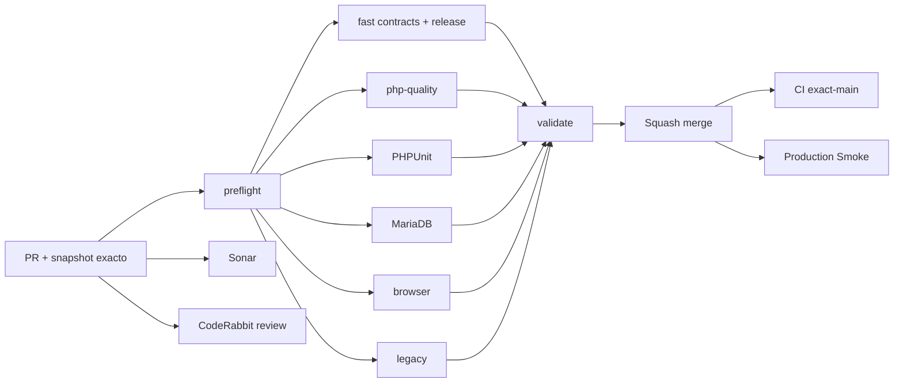

# GrindFlow — Último deploy

  
  
  

> **Development dashboard** de **solo el deploy actual**. Implementado, CI, deploy y validación productiva son estados distintos.

## Progress convention

- ✅ ~~Completado~~ = concluido y verificado por las compuertas que correspondan.
- 🚧 Pendiente = por hacer o en curso, sin tachado.

## Estado del deploy

| Señal | Estado | Evidencia |
| --- | --- | --- |
| Work line | 🚧 **GF-OPS · Navegación entre workspaces** | [Roadmap #88](https://github.com/drpipe1098-commits/GrindFlow/issues/88) |
| Base exacta | ✅ **v0.1.0 · PR #89 fusionado** | `main` `f65059a0d2d2e3e40b48a5563604fea7286d119c` |
| Version | 🚧 **v0.1.1** | patch de navegación |
| CI del PR | 🚧 **pendiente del head final** | GrindFlow CI / validate |
| Sonar | 🚧 **pendiente** | Quality Gate del PR |
| CodeRabbit | 🚧 **pendiente** | review sobre head estable |
| CI del SHA exacto de main | 🚧 **verificar tras merge** | separado del CI del PR |
| Production Smoke | 🚧 **schema bloqueado** | [#69](https://github.com/drpipe1098-commits/GrindFlow/issues/69): 7 migraciones pendientes en run #35428068354 |
| Migraciones | 🚧 **no ejecutadas** | backup externo restaurable + aprobación expresa |

## Huella del cambio

<!-- grindflow:git-delta -->

| Archivos | Inserciones | Eliminaciones | Neto |
| ---: | ---: | ---: | ---: |
| **6** | **+180** | **−61** | **+119** |

## Calidad y entrega

<!-- grindflow:gate-plan -->

| Control | Estado / contrato |
| --- | --- |
| Gates seleccionados | **preflight · fast[contracts] · php-quality · PHPUnit · browser** |
| Tests | enlaces reales, organización visible/ajena, empty state y versión |
| Autorización | sin cambios de roles ni permiso por UI; rutas tenant-scoped ya protegidas |
| Producción | migraciones y deploy siguen controles separados |

## Flujo de entrega

## Qué se hizo

- Corrige el Dashboard: Distribution vuelve a ser navegable cuando existe una organización visible.
- Admin > System enlaza Vault, Scheduler, Distribution y Traffic en una organización accesible al admin.
- Sin organización, los accesos conservan el estado deshabilitado; System no depende del esquema nuevo de estos módulos.
- Incorpora regresiones de enlaces, aislamiento entre organizaciones y navegación vacía.
- Bump deliberado `v0.1.1`, sin SQL de producción ni acciones externas.

## Archivos modificados en este deploy

- `README.md` — dashboard de v0.1.1.
- `app/Http/Controllers/Admin/SystemController.php` — organización para enlaces.
- `config/version.php` — patch de versión.
- `resources/views/admin/system.blade.php` — navegación funcional.
- `resources/views/dashboard.blade.php` — enlace Distribution tenant-scoped.
- `tests/Feature/AdminSystemTest.php` — regresiones de navegación.

## Validación

- Requiere CI / validate y Sonar sobre el head final.
- Prueba de rutas operativas y de ausencia de enlaces a organizaciones ajenas.
- El último Smoke exact-main informó **7 migraciones pendientes**, no ejecutadas.

## Qué sigue

| Lane | Trabajo |
| --- | --- |
| **NOW** | 🚧 Validar y fusionar navegación v0.1.1; [roadmap #88](https://github.com/drpipe1098-commits/GrindFlow/issues/88). |
| **NEXT** | 🚧 Verificar CI exact-main, Hostinger y lote de [#69](https://github.com/drpipe1098-commits/GrindFlow/issues/69). |
| **LATER** | 🚧 Auditoría de intentos y providers en sandbox. |
| **BLOCKED / EXTERNAL** | 🚧 Backup restaurable, aprobación, storage S3 y FFmpeg. |

## Panorama general pendiente

| Lane | Frente | Estado |
| --- | --- | --- |
| **DONE** | ✅ ~~Workflow #87 y modelo operativo #89 fusionados~~ | ✅ ~~CI de PR aprobado; no implica producción~~ |
| **NOW** | 🚧 Navegación | 🚧 v0.1.1 |
| **NEXT** | 🚧 Migraciones y storage | 🚧 [#34](https://github.com/drpipe1098-commits/GrindFlow/issues/34) · [#40](https://github.com/drpipe1098-commits/GrindFlow/issues/40) |
| **LATER** | 🚧 Finance y paridad legado | 🚧 Después del esquema |
| **BLOCKED / EXTERNAL** | 🚧 Producción | 🚧 Backup/aprobación y deploy |
