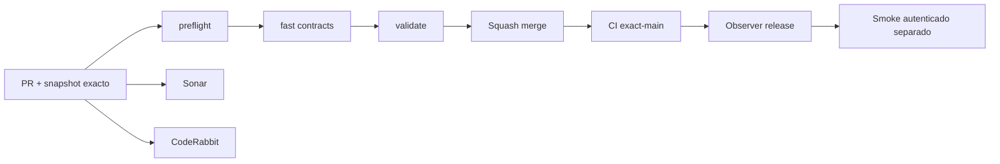

# GrindFlow — Último deploy

> **Snapshot v0.1.35: solo el deploy actual, pendiente de validación.** Base `main` v0.1.34 `3597ab5735e2f84713b69b0f4b6aec54782d952d`. S1 suma ajustes reales por rol con CSRF y revalidación de organización en SQL. Laravel sigue como runtime productivo; **Symfony no se ha desplegado ni se han migrado cuentas**.

## Progress convention
- ✅ ~~Completado~~ = verificado; 🚧 Pendiente = en curso; ⛔ bloqueado = dependencia externa.

## Fuentes de verdad
[AGENTS.md](AGENTS.md) · [Spec](docs/GRINDFLOW-SPEC.md) · [Requisitos](docs/REQUIREMENTS.md) · [Transición](docs/STACK-TRANSITION-SYMFONY.md) · [Roadmap #2](https://github.com/pl0n3r/GrindFlow/issues/2)

## Estado del deploy
| Señal | Estado | Evidencia |
| --- | --- | --- |
| Version objetivo | 🚧 **v0.1.35** | `config/version.php` |
| Base exacta | ✅ ~~main v0.1.34~~ | `3597ab5735e2f84713b69b0f4b6aec54782d952d` |
| CI del PR | 🚧 Head final pendiente | `GrindFlow CI / validate` |
| Sonar | 🚧 Pendiente | SonarCloud PR |
| CodeRabbit | 🚧 Revisión por comprobar | PR |
| CI del SHA exacto de main | 🚧 Después del merge | CI PR no lo sustituye |
| Deploy Observer | 🚧 Release humano por observar | No prueba Symfony en remoto |
| Production Smoke | ⛔ Credencial E2E productiva pendiente | [Issue #1](https://github.com/pl0n3r/GrindFlow/issues/1) |
| Symfony S1 en Hostinger | ⛔ NO desplegado | Solo entorno aislado CI |
| Migraciones | ✅ ~~Ningún esquema productivo modificado~~ | DB Symfony descartable |

## Huella del cambio
<!-- grindflow:git-delta -->
| Archivos | Inserciones | Eliminaciones | Neto |
| ---: | ---: | ---: | ---: |
| **11** | **+372** | **−25** | **+347** |

## Calidad y entrega
<!-- grindflow:gate-plan -->
| Control | Estado / contrato |
| --- | --- |
| Gates seleccionados | **preflight · fast[contracts] · symfony-preview** |
| Alcance | Ajustes reales de organización, CSRF, rol en SQL, usuario activo y UI móvil |
| Revisiones | CI/Sonar/CodeRabbit, exact-main y Hostinger son independientes |

## Flujo de entrega

## Qué se hizo
- Formulario React para que solo `admin` y `studio` renombren su organización activa, con confirmación y errores visibles en móvil.
- `POST /api/admin/organization/name` no acepta IDs de tenant del cliente: CSRF, membresía y rol se verifican en HTTP y durante el UPDATE SQL.
- La consulta de membresía comprueba también `is_active` en DB, sin confiar únicamente en el usuario serializado en sesión.
- Documentado el camino de entrega vía GitHub + Actions cuando Codex Tasks no tiene entorno. CSS común versionado con el release.

## Archivos modificados en este deploy
- `AGENTS.md`
- `README.md`
- `config/version.php`
- `symfony/README.md`
- `symfony/frontend/admin/AdminApp.tsx`
- `symfony/frontend/admin/admin.css`
- `symfony/src/Http/Controller/AdminContextController.php`
- `symfony/src/Identity/Application/MembershipContext.php`
- `symfony/templates/base.html.twig`
- `symfony/tests/e2e/preview.spec.mjs`
- `symfony/tests/php/OrganizationSettingsTest.php`

## Validación
- PHPUnit aislado prueba roles `editor`/`studio`, CSRF, IDOR, revocación de rol, cuenta inactiva y ausencia de selección.
- Playwright simula flujo móvil de formulario y verifica que no envía un ID de tenant. CI/Sonar/CodeRabbit y exact-main pendientes de comprobar.

## Qué sigue
| Lane | Trabajo |
| --- | --- |
| **NOW** | 🚧 Validar ajustes de organización S1 v0.1.35, [roadmap #2](https://github.com/pl0n3r/GrindFlow/issues/2) |
| **NEXT** | 🚧 Vault móvil real sobre el contexto tenant-safe |
| **LATER** | 🚧 Vault móvil → reglas → distribución autorizada → piloto |
| **BLOCKED / EXTERNAL** | ⛔ Cutover sin paridad/datos migrados; Smoke sin credencial |

## Panorama general pendiente
| Lane | Frente | Estado |
| --- | --- | --- |
| **DONE** | ✅ ~~Dashboard Laravel v0.1.30~~ | ✅ ~~Esquema Symfony S1 v0.1.31~~ |
| **NOW** | 🚧 Ajustes S1 v0.1.35 | 🚧 Validación y revisión |
| **NEXT** | 🚧 Vault móvil | 🚧 S2 |
| **LATER** | 🚧 Automatización de contenido | 🚧 S2–S5 |
| **BLOCKED / EXTERNAL** | ⛔ Sin cutover Symfony | ⛔ Sin credencial Smoke |
