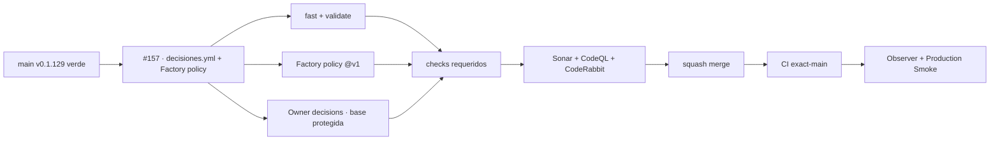

# GrindFlow — Último deploy

> **Candidato v0.1.130: primer slice de TANDA 2.** Adopta decisiones como código y el caller de política Factory v1 sin retirar los gates actuales ni tocar runtime, datos o producción.

## Progress convention
- ✅ ~~Completado~~ = verificado; 🚧 Pendiente = en curso; ⛔ bloqueado = dependencia externa.

## Fuentes de verdad
[AGENTS.md](AGENTS.md) · [Spec](docs/GRINDFLOW-SPEC.md) · [Requisitos](docs/REQUIREMENTS.md) · [Roadmap #2](https://github.com/pl0n3r/GrindFlow/issues/2)

## Estado del deploy
| Señal | Estado | Evidencia |
| --- | --- | --- |
| SHA exacto de main (base) | ✅ **d0bf0693ec16efff4baa1654fc38104732103654** | v0.1.129 fusionada |
| Versión observada en producción (base) | ✅ **v0.1.129** | Production Smoke `36077101214` |
| CI del SHA exacto de main (base) | ✅ **success** | GrindFlow CI `36077101190` |
| Deploy Observer base | ✅ **success** | run `36077101295` |
| Production Smoke base | ✅ **success** | autenticado, checkout exacto |
| Version objetivo | 🚧 **v0.1.130** | `config/version.php` |
| CI/Sonar/CodeRabbit del PR | 🚧 pendiente | HEAD final de PR #158 |
| Producción objetivo | 🚧 pendiente | solo tras merge + exact-main + observer + smoke |

## Huella del cambio
<!-- grindflow:git-delta -->
| Archivos | Inserciones | Eliminaciones | Neto |
| ---: | ---: | ---: | ---: |
| **10** | **+660** | **−39** | **+621** |

## Calidad y entrega
<!-- grindflow:gate-plan -->
| Control | Estado / contrato |
| --- | --- |
| Gates seleccionados | **preflight · fast[operational contracts + automation syntax + README dashboard] · php-quality · PHPUnit · MariaDB · browser · real-stack · legacy · symfony-preview** |
| PR + snapshot exacto | **PR #158 / Issue #157 · v0.1.130**; diff y README deben coincidir con el HEAD final |
| Gate agregador obligatorio | **validate** mantiene todos los gates seleccionados + privacy-as-code; Sonar, CodeQL y CodeRabbit separados |
| Política Factory | `politica.yml@v1` valida esquema y máximo 3 rondas; no sustituye el gate local de ownership |
| Ownership protegido | `pull_request_target` ejecuta gate/script desde base protegida; el HEAD aporta solo `decisiones.yml` como dato |
| Rol del PR | **Infraestructura · Seguridad · QA** |

## Flujo de entrega

## Qué se hizo
- Añade `decisiones.yml` compatible con Factory v1 y `review_round_limit=3`, limitado a decisiones realmente aplicables a GrindFlow.
- Añade caller PR-only `.github/workflows/politica.yml` con `contents: read` y `pull-requests: read`, fijo a `@v1`.
- Añade `decision-owner-gate.py` y `decision-owner.yml`: después del bootstrap, cambios semánticos exigen aprobación OWNER ligada al HEAD exacto.
- La compuerta privilegiada corre con `pull_request_target` desde base protegida; el PR no puede sustituir su script y su HEAD se lee solo como datos.
- Tests negativos cubren borrado, supersesión, cambio de texto, límite >3, actor no OWNER, SHA equivocado y caller inseguro.
- No se retira el CI actual, no se mueve Factory `v1` y no se escribe producción.

## Archivos modificados en esta entrega candidata
<!-- grindflow:changed-files -->
- `.github/workflows/decision-owner.yml`
- `.github/workflows/grindflow-ci.yml`
- `.github/workflows/politica.yml`
- `README.md`
- `config/version.php`
- `decisiones.yml`
- `docs/GOVERNANCE.md`
- `scripts/decision-owner-gate.py`
- `tests/test_decision_owner_gate.py`
- `tests/test_factory_policy_adoption.py`

## Validación
- AC-01/02/03 tienen regresiones offline en `fast`; Factory policy y Owner decisions son checks paralelos e independientes.
- `GrindFlow CI / validate`, privacidad, Sonar, CodeQL y CodeRabbit siguen siendo obligatorios para el HEAD final.
- Merge, deploy y validación productiva permanecen estados separados.

## Qué sigue
[Roadmap canónico #2](https://github.com/pl0n3r/GrindFlow/issues/2)

## Panorama general pendiente
| Lane | Frente | Estado |
| --- | --- | --- |
| **NOW** | 🚧 #157 · decisiones + política Factory v1 | 🚧 candidata v0.1.130 |
| **NEXT** | 🚧 #129 · siguiente slice Factory | 🚧 CI reusable en paralelo |
| **BLOCKED / EXTERNAL** | ⛔ #139 Dependabot + #146 media storage | ⛔ evidencia/configuración externa |
| **LATER** | 🚧 #122 helper CodeRabbit + #138 Sentry | 🚧 preservados tras TANDA 2 |
