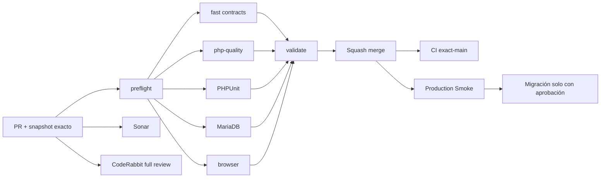

# GrindFlow — Último deploy

  
  
  

> **Development dashboard** · snapshot profesional de **solo el deploy actual**. CI, deploy y validación en producción son evidencias distintas.

## Estado del deploy

| Señal | Estado actual | Evidencia |
| --- | --- | --- |
| Work line | 🟠 **GF-FR-007 · Finance core v1** | IMPLEMENTED en rama enfocada |
| Base exacta | ✅ **main** | `eb8a051d85e866c8e99012eed3b56e67554ab749` |
| Traffic dependency | ✅ **GF-FR-006 merged** | PR #73 + snapshot post-merge #74 |
| Ledger | ✅ **append-only** | corrections use explicit reversal rows |
| Money | ✅ **integer minor units** | no floating-point persistence |
| CI del SHA exacto de main | ⚪ **no observable por el conector** | PR validation kept separate |
| Producción | ⚪ **sin cambios** | no payouts, invoices, bank operations or mutations |
| Migraciones | 🟠 **1 nueva en este slice** | `revenue_allocations`; no se aplica automáticamente |

## Huella del cambio

<!-- grindflow:git-delta -->

| Archivos | Inserciones | Eliminaciones | Neto |
| ---: | ---: | ---: | ---: |
| **17** | **+1623** | **−39** | **+1584** |

La huella se calcula con `git diff --numstat`; CI rechaza este dashboard si queda desactualizado.

## Calidad y entrega

<!-- grindflow:gate-plan -->

| Control | Estado / contrato |
| --- | --- |
| Gates seleccionados | **preflight · fast[contracts] · php-quality · PHPUnit · MariaDB · browser** |
| GrindFlow CI | `validate` exige success real de cada gate seleccionado |
| Sonar | análisis independiente + comentario estable del PR |
| CodeRabbit | full review sobre el head estable |
| Migración | nunca se ejecuta automáticamente desde este PR |
| Producción | Finance core no ejecuta payouts ni mutaciones financieras externas |

## Flujo de entrega

## Qué se hizo

- Añade `revenue_allocations` como ledger tenant-owned y append-only.
- Admin/Studio pueden administrar Finance; Editor/Model quedan bloqueados server-side.
- Persiste dinero como `amount_minor` entero positivo + currency de 3 letras.
- Beneficiario opcional, validado contra memberships de la organización activa.
- Cada asiento conserva actor, fecha, fuente y nota auditables.
- Las correcciones crean una única reversa con `reversal_of_id`; no hay update/delete funcional.
- Una reversa no puede revertirse y el original no puede tener dos reversas.
- El neto se deriva como originales menos reversas **por moneda**; nunca se mezclan minor units de currencies distintas.
- Añade workspace Finance con creación, listado, métricas y reversa explícita.
- Deploy-before-migration es seguro: GET informa bloqueo y writes responden 503.
- No implementa payouts, invoices, taxes, payment providers ni bank reconciliation.

## Archivos modificados en este deploy

- `AGENTS.md` — reglas durables del ledger Finance.
- `README.md` — dashboard exacto del slice.
- `app/Http/Controllers/Finance/FinanceController.php` — workspace tenant.
- `app/Http/Middleware/RequireFinanceSchema.php` — write gate migration-safe.
- `app/Http/Requests/Finance/ReverseRevenueAllocationRequest.php` — validación de reversas.
- `app/Http/Requests/Finance/StoreRevenueAllocationRequest.php` — validación de creación.
- `app/Models/RevenueAllocation.php` — asiento append-only.
- `app/Models/User.php` — capability Admin/Studio para Finance.
- `app/Services/Finance/FinanceLedgerManager.php` — create/reverse + tenant/beneficiary checks.
- `database/migrations/2026_09_19_041500_create_revenue_allocations_table.php` — schema Finance.
- `docs/GRINDFLOW-SPEC.md` — contrato de producto Finance core.
- `docs/REQUIREMENTS.md` — verificación GF-FR-007.
- `resources/views/dashboard.blade.php` — acceso al workspace.
- `resources/views/finance/index.blade.php` — UI del ledger.
- `resources/views/traffic/index.blade.php` — navegación hacia Finance.
- `routes/web.php` — rutas tenant create/reverse/index.
- `tests/Feature/FinanceTest.php` — roles, tenant, reversas, inmutabilidad y migration safety.

## Validación

- Estado actual: **IMPLEMENTED** en `feat/finance-core-v1`.
- Base exacta: `eb8a051d85e866c8e99012eed3b56e67554ab749`.
- El ledger no usa floats y no expone update/delete de asientos.
- Beneficiarios se validan contra membership same-tenant en cada creación.
- Reversas son únicas, append-only y conservan monto/moneda/fuente/beneficiario del original.
- Totales COP/USD/etc. se calculan por separado; hay regresión explícita contra sumas cross-currency.
- Editor/Model no pueden acceder a Finance.
- Cross-tenant listing y reversal están cubiertos negativamente.
- La migración nueva no se ejecuta desde CI ni desde esta rama.
- No hay integración bancaria, pagos, impuestos ni mutación financiera externa.

## Qué sigue

| Lane | Trabajo |
| --- | --- |
| **NOW** | Abrir PR de Finance core v1 y validar CI, Sonar y CodeRabbit sobre el head estable. |
| **NEXT** | Squash merge + snapshot post-merge; mantener migración/Smoke separados. |
| **NEXT** | Integrar tracked links con Distribution/campañas y conectar Finance con revenue sources reales. |
| **BLOCKED / EXTERNAL** | Migraciones productivas requieren aprobación operacional. |
| **LATER** | Providers reales, payouts/invoices y retiro progresivo del legacy. |

## Panorama general pendiente

| Lane | Frente | Estado |
| --- | --- | --- |
| **NOW** | Finance | core v1 IMPLEMENTED · pendiente PR/gates |
| **NEXT** | Traffic + Distribution | tracked links por campaña |
| **NEXT** | Distribution providers | adapters reales + auth/reconnect |
| **BLOCKED / EXTERNAL** | Scheduling/Distribution/Traffic/Finance producción | migrations + Smoke |
| **BLOCKED / EXTERNAL** | Hosting / storage | FFmpeg real + S3-compatible |
| **LATER** | Payouts / invoices | fuera de Finance core v1 |
| **LATER** | Legacy retirement | solo tras GF-MIG |
