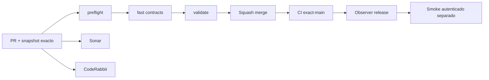

# GrindFlow — Último deploy

> **Candidato v0.1.60: notas privadas por imagen del Vault móvil y catálogo restaurable, todavía no desplegado.** El alcance «solo el deploy actual» corresponde al runtime Laravel observado; Symfony permanece aislado. Base `main` v0.1.59 `6d30a0370986541b1c3ca7da7101a0a28fe9d457`, CI exact-main success. No se activan proveedores ni migraciones productivas.

## Progress convention
- ✅ ~~Completado~~ = verificado; 🚧 Pendiente = en curso; ⛔ bloqueado = dependencia externa.

## Fuentes de verdad
[AGENTS.md](AGENTS.md) · [Spec](docs/GRINDFLOW-SPEC.md) · [Requisitos](docs/REQUIREMENTS.md) · [Transición](docs/STACK-TRANSITION-SYMFONY.md) · [Roadmap #2](https://github.com/pl0n3r/GrindFlow/issues/2)

## Estado del deploy
| Señal | Estado | Evidencia |
| --- | --- | --- |
| Version objetivo | 🚧 **v0.1.60** | `config/version.php` |
| Base exacta | ✅ ~~main v0.1.59~~ | `6d30a0370986541b1c3ca7da7101a0a28fe9d457` |
| CI del PR | 🚧 Validación del nuevo head pendiente | `GrindFlow CI / validate` |
| Sonar | 🚧 Pendiente | SonarCloud PR |
| CodeRabbit | 🚧 Revisión pendiente | PR |
| CI del SHA exacto de main | 🚧 Después del merge | CI PR no lo sustituye |
| Deploy Observer | 🚧 Release humano por observar | No prueba Symfony en remoto |
| Production Smoke | ⛔ Credencial E2E productiva pendiente | [Issue #1](https://github.com/pl0n3r/GrindFlow/issues/1) |
| Symfony S2 en Hostinger | ⛔ NO desplegado | Solo entorno aislado CI |
| Migraciones | ✅ ~~Ningún esquema productivo modificado~~ | DB Symfony descartable |

## Huella del cambio
<!-- grindflow:git-delta -->
| Archivos | Inserciones | Eliminaciones | Neto |
| ---: | ---: | ---: | ---: |
| **18** | **+404** | **−22** | **+382** |

## Calidad y entrega
<!-- grindflow:gate-plan -->
| Control | Estado / contrato |
| --- | --- |
| Gates seleccionados | **preflight · fast[contracts] · symfony-preview** |
| Alcance | S2: notas privadas por imagen, ACL/CSRF/React móvil y recuperación del catálogo |
| Revisiones | CI/Sonar/CodeRabbit, exact-main y Hostinger son independientes |

## Flujo de entrega

## Qué se hizo
- Nota interna opcional de hasta 280 caracteres visibles por imagen. Solo las membresías con permiso `content_prepare` pueden editarla/limpiarla con CSRF y reautorización en la transacción; rol de lectura solo consulta.
- Formulario accesible a 360 px en el detalle privado: guardar, descartar y errores. La nota no autoriza publicaciones ni modifica imagen, cuotas o URLs de descarga.
- Migración Doctrine reversible solo para MariaDB Symfony descartable, con regresión PHP/Chromium para tenant ajeno, papelera, CSRF, validación y roles.
- Auditoría, stage, verificación offline y cotejo de restauración incluyen `private_note` en el digest. Manifiestos antiguos sin el campo no se aceptan bajo el contrato nuevo; no se ejecutaron backups ni migraciones de producción.
## Archivos modificados en este deploy
Inventario del **cambio candidato en el PR**, no archivos desplegados en Hostinger.
- `README.md`
- `config/version.php`
- `docs/GRINDFLOW-SPEC.md`
- `docs/REQUIREMENTS.md`
- `docs/SYMFONY-VAULT-STORAGE.md`
- `symfony/README.md`
- `symfony/frontend/admin/VaultPanel.tsx`
- `symfony/frontend/admin/admin.css`
- `symfony/migrations/Version20260921061500.php`
- `symfony/src/Http/Controller/VaultController.php`
- `symfony/src/Infrastructure/Storage/VaultAuditCommand.php`
- `symfony/src/Infrastructure/Storage/VaultManifest.php`
- `symfony/src/Infrastructure/Storage/VaultStageCommand.php`
- `symfony/src/Infrastructure/Storage/VaultVerifyRestoreCommand.php`
- `symfony/src/Infrastructure/Storage/VaultVerifyStageCommand.php`
- `symfony/tests/e2e/preview.spec.mjs`
- `symfony/tests/php/VaultAuditCommandTest.php`
- `symfony/tests/php/VaultTrashTest.php`
## Validación
- PHP/MariaDB, TypeScript y Chromium se comprueban mediante CI del PR; sin checkout local disponible en esta sesión.
- CI exact-main v0.1.59 success; CI/Sonar/CodeRabbit del head v0.1.60 y Hostinger son señales separadas. No se tocó producción.

## Qué sigue
[Roadmap canónico #2](https://github.com/pl0n3r/GrindFlow/issues/2)

| Lane | Trabajo | Estado |
| --- | --- | --- |
| **NOW** | 🚧 Validar notas privadas del Vault v0.1.60 | 🚧 CI y revisión |
| **NEXT** | 🚧 Clasificación y reglas de uso; ensayo real backup MariaDB + blobs | 🚧 Retención y operación pendientes |
| **LATER** | 🚧 Vault móvil → reglas → distribución autorizada → piloto | 🚧 Planificado |
| **BLOCKED / EXTERNAL** | ⛔ Cutover sin paridad/datos migrados; Smoke sin credencial | ⛔ Dependencia externa |

## Panorama general pendiente
| Lane | Frente | Estado |
| --- | --- | --- |
| **DONE** | ✅ ~~Dashboard Laravel v0.1.30~~ | ✅ ~~Esquema Symfony S1 v0.1.31~~ |
| **NOW** | 🚧 Nota interna por imagen y recuperación v0.1.60 | 🚧 CI y revisión |
| **NEXT** | 🚧 Backup de MariaDB y ensayo integral de restauración | 🚧 Pendiente de definir política de retención y backup |
| **LATER** | 🚧 Automatización de contenido | 🚧 S2–S5 |
| **BLOCKED / EXTERNAL** | ⛔ Sin cutover Symfony | ⛔ Sin credencial Smoke |
