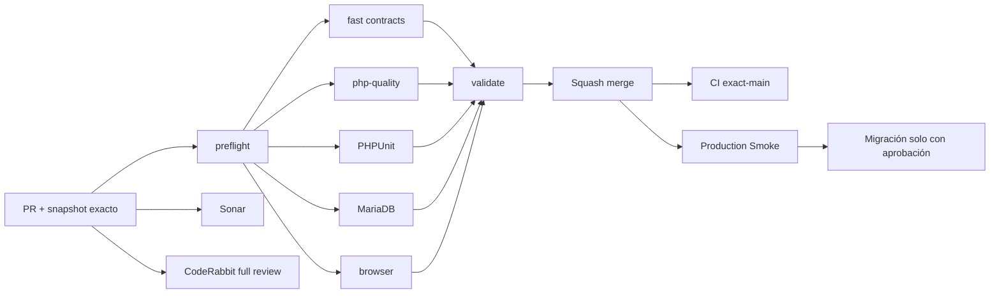

# GrindFlow — Último deploy

  
  
  

> **Development dashboard** · snapshot profesional de **solo el deploy actual**. CI, deploy y validación en producción son evidencias distintas.

## Estado del deploy

| Señal | Estado actual | Evidencia |
| --- | --- | --- |
| Work line | 🟠 **GF-OPS · Migration readiness** | IMPLEMENTED en rama enfocada |
| Base exacta | ✅ **main** | `75a81c310ea3f7f768e5220de913d120dc9fcb35` |
| Cambio | 🟠 **Admin > System** | inventario y aprobación del lote, sin ejecutar migraciones |
| CI del SHA exacto de main | ⚪ **sin evidencia confirmada** | validación del PR y exact-main no son equivalentes |
| Producción | ⚪ **sin cambios** | no se ejecutaron migraciones ni backups |
| Riesgo externo | 🟠 **backup verificable** | responsabilidad explícita del operador |

## Huella del cambio

<!-- grindflow:git-delta -->

| Archivos | Inserciones | Eliminaciones | Neto |
| ---: | ---: | ---: | ---: |
| **7** | **+0000** | **−0000** | **+0000** |

La huella se calcula con `git diff --numstat`; CI rechaza este dashboard si queda desactualizado.

## Calidad y entrega

<!-- grindflow:gate-plan -->

| Control | Estado / contrato |
| --- | --- |
| Gates seleccionados | **preflight · fast[contracts] · php-quality · PHPUnit · MariaDB · browser** |
| GrindFlow CI | `validate` requiere éxito de todos los gates seleccionados |
| Sonar | Quality Gate independiente del PR |
| CodeRabbit | full review sobre head estable |
| Migración | lectura y validación de lote, sin auto-ejecución |
| Producción | no se toca desde este PR |

## Flujo de entrega

## Qué se hizo

- `Admin > System` muestra los nombres de migraciones pendientes, no solo su cantidad.
- El lote incluye una huella SHA-256 de nombres y contenido de los archivos pendientes.
- El POST exige platform admin, CSRF, confirmación `MIGRAR` y declaración explícita de backup externo restaurable.
- El lote se reconsulta dentro del lock de migración; si cambió, se rechaza y exige nueva revisión.
- Sin migraciones o sin inventario disponible, no aparece el formulario ejecutable.
- Los mensajes de validación se muestran sin exponer código, secretos ni detalles de conexión.
- La pantalla **no crea ni verifica técnicamente backups**, solo requiere confirmación humana.
- Pruebas cubren acceso, ausencia de confirmación, lote obsoleto, flujo válido simulado y cambio de contenido.
- No se ejecuta `migrate` en producción desde este desarrollo.

## Archivos modificados en este deploy

- `AGENTS.md` — regla durable para el operador.
- `README.md` — dashboard exacto.
- `app/Http/Controllers/Admin/RunMigrationsController.php` — guard de aprobación y lote.
- `app/Http/Controllers/Admin/SystemController.php` — consulta de inventario.
- `app/Support/Operations/MigrationReadiness.php` — huella estable de pendientes.
- `resources/views/admin/system.blade.php` — revisión y confirmación de lote.
- `tests/Feature/AdminMigrationReadinessTest.php` — regresiones de seguridad.

## Validación

- Base `main`: `75a81c310ea3f7f768e5220de913d120dc9fcb35`.
- Feature GF-FR-006A y snapshot #78 ya estaban fusionados en la base.
- La nueva funcionalidad es un guard operacional; no cambia schema de GrindFlow.
- CI, deploy, migración y Production Smoke son estados separados.

## Qué sigue

| Lane | Trabajo |
| --- | --- |
| **NOW** | Abrir PR de migration readiness y validar CI, Sonar y CodeRabbit. |
| **NEXT** | Merge y validar el SHA exacto de main. |
| **NEXT** | Revisar backup externo y migraciones pendientes en Admin > System antes de pedir aprobación operacional. |
| **BLOCKED / EXTERNAL** | Storage S3, FFmpeg en hosting y migraciones de producción. |
| **LATER** | Primer adapter real en sandbox y conciliación Finance. |

## Panorama general pendiente

| Lane | Frente | Estado |
| --- | --- | --- |
| **NOW** | Migration readiness | implementado en rama · pendiente gates |
| **NEXT** | Production Smoke | requiere evidencia exact-main |
| **NEXT** | Scheduling/Distribution/Traffic/Finance | migraciones bajo aprobación |
| **BLOCKED / EXTERNAL** | Hosting/storage | S3 + FFmpeg |
| **LATER** | Provider adapters | sandbox + credenciales cifradas |
| **LATER** | Legacy retirement | solo tras GF-MIG |
