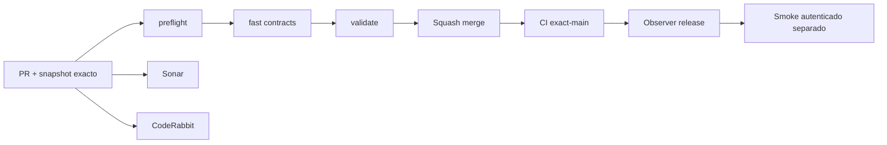

# GrindFlow — Último deploy

> **Candidato v0.1.54: proteger entrega/restauración de originales y verificar página visible, todavía no desplegado.** La lectura «solo el deploy actual» corresponde al runtime Laravel observado; Symfony permanece aislado. Base `main` v0.1.53 `a9605f89df4eb1aa28f28762e5e95c0820406fc0`, CI exact-main success. Ningún dato productivo ni migración se modifica.

## Progress convention
- ✅ ~~Completado~~ = verificado; 🚧 Pendiente = en curso; ⛔ bloqueado = dependencia externa.

## Fuentes de verdad
[AGENTS.md](AGENTS.md) · [Spec](docs/GRINDFLOW-SPEC.md) · [Requisitos](docs/REQUIREMENTS.md) · [Transición](docs/STACK-TRANSITION-SYMFONY.md) · [Roadmap #2](https://github.com/pl0n3r/GrindFlow/issues/2)

## Estado del deploy
| Señal | Estado | Evidencia |
| --- | --- | --- |
| Version objetivo | 🚧 **v0.1.54** | `config/version.php` |
| Base exacta | ✅ ~~main v0.1.53~~ | `a9605f89df4eb1aa28f28762e5e95c0820406fc0` |
| CI del PR | 🚧 Validación del nuevo head pendiente | `GrindFlow CI / validate` |
| Sonar | 🚧 Pendiente | SonarCloud PR |
| CodeRabbit | 🚧 Revisión pendiente | PR |
| CI del SHA exacto de main | 🚧 Después del merge | CI PR no lo sustituye |
| Deploy Observer | 🚧 Release humano por observar | No prueba Symfony en remoto |
| Production Smoke | ⛔ Credencial E2E productiva pendiente | [Issue #1](https://github.com/pl0n3r/GrindFlow/issues/1) |
| Symfony S2 en Hostinger | ⛔ NO desplegado | Solo entorno aislado CI |
| Migraciones | ✅ ~~Ningún esquema productivo modificado~~ | DB Symfony descartable |

## Huella del cambio
<!-- grindflow:git-delta -->
| Archivos | Inserciones | Eliminaciones | Neto |
| ---: | ---: | ---: | ---: |
| **8** | **+000** | **−000** | **+000** |

## Calidad y entrega
<!-- grindflow:gate-plan -->
| Control | Estado / contrato |
| --- | --- |
| Gates seleccionados | **preflight · fast[contracts] · symfony-preview** |
| Alcance | S2: integridad de bytes antes de lectura/restauración y revisión visible mobile-first |
| Revisiones | CI/Sonar/CodeRabbit, exact-main y Hostinger son independientes |

## Flujo de entrega

## Qué se hizo
- Descarga, vista previa y restauración en Symfony reutilizan la verificación de tamaño/SHA-256: nunca entregan un original privado modificado, aunque conserve el mismo tamaño.
- Auditoría manual de hasta 30 originales visibles por página (biblioteca o papelera), con estado por imagen y progreso accesible a 360 px. No es backup ni copia de archivos.
- Regresión PHPUnit/MariaDB para bytes alterados, revocación y papelera; Chromium para estado de auditoría móvil y cambio de vista. Sin integración externa, purga, migración ni cutover.

## Archivos modificados en este deploy

Este inventario corresponde al **cambio candidato en el PR**, no a archivos desplegados en Hostinger.
- `README.md`
- `config/version.php`
- `symfony/README.md`
- `symfony/frontend/admin/VaultPanel.tsx`
- `symfony/frontend/admin/admin.css`
- `symfony/src/Http/Controller/VaultController.php`
- `symfony/tests/e2e/preview.spec.mjs`
- `symfony/tests/php/VaultTrashTest.php`

## Validación
- PHP/MariaDB y Chromium se comprueban en CI del PR; sin checkout local de este repositorio en esta sesión.
- CI exact-main v0.1.53 success; CI/Sonar/CodeRabbit del head v0.1.54 y Hostinger son señales separadas. No se tocó producción.

## Qué sigue
[Roadmap canónico #2](https://github.com/pl0n3r/GrindFlow/issues/2)

| Lane | Trabajo | Estado |
| --- | --- | --- |
| **NOW** | 🚧 Validar entrega e integridad S2 v0.1.54 | 🚧 CI y revisión |
| **NEXT** | 🚧 Storage durable, backup y purga con política explícita | 🚧 Pendiente definir política de retención y backup |
| **LATER** | 🚧 Vault móvil → reglas → distribución autorizada → piloto | 🚧 Planificado |
| **BLOCKED / EXTERNAL** | ⛔ Cutover sin paridad/datos migrados; Smoke sin credencial | ⛔ Dependencia externa |

## Panorama general pendiente
| Lane | Frente | Estado |
| --- | --- | --- |
| **DONE** | ✅ ~~Dashboard Laravel v0.1.30~~ | ✅ ~~Esquema Symfony S1 v0.1.31~~ |
| **NOW** | 🚧 Validar integridad y revisión visible v0.1.54 | 🚧 CI y revisión |
| **NEXT** | 🚧 Storage durable, backup y retención | 🚧 Pendiente de definir política de retención y backup |
| **LATER** | 🚧 Automatización de contenido | 🚧 S2–S5 |
| **BLOCKED / EXTERNAL** | ⛔ Sin cutover Symfony | ⛔ Sin credencial Smoke |
