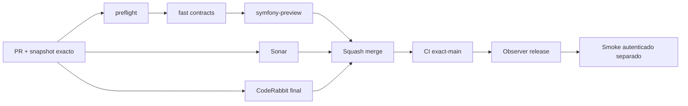

# GrindFlow — Último deploy

> **Candidato v0.1.80: S5, resumen semanal privado del piloto.** Base exacta `main` v0.1.79 `3d79eb53f2ad0e3e53d5ea48df104ec2654a090c`; Symfony solo en entorno aislado, sin cutover ni migraciones productivas.

## Progress convention
- ✅ ~~Completado~~ = verificado; 🚧 Pendiente = en curso; ⛔ bloqueado = dependencia externa.

## Fuentes de verdad
[AGENTS.md](AGENTS.md) · [Spec](docs/GRINDFLOW-SPEC.md) · [Requisitos](docs/REQUIREMENTS.md) · [Transición](docs/STACK-TRANSITION-SYMFONY.md) · [Roadmap #2](https://github.com/pl0n3r/GrindFlow/issues/2)

## Estado del deploy
| Señal | Estado | Evidencia |
| --- | --- | --- |
| Version objetivo | 🚧 **v0.1.80** | `config/version.php` |
| Base exacta | ✅ ~~main v0.1.79~~ | `3d79eb53f2ad0e3e53d5ea48df104ec2654a090c` |
| CI del PR S5 | 🚧 No ejecutado todavía | PR candidato; verificar HEAD final |
| Sonar / CodeRabbit | 🚧 Pendiente | Revisión completa sobre HEAD final, no check skipped |
| CI del SHA exacto de main | ✅ ~~v0.1.79 success~~ | run `35681696260` |
| Deploy Observer | ✅ ~~Release v0.1.79 observado~~ | run `35681696462`; NO prueba SHA remoto |
| Production Smoke | ⛔ Auth E2E sin validar | run `35681696196` failure; [#73](https://github.com/pl0n3r/GrindFlow/issues/73) |
| Symfony en Hostinger | ⛔ NO desplegado | Solo CI aislado |
| Migraciones | ✅ ~~Sin cambios de esquema~~ | S5 reutiliza ledger existente en Symfony |

## Huella del cambio
<!-- grindflow:git-delta -->
| Archivos | Inserciones | Eliminaciones | Neto |
| ---: | ---: | ---: | ---: |
| **9** | **+718** | **−36** | **+682** |

## Calidad y entrega
<!-- grindflow:gate-plan -->
| Control | Estado / contrato |
| --- | --- |
| Gates seleccionados | **preflight · fast[contracts] · symfony-preview** |
| Alcance | GET/CSV privado, consulta tenant-safe MariaDB, React responsive, PHPUnit y Playwright |
| Revisiones | CI/Sonar/CodeRabbit mismo HEAD antes del squash; exact-main y Hostinger separados |

## Flujo de entrega

## Qué se hizo
- S5: `GET /api/admin/pilot/weekly-summary` consulta un lunes UTC de las últimas 12 semanas; muestra siete días de eventos internos `prepare/complete/fail` agregados por organización y membresía vigente.
- `GET /api/admin/pilot/weekly-summary.csv` exporta solamente siete filas agregadas tras la misma autorización; ambos endpoints usan `no-store, private`. Semana inválida → 422; ledger no migrado → métricas no disponibles.
- React añade pestaña **Piloto** al workspace, totales diarios, navegación semanal, estado vacío/error y exportación CSV; diseño responsive a 360 px.
- Tráfico Symfony, publicaciones externas e ingresos **no están integrados**: se muestran como no disponibles, nunca como cero inventado o publicación verificada.
- Tests PHPUnit con dos organizaciones, revocación de membresía, CSV/fecha inválida y Playwright sintético móvil. Requisito `GF-FR-018` documentado.

## Archivos modificados en este deploy
Inventario del candidato v0.1.80, no evidencia de publicación. «solo el deploy actual» conserva el marcador de control del snapshot README.
- `README.md`
- `config/version.php`
- `docs/REQUIREMENTS.md`
- `symfony/frontend/admin/AdminApp.tsx`
- `symfony/frontend/admin/PilotWeeklySummaryPanel.tsx`
- `symfony/frontend/admin/admin.css`
- `symfony/src/Http/Controller/PilotWeeklySummaryController.php`
- `symfony/tests/e2e/preview.spec.mjs`
- `symfony/tests/php/PilotWeeklySummaryTest.php`

## Validación
- Candidato fuente preparado sobre main v0.1.79 con CI exact-main success. CI Symfony, Sonar y CodeRabbit de v0.1.80 **pendientes**, no deducidos de la rama fuente original.
- Production Smoke v0.1.79 falló; investigar solo con evidencia saneada [#73](https://github.com/pl0n3r/GrindFlow/issues/73). No reintentar credenciales ciegamente, ni asociar falla a Symfony no desplegado.

## Qué sigue
[Roadmap canónico #2](https://github.com/pl0n3r/GrindFlow/issues/2)

| Lane | Trabajo | Estado |
| --- | --- | --- |
| **NOW** | 🚧 Validar S5 piloto v0.1.80 | 🚧 CI/Sonar/CodeRabbit |
| **NEXT** | 🚧 Analizar fallo Smoke #73 sin nuevas mutaciones | 🚧 Diagnóstico seguro |
| **LATER** | 🚧 S4/S5 Distribution + Traffic Symfony | 🚧 Sin cutover |
| **BLOCKED / EXTERNAL** | ⛔ Smoke autenticado #73 y paridad cutover | ⛔ Producción no verificada |

## Panorama general pendiente
| Lane | Frente | Estado |
| --- | --- | --- |
| **DONE** | ✅ ~~Smoke seguro y fail-fast v0.1.79 PR #75~~ | ✅ ~~Fusionada con CodeRabbit final y CI exact-main~~ |
| **NOW** | 🚧 S5 resumen semanal privado | 🚧 PR y gates pendientes |
| **NEXT** | 🚧 Corregir causa #73 basada en evidencia | 🚧 No inferir credenciales |
| **LATER** | 🚧 Distribution + Traffic Symfony | 🚧 Sin cutover |
| **BLOCKED / EXTERNAL** | ⛔ Smoke autenticado y paridad | ⛔ Hostinger no verificado |
