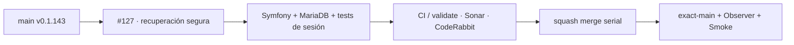

# GrindFlow — Último deploy

> **Candidata v0.1.144 · Issue #127.** Recuperación de contraseña y cambio seguro del admin sobre Symfony/Doctrine, con tokens de un solo uso, rate limiting y pruebas de sesión.

## Progress convention
- ✅ ~~Completado~~ = verificado; 🚧 Pendiente = en curso; ⛔ bloqueado = dependencia externa.

## Fuentes de verdad
[AGENTS.md](AGENTS.md) · [Spec](docs/GRINDFLOW-SPEC.md) · [Requisitos](docs/REQUIREMENTS.md) · [Roadmap #2](https://github.com/pl0n3r/GrindFlow/issues/2)

## Estado del deploy
| Señal | Estado | Evidencia |
| --- | --- | --- |
| SHA exacto de main (base) | ✅ **f5b74ddff10569023dd1b2a73de5dd8937bc3192** | v0.1.143 |
| CI del SHA exacto de main (base) | ✅ **success** | GrindFlow CI 36213912464 |
| Deploy Observer / Production Smoke base | ✅ **success / success** | 36213912470 / 36213912462 |
| Version objetivo | 🚧 **v0.1.144** | recuperación de cuenta Symfony |
| CI/Sonar/CodeRabbit del PR | 🚧 pendiente | PR #181 · Issue #127 · v0.1.144 |
| Producción objetivo | 🚧 sin desplegar | migración y runtime aún no aplicados |

## Huella del cambio
<!-- grindflow:git-delta -->
| Archivos | Inserciones | Eliminaciones | Neto |
| ---: | ---: | ---: | ---: |
| **24** | **+901** | **−48** | **+853** |

## Calidad y entrega
<!-- grindflow:gate-plan -->
| Control | Estado / contrato |
| --- | --- |
| Gates seleccionados | **preflight · fast[operational contracts + automation syntax + README dashboard] · php-quality · PHPUnit · MariaDB · browser · real-stack · legacy · symfony-preview** |
| PR + snapshot exacto | **PR #181 · Issue #127 · v0.1.144**; README debe coincidir con HEAD final |
| Gate agregador obligatorio | **validate** exige todos los gates seleccionados; Sonar y CodeRabbit separados |
| Seguridad | token aleatorio, hash persistido, TTL ≤60 min, CSRF, rate limiting, no-referrer/no-store, auditoría sin secretos |
| CI local canónico | **GrindFlow CI / validate** |
| Rol del PR | **Ingeniería de software · Seguridad · QA** |

## Flujo de entrega

## Qué se hizo
- Añade solicitud de recuperación no enumerante con token criptográfico persistido solo como SHA-256 y expiración máxima de 60 minutos.
- Reemitir el reset invalida el token anterior; usarlo lo elimina y registra auditoría sin secretos.
- Añade rate limiting por IP/cuenta, CSRF, respuestas privadas/no-cache y `Referrer-Policy: no-referrer`.
- El enlace entrega el token en fragmento URL y lo retira del navegador antes del POST.
- Centraliza política de contraseña, rechaza comunes/reutilización y notifica cambios por transporte server-side configurable.
- Extiende cambio autenticado con auditoría, notificación e invalidación de la sesión actual.
- Añade regresión que restaura una sesión autenticada previa tras un reset y exige que Symfony la rechace al refrescar el hash.
- El firewall actual no configura `remember_me` y el repositorio no implementa 2FA/TOTP; este slice no crea ni desactiva mecanismos inexistentes.

## Archivos modificados en esta entrega candidata
<!-- grindflow:changed-files -->
- `README.md`
- `config/version.php`
- `datos.yml`
- `docs/privacidad/aviso-privacidad.md`
- `docs/privacidad/politica-tratamiento.md`
- `docs/privacidad/registro-tratamientos.md`
- `package-lock.json`
- `package.json`
- `symfony/config/packages/framework.yaml`
- `symfony/config/services.yaml`
- `symfony/config/services_test.yaml`
- `symfony/migrations/Version20260926030500.php`
- `symfony/src/Http/Controller/AccountSecurityController.php`
- `symfony/src/Http/Controller/PasswordRecoveryController.php`
- `symfony/src/Identity/Entity/IdentityUser.php`
- `symfony/src/Identity/Security/PasswordPolicy.php`
- `symfony/src/Identity/Security/PasswordRecoveryNotifier.php`
- `symfony/src/Infrastructure/Mail/InMemoryPasswordRecoveryNotifier.php`
- `symfony/src/Infrastructure/Mail/NativePasswordRecoveryNotifier.php`
- `symfony/templates/identity/forgot-password.html.twig`
- `symfony/templates/identity/login.html.twig`
- `symfony/templates/identity/recover-password.html.twig`
- `symfony/tests/php/PasswordRecoveryTest.php`
- `tests/test_password_recovery_acceptance.py`

## Validación
- `PasswordRecoveryTest` cubre no enumeración, hash/TTL, uso único, reemisión, contraseña común, cambio efectivo, notificación y rechazo de sesión previa.
- `AccountSecurityTest` conserva CSRF, password actual, rate limit y límites de payload del cambio autenticado.
- La migración es reversible y solo añade tokens/auditoría del stack Symfony; esta PR no la ejecuta en producción.
- `datos.yml` declara hash/expiración de reset y evento de seguridad sin persistir token plano.
- Estado final exige CI/Sonar/CodeRabbit del mismo HEAD y exact-main + Observer + Smoke tras merge.

## Qué sigue
[Roadmap canónico #2](https://github.com/pl0n3r/GrindFlow/issues/2)

## Panorama general pendiente
| Lane | Frente | Estado |
| --- | --- | --- |
| **NOW** | 🚧 #127 · recuperación/cambio de contraseña | 🚧 candidata v0.1.144 |
| **NEXT** | 🚧 #174 · API staff ControlBot | 🚧 depende de #127 |
| **BLOCKED / EXTERNAL** | ⛔ #139 Dependabot + #146 media storage | ⛔ dependencias externas |
| **LATER** | 🚧 roadmap de producto | 🚧 preservado |

