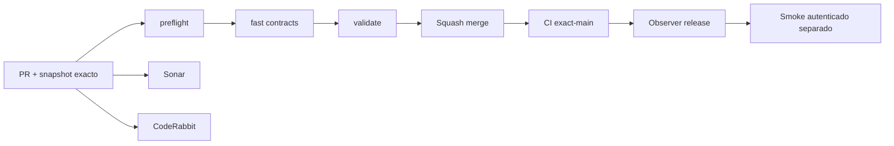

# GrindFlow — Último deploy

> **Snapshot v0.1.24: solo el deploy actual.** Base `main` v0.1.23 `8b0cf563af5bcbae4fa230ede22117b99642b071`. Primer Symfony aislado y vista React/Vite para validación de código; **Laravel continúa como runtime productivo** y la demo nueva no está desplegada en Hostinger.

## Progress convention
- ✅ ~~Completado~~ = verificado; 🚧 Pendiente = en curso; ⛔ bloqueado = dependencia externa.

## Fuentes de verdad
[AGENTS.md](AGENTS.md) · [Spec](docs/GRINDFLOW-SPEC.md) · [Requisitos](docs/REQUIREMENTS.md) · [Transición](docs/STACK-TRANSITION-SYMFONY.md) · [Roadmap #2](https://github.com/pl0n3r/GrindFlow/issues/2)

## Estado del deploy
| Señal | Estado | Evidencia |
| --- | --- | --- |
| Version objetivo | 🚧 **v0.1.24** | `config/version.php` |
| Base exacta | ✅ ~~main v0.1.23~~ | `8b0cf563af5bcbae4fa230ede22117b99642b071` |
| CI del PR | 🚧 Validación del head final pendiente | [Issue #12](https://github.com/pl0n3r/GrindFlow/issues/12) |
| Sonar | 🚧 Por revisar | [PR del slice S0](https://github.com/pl0n3r/GrindFlow/pulls) |
| CodeRabbit | 🚧 Revisión pendiente | PR del slice S0 |
| CI del SHA exacto de main | 🚧 Posterior a merge | No inferir del CI de PR |
| Deploy Observer | ⛔ Entorno remoto sin validar | Observación de producción independiente |
| Production Smoke | ⛔ Credencial E2E ausente | [Issue #1](https://github.com/pl0n3r/GrindFlow/issues/1) |
| Producción Symfony S0 | ⛔ NO desplegada | Directorio `symfony/` aislado |
| Migraciones | ✅ ~~Cero cambios de esquema productivo~~ | Doctrine configurado sin ejecutar migraciones |

## Huella del cambio
<!-- grindflow:git-delta -->
| Archivos | Inserciones | Eliminaciones | Neto |
| ---: | ---: | ---: | ---: |
| **53** | **+9300** | **−46** | **+9254** |

## Calidad y entrega
<!-- grindflow:gate-plan -->
| Control | Estado / contrato |
| --- | --- |
| Gates seleccionados | **preflight · fast[contracts] · php-quality · PHPUnit · MariaDB · browser · real-stack · legacy · symfony-preview** |
| Alcance | Nuevo Symfony y CI paralelo: PHP/Doctrine/MariaDB, Twig, React/TS/Vite, Chromium y contratos HTTP |
| Revisiones | CI/Sonar/CodeRabbit y exact-main independientes |

## Flujo de entrega

## Qué se hizo
- S0: home Twig real y demo React interactiva con navegación y versión; `/admin` protegido con 403 hasta identidad real en S1.
- Vite genera assets con manifiesto validado; health sin inventar SHA desplegado; headers de seguridad y request ID.
- Nuevo gate Symfony/MariaDB/TypeScript/Playwright, en paralelo a pruebas Laravel/legado; sin borrar datos ni tocar Hostinger.

## Archivos modificados en este deploy
- `.github/workflows/grindflow-ci.yml`
- `README.md`
- `config/version.php`
- `eslint.config.mjs`
- `pint.json`
- `scripts/ci-scope-contract.sh`
- `scripts/ci-scope.sh`
- `scripts/readme-dashboard.py`
- `symfony/.env.example`
- `symfony/.gitignore`
- `symfony/README.md`
- `symfony/bin/console`
- `symfony/composer.json`
- `symfony/composer.lock`
- `symfony/config/bootstrap.php`
- `symfony/config/bundles.php`
- `symfony/config/packages/doctrine.yaml`
- `symfony/config/packages/doctrine_migrations.yaml`
- `symfony/config/packages/framework.yaml`
- `symfony/config/packages/security.yaml`
- `symfony/config/packages/test/framework.yaml`
- `symfony/config/packages/twig.yaml`
- `symfony/config/routes.yaml`
- `symfony/config/services.yaml`
- `symfony/frontend/admin/PreviewApp.tsx`
- `symfony/frontend/admin/main.tsx`
- `symfony/frontend/admin/preview.css`
- `symfony/package-lock.json`
- `symfony/package.json`
- `symfony/phpunit.xml.dist`
- `symfony/playwright.config.mjs`
- `symfony/public/.htaccess`
- `symfony/public/assets/grindflow.css`
- `symfony/public/index.php`
- `symfony/public/router.php`
- `symfony/src/Http/AssetManifest.php`
- `symfony/src/Http/Controller/AdminController.php`
- `symfony/src/Http/Controller/HealthController.php`
- `symfony/src/Http/Controller/HomeController.php`
- `symfony/src/Http/Controller/PreviewController.php`
- `symfony/src/Infrastructure/Http/RequestIdSubscriber.php`
- `symfony/src/Infrastructure/Http/SecurityHeadersSubscriber.php`
- `symfony/src/Kernel.php`
- `symfony/src/Shared/Version/ProductVersion.php`
- `symfony/templates/base.html.twig`
- `symfony/templates/home/index.html.twig`
- `symfony/templates/preview/index.html.twig`
- `symfony/tests/contract/smoke.sh`
- `symfony/tests/e2e/preview.spec.mjs`
- `symfony/tests/php/PreviewTest.php`
- `symfony/tsconfig.json`
- `symfony/vite.config.ts`
- `tsconfig.json`

## Validación
- [Issue #12](https://github.com/pl0n3r/GrindFlow/issues/12): CI y Sonar sobre head final por comprobar.
- Las URLs S0 son de entorno aislado de pruebas, **no** de producción.

## Qué sigue
| Lane | Trabajo |
| --- | --- |
| **NOW** | 🚧 S0 validar CI, fusionar y comprobar SHA [roadmap #2](https://github.com/pl0n3r/GrindFlow/issues/2) |
| **NEXT** | 🚧 S1 identidad/tenant y onboarding real |
| **LATER** | 🚧 S2 Vault móvil → S3 reglas → S4 distribución → S5 Traffic/piloto |
| **BLOCKED / EXTERNAL** | ⛔ Producción Hostinger/Smoke pendiente; claves de proveedores externos aún no verificadas |

## Panorama general pendiente
| Lane | Frente | Estado |
| --- | --- | --- |
| **DONE** | ✅ ~~Arquitectura Symfony aprobada~~ | ✅ ~~PR #11 fusionado~~ |
| **NOW** | 🚧 UI S0 en rama | 🚧 Por validar gates |
| **NEXT** | 🚧 Onboarding/tenant | 🚧 Por portar |
| **LATER** | 🚧 Biblioteca y reglas | 🚧 Por migrar |
| **BLOCKED / EXTERNAL** | ⛔ Producción | ⛔ Sin verificación |
